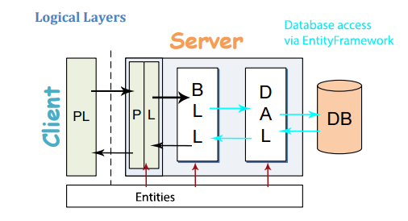

# EntityFramework: Data Access

When ASP.Net first started, users used ADO.Net to access the database. This required mounts of work, redundant setup work. As time went on, as usual, 3rd party individuals attempted to reduce the amount of work needed to access the database using ADO.Net. One popular library was Enterprise Library. This reduce the redundant tedious work of using ADO.net directly. In about 2008, Microsoft introduce EntityFramework to assist developers with database access. ADO.Net was even further removed from developer (hidden). EntityFramework is a set of classes that manage your database access. One links into EntityFramework via inheriting its DBContext class. Using the `DBSet<T>` of this context class (where `<T>` is an entity definition class) and properly annotated entity definition class, database CRUD management has been greatly simplified. **In this course, the entity definition classes will be coded manually by the student so they can get a better understanding of the components needed by EnityFramework. Do not reverse engineer the entities. This will be covered in DMIT2018.**

<https://en.wikipedia.org/wiki/Entity_Framework>

<http://www.entityframeworktutorial.net/what-is-entityframework.aspx>

## EntityFramework in logical Client Server Architecture

EntityFramework will manage the access of data to and from the database (aqua color). The DAL layer will contain a class which will be referred to as the Context class. This class will inherit DbContext from EntityFramework. The commands to query, add, update and delete records will be coded in the BLL classes using the DAL Context Class. The mapping of the sql tables will be done in the Entity classes of the Entity library. These entity classes will be used by the DAL, BLL and PL layers. These classes are data definitions of the sql tables.



## Coding: Create Controller class

When creating your controller class, you are creating the interface to your application. When we created the context class, we use an access privilege of **internal**. This restricts the access to the context class to **only** other calls from **within** the same class library. We are using this context class as access to the database. Logically, therefore, we need “entrance” into the class library. This interface (entrance) has a public access. Any user wishing to have access to the database must therefore use the methods within this public interface. The interface is made up of public methods. Controlling the code we place in these methods means the application controls what an outside user can or cannot do.

Business Logic:

The controller method can contain complex business rules. These are generally rules that cannot be covered by simply validation (presence, datatype, range, etc.). This logic may required multiple database queries. The Alberta Graduated Driver license is an example. There are several different criteria that must be meet before one moves to the next level.

Transaction Processing:

The workflow to complete a process many require multiple accesses to the database. This means using a transaction workflow which at any time could be logically terminated for some reason. Consider a sale. There are several tables that need to be updated: inventory, sale, and saledetail. Also, if the transaction is anything but cash, external calls to verify funds need to be worked into the workflow. Transaction Processing will be covered in DMIT2018.

Security:

Security can be done at several levels in your application and the BLL method is prime place. Since all outside users wanting to access your database need to
travel through a public interface, checking logins and roles can be done here. Failure to meet proper security clearance means a simple thrown exception. Security will be covered in DMIT2018.

When we create the controller, one can place all of the interface into one physical file and class. This would made maintenance hazardless. Use the same logical reasons for separating out multiple classes from one physical file and out of one class to more logical classes that has been in the pass. Each entity will have their own controller in its own physical file.

## Coding: Setup

1. Create a folder called NorthwindPages for sample pages

2. Download ProductCRUD startup WebPage and extract files into NorthwindPages. Refresh folder.

3. Create a web.sitemap with 3 root nodes (Home, Contact and About) and a drop down menu which will contain the coded samples. Add ProductCRUD to drop down menu.

4. Open site.master and alter menu to use web.sitemap. You can copy the code from BasicASPX sitemaster. Rename menu to ClientServerMenu. Change My Application brand to ASPX Client Server.

5. Run and Test menu. End on ProductCRUD

6. Review contents of form (review of basic aspx controls)

## Coding: Create BLL ProductController class

1. Create a class in the BLL folder of your NorthwindSystem project called ProductController.

2. Change the access privilege from the default private to public. Any class without a stated access privilege defaults to private.

3. Add the following namespaces:
    1. using NorthwindEntities;
    2. using NorthwindSystem.DAL;

## Coding: Product_List

EntityFramework has a couple of queries that need no additional effort from you in grabbing either all the records from a table or a single record via the primary key. All work to the database will go through the context class, therefore, we will need to create an instance of the class. To access the data of a sql table, one uses the `DbSet<T>` properties associated with that table. In this course we will use the simplest techniques in accessing the database. The return datatype of a query for multiple records is usually IEnumerable. We will cast this to a `List<T>` to make things easier for us. The work will be wrapped in a transaction using **`using(){…}`**.

```csharp
//a method to return all product records from the database to the calling method
public List<Product> Product_List()
{
    //need to connect to the Context class
    //this connection will be done in a transaction coding group
    using (var context = new NorthwindContext())
    {
        //via EnityFrame, make a request for all records,
        //all attributes from the specified DbSet property
        return context.Products.ToList();
    }
}
```

## Coding: Product_Get(int productid)

EntityFramework has a method called **Find(datatype)** which can be used to retrieve a record from the associate sql table via the context `DbSet<T>` property.


```csharp
public Product Product_Get (int productid)
{
    //return the record from the database via the DbSet collection
    //where the pkey matches the supplied value
    using (var context = new NorthwindContext())
    {
        return context.Products.Find(productid);
    }
}
```
  
## Coding: Classroom exercise

Create the SupplierController and CategoryController classes. Add two methods to each class. One method to return all records of the associated sql table and one method to return the sql table record for a supplied primary key value.

## Coding: Web page

## Coding: Required Namespaces for the Code-Behind.

```csharp
#region Additional Namespaces
using NorthwindEntities;
using NorthwindSystem.BLL;
#endregion
```

## Coding: Error Handling GetInnerException(Exception ex)

Most times when an error is generated, we handle it using Try/Catch. This will display the error and we can determine the problem with our code and fix it. However, there will be times when an error is generated and tells you to view the Inner Exception. This can be annoying. A method has been created for your use to handle Catch exceptions. This method will take in an Exception datatype and drill down until it reaches the lowest error then return it as an Exception. You can then cast to a string and assign the result to your message label on the form.

```csharp
try
{
    //place your code here
}
catch(Exception ex)
{
    Message.Text = GetInnerException(ex).ToString();
}
```

```csharp
//use this method to discover the inner most error message.
//this routine has been created by the user
protected Exception GetInnerException(Exception ex)
{
    //drill down to the inner most exception
    while (ex.InnerException != null)
    {
        ex = ex.InnerException;
    }
    return ex;
}
```

## Coding: Fill drop down list

The concept of placing data into a drop down list should be well understood by your students by this time. Review the two components: display text (visible)
and value text (hidden and associated). Filling a drop down list control will require making a call to the appropriate controller class and obtaining the table collection (data). This collection will be sourced to the control (.DataSource). The display and value texts will be assigned by entity property name. Lastly, the data will be bound to the control (.DataBind()). Prompts can also be added to the drop down list. Although, not necessary, it is handy to place this code into a method so it can be called from any event handler of the web page.

```csharp
protected void BindProductList()
{
    //since this method will be making a call off the web page
    //to another class/project it needs to be placed
    //within user friendly error handling
    try
    {
        //setup a connect to the controller that will provide
        //the need interface for the request
        ProductController sysmgr = new ProductController();
        //obtain the data from the controller
        List<Product> info = sysmgr.Product_List();
        //Sort of the collection
        //optional
        info.Sort((x, y) => x.ProductName.CompareTo(y.ProductName));
        //attach data to the drop down list
        ProductList.DataSource = info;
        //specify the display attribute and value attribute
        ProductList.DataTextField = "ProductName";
        ProductList.DataValueField = "ProductID";
        //bind the data to the control
        ProductList.DataBind();
        //optional prompt line
        ProductList.Items.Insert(0, "select ....");
    }
    catch (Exception ex)
    {
        Message.Text = GetInnerException(ex).ToString();
    }
}
```

## Coding: Classroom exercise

Create the BindSupplierList() and BindCategoryList() classes. The drop down controls are SupplierList and CategoryList.

## Coding: Clear Event.

Implement the Clear event. Double click the clear linkbutton on the Design view.

```csharp
protected void Clear_Click(object sender, EventArgs e)
{
    ProductID.Text = "";
    ProductName.Text = "";
    SupplierList.SelectedIndex = 0;
    CategoryList.SelectedIndex = 0;
    QuantityPerUnit.Text = "";
    UnitPrice.Text = "";
    UnitsInStock.Text = "";
    UnitsOnOrder.Text = "";
    ReorderLevel.Text = "";
    Discontinued.Checked = false;
}
```

## Coding: Search event.

Implement the Search event. Double click the clear linkbutton on the Design view.

```csharp
protected void Search_Click(object sender, EventArgs e)
{
    //verify a product was selected for lookup
    if (ProductList.SelectedIndex == 0)
    {
        Message.Text = "Please select a product for the search";
    }
    else
    {
        try
        {
            //connect to the required controller
            ProductController sysmgr = new ProductController();
            //create a pointer for the data being returned
            Product info = null;
            //make your call
            info = sysmgr.Product_Get(int.Parse(ProductList.SelectedValue));
            //did you actually get data
            if (info == null)
            {
                Message.Text = "Product not found. Make another selection.";
                BindProductList();
            }
            else
            {
                //load the web controls with the data in my data instance
                ProductID.Text = info.ProductID.ToString();
                ProductName.Text = info.ProductName;
                SupplierList.SelectedValue = info.SuppierID.ToString();
                CategoryList.SelectedValue = info.CategoryID.ToString();
                QuantityPerUnit.Text = info.QuantityPerUnit;
                UnitPrice.Text = info.UnitPrice == null ? "0.00" :  
                    string.Format("{0:0.00}", info.UnitPrice);
                UnitsInStock.Text = info.UnitsInStock == null ? "0" :  
                    info.UnitsInStock.ToString();
                UnitsOnOrder.Text = info.UnitsOnOrder == null ? "0" :  
                    info.UnitsOnOrder.ToString();
                ReorderLevel.Text = info.ReorderLevel == null ? "0" :  
                    info.ReorderLevel.ToString();
                Discontinued.Checked = info.Discontinued;
            }
        }
        catch (Exception ex)
        {
            Message.Text = GetInnerException(ex).ToString();
        }
    }
}
```
