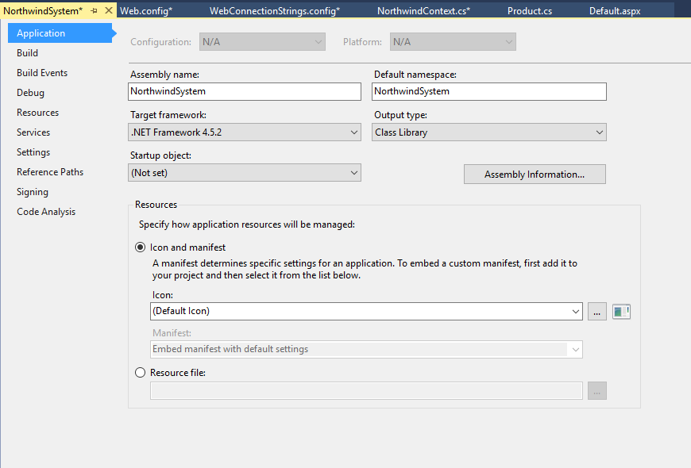
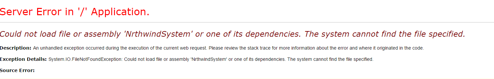

# EntityFramework: Data Access

When ASP.Net first started, users used ADO.Net to access the database. This required mounts of work, redundant setup work. As time went on, as usual, 3rd party individuals attempted to reduce the amount of work needed to access the database using ADO.Net. One popular library was Enterprise Library. This reduce the redundant tedious work of using ADO.net directly. In about 2008, Microsoft introduce EntityFramework to assist developers with database access. ADO.Net was even further removed from developer (hidden). EntityFramework is a set of classes that manage your database access. One links into EntityFramework via inheriting its DBContext class. Using the `DBSet<T>` of this context class (where `<T>` is an entity definition class) and properly annotated entity definition class, database CRUD management has been greatly simplified. **In this course, the entity definition classes will be coded manually by the student so they can get a better understanding of the components needed by EnityFramework. Do not reverse engineer the entities. This will be covered in DMIT2018.**

<https://en.wikipedia.org/wiki/Entity_Framework>

<http://www.entityframeworktutorial.net/what-is-entityframework.aspx>

## EntityFramework in logical Client Server Architecture

EntityFramework will manage the access of data to and from the database (aqua color). The DAL layer will contain a class which will be referred to as the Context class. This class will inherit DbContext from EntityFramework. The commands to query, add, update and delete records will be coded in the BLL classes using the DAL Context Class. The mapping of the sql tables will be done in the Entity classes of the Entity library. These entity classes will be used by the DAL, BLL and PL layers. These classes are data definitions of the sql tables.


## Coding: Create Entity class

When creating your entity class, you are mapping a sql table to a set of properties. The basics of objects does not change. You usually have public properties (private data members if fully implemented) and constructors. What you also have is annotations that are used to assist in the mapping. There are some defaults. Example the [Key] annotation is place with the property that is mapped to the primary key of the sql database. If the name of the property is the same as the name of the sql attribute AND that attribute ends in Id or ID, the [Key] annotation is not needed. If the primary key is an identity attribute, then no other parameters are need for the [Key] annotation.

Required **using** Namespace statements:

```csharp
#region Additional Namespaces
using System.ComponentModel.DataAnnotations.Schema;
using System.ComponentModel.DataAnnotations;
#endregion
```

## Common Annotations:

### `[Table(“sql tablename”,Schema=“sql schemaname”)]`

The `Table` annotation is placed before the public class classname. Use to map sql table to the class entity definition. If the sql database does not have subschemas then the ,Schema(“sql schemaname’) is not needed. If you wish to use it, use dbo as the schemaname.

```csharp
[Table(“myTable”)] or [Table(“myTable”,Schema=“Sales”)]
public class myTable{….. public class myTable{…..
```

### `[Key, Column(Order=n),DatabaseGenerated(DatabaseGeneratedOption.xxxxxx]`

The `[Key]` annotation is place with the property that is mapped to the primary key of the sql database. If the name of the property is the same as the name of the sql attribute AND that attribute ends in Id or ID, the `[Key]` annotation is not needed. If the primary key is an identity attribute, then no other parameters are need for the `[Key]` annotation. The Column parameter is used if the primary key is a compound key. Each property making up the compound key needs an annotation. The Order=n starts at 1 (logical count **not** index) and positions the order of the properties to the order of the compound key. The DatabaseGenerated parameter is used to identify the field type of the sql attribute key. `Xxxxxx` can be `Computed`, `Identity` or `None`. The `Identity` option is the default. If your sql pkey is an identity key, you do not have to use this parameter. None indicates the user will supply the pkey value. Computed is used if the sql attribute is a computed attribute.

```csharp
[Key] // ( a sql identity primary key with a name ending in ID or Id)
public int myIdentityPkeyID{ get; set; }
```

```csharp
[Key,Column(Order=1)] // (a compound primary key of 2 attributes)
public int firstCompoundPFkeyID{ get; set; }
[Key,Column(Order=2)]
public int secondCompoundPFkeyID{ get; set; }
```

```csharp
[Key,DatabaseGenerated(DatabaseGeneratedOption.None)] //( a sql user supplied primary key)
public int myIdentityPkeyID{ get; set; }
```

### `[DatabaseGenerated(DatabaseGeneratedOption.Computed]`

If you have a computed sql attribute, place the DatabaseGenerated annotation before it. This will map the property to the attribute but also indicate that on DML insert and update no value will be supplied by the user. Assume the sql attribute Total is computed using GST and SubTotal.

```csharp
public decimal SubTotal { get; set;}
public decimal GST { get; set;}

[DatabaseGenerated(DatabaseGeneratedOption.Computed] // (no value from user)
public decimal Total { get; set;}
```

### `[ForeignKey(“tablename”)]` (**do not use unless necessary**)

The foreign key annotation is only necessary if the sql foreign key attribute name is different than the sql primary key name. If the FKey name is the same as the PKey name do not use this attribute.

```csharp
[ForeignKey(“pkeytablename”)]
public int differentFKeyPkeyname { get; set;}
```

### `[NotMapped]`

This attribute is used for properties that exist in the definition class that are not directly associated with an sql table attribute. A typical usage is for a read-only property such as Name (a concatenation of FirstName and LastName attributes).

```csharp
[NotMapped]
public string Name { get { return LastName + “, “ + FirstName}}
```

## Entity:Products

This entity has an optional Schema= coded. The property names **match** the sql attribute names. The property names **do not** need to be in the same order as
the sql attributes **if** the property names match the sql attribute names. **If** the names **do not** match then the **physical order** of the properties
are mapped to the **physical order** of the sql attributes. The only not null attributes are ProductID and ProductName on the sql table. Thus, the datatypes
in the entity require the ? mark (except for strings). **Our** coding standard will be to use the **singular name** for the entity definition.

```csharp
using System;
using System.Collections.Generic;
using System.Linq;
using System.Text;
using System.Threading.Tasks;
#region Additional Namespaces
using System.ComponentModel.DataAnnotations.Schema;
using System.ComponentModel.DataAnnotations;
#endregion

namespace NorthwindSystem
{
    [Table("Products",Schema ="dbo")]
    public class Product
    {
        private string _QuanityPerUnit;

        [Key]
        public int ProductID { get; set; }

        public string ProductName { get; set; }
        public int? SupplierID { get; set; }
        public int? CategoryID { get; set; }
        public string QuantityPerUnit
        {
            get
            {
                return _QuanityPerUnit;
            }
            set
            {
                if(string.IsNullOrEmpty(value))
                {
                    _QuanityPerUnit = null;
                }
                else
                {
                    _QuanityPerUnit = value;
                }
            }
        }

        public decimal? UnitPrice { get; set; }
        public Int16? UnitsInStock { get; set; }
        public Int16? UnitsOnOrder { get; set; }
        public Int16? ReorderLevel { get; set; }
        public bool Discontinued { get; set; }
    }
}
```

## Coding: Create DAL Context class

The DAL Context is where we connect to EntityFramework. This is done by having our Context class inherit DbContext from EntityFramework. The constructor of our context class will pass the name of our sql connectionstring to EntityFramework. References to the tables in sql are done by using `DbSet<T>` where `<T>` is one of the entity definition classes. The DbSet is the datatype of a public property in our context class. These property names will be a plural version of the entity definition class name. Our context class access will be **internal** to force users of the NorthwindSystem library to access the library via the BLL methods. Right click on the DAL folder and add a class called **NorthwindContext**. Note the required using statements: NorthwindEntities (for entity definitions) and System.Data.Entity for obtaining necessary EntityFramework references.

### NorthwindSystem.DAL.NorthwindContext:

```csharp
using System;
using System.Collections.Generic;
using System.Linq;
using System.Text;
using System.Threading.Tasks;
#region Additional Namespaces
using System.Data.Entity;
using Northwind.Data.Entities;
#endregion

namespace NorthwindSystem.DAL
{
    internal class NorthwindContext:DbContext
    {
        public NorthwindContext():base("NWDB")
        {
        }

        public DbSet<Product> Products { get; set; }
    }
}
```

## Coding: Configuration setup

The DAL Context is where we connect to the connectionstring for our database. On the context class constructor is a base reference to the connectionstring name. This name will be passed to EntityFramework when an instance of the context class is generated. We need to set up the connectionstring. The connectionstring could be setup in the exitings Web.config file but we will setup a separate config file for all connectionstrings and reference the new file in the Web.config file. This will allow us to alter any connection string without possibly damaging any of the other configuration values of the web site.

- Right click WebSite, select Add/Add New Item.. and scroll down until you file Web Configuration file.
- Select and name the file **WebConnectionStrings**.
- Delete the current contents of this new file.
- Open the Web.Config file.
- Locate the `<connectionStrings>` tag, select and copy the tag.
- Return to the WebConnectionStrings file and paste.
- Add the following under the existing `<add>` tag

```xml
<add name="NWDB"
    connectionString="Data Source=.; Initial Catalog=Northwind_CPSC1517; Integrated Security=true"
    providerName="System.Data.SqlClient"/>
```

- Return to the Web.config file and replace the `<connectionStrings>` tag with

```xml
<connectionStrings configSource="WebConnectionStrings.config" />
```

EntityFramework likes to be helpful by creating tables for the application. When you created the entity definition, one of the annotations was `[Table(“tablename”)]`. If the tablename does not exist in the database, EntityFramework will create the table using your entity definition as the layout for the table when you initially execute the web application. Naturally, this will prevent any abort of a missing object (sql table). However, your new table will have no data. This can cause confusion as there is no abort but no data, and you probably say to yourself…Ughhhhhhh! Why!!.

To avoid this situation, you can add a new tag to the web.config file. By adding this new tag, you will prevent EntityFramework from dynamically creating new tables for you. Thus, if you do mistype the tablename in the entity definition and that tablename does not exits in the database, you will end up getting what you actually expect: an error stating this is **an invalid object** (the missing table).

- Open the web.config file
- Scroll down to the `<entityFramework>` tag
- Enter the following new tag

```xml
<contexts>
    <context disableDatabaseInitialization="true"
        type="NorthwindSystem.DAL.NorthwindContext,NorthwindSystem">
    </context>
</contexts>
```

The Type parameter has two values. The first is the fully qualified class name for the context class. A fully qualified class name consists of the namespace.classname (NorthwindSystem.DAL followed by the classname .NorthwindContext). The second parameter is the assembly name for your library which is typically the project name.

One problem that I normally see is the students create their projects then realize the project name is incorrect (or just not what they wanted). The student will try to rename the project using (r/c Rename). This does not change the original assembly name. To change the assembly name you need to r/c your project library name and select Properties. This will open a window to show you the current Assembly Name and Namespace. You (the student) can then alter the values to their new desired value. It is also wise to check under the button

## Assembly Information…



To ensure that the corrected assembly name is in-effect, I suggest the student open the Bin folder of the Website and locate the library dlls for Northwind (NorthwindEntities.dll, NorthwindEntities.pcb, NorthwindSystem.dll, and NorthwindSystem.pcb). Select these files and delete them. Now do a ReBuild of the Solution.

Another problem that arises with this `<context>` tag is typos. Assume the follow typo of the assembly name: NrthwindSystem (instead of NorthwindSystem) in
the web.config file. The solution is to fix the typo.



## Exercise:

As an exercise, have your students create the entity definitions for the Suppliers and Categories sql tables. Have them update the context class with appropriate `DbSet<T>`. In Categories for Picture use byte[] and for PictureMimeType use string.
