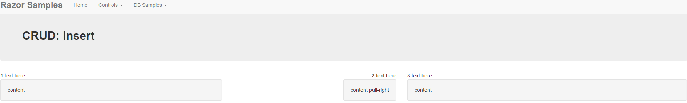
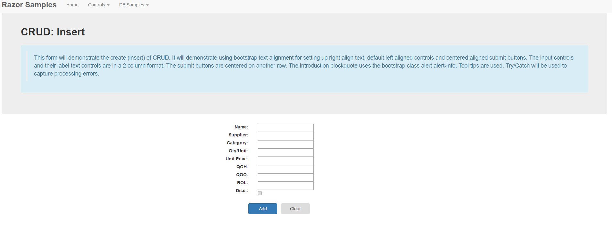

**Objectives:**

**Discuss:**

>   What is CRUD?

>   Various web page styles for CRUD.

>   Entity method for Insert?

>   Handling required and nullable fields.

**Code:**

>   Create an insert page using Product.

**Resources: Student**

Moodle site.

URL Student Notes

**Resources: Instructor**

Lesson 1: CRUD Insert.

**Concepts:**

1. What is CRUD

2. Identity insert vs User supplied pKey insert

3. Using various techniques for CURD

    -   All on one page: Lookup, Insert, Update and Delete

    -   Using a separate page for each (however update and delete still would
        need a lookup on it)

    -   Hybrids: Insert page, Lookup/Update/Delete

    -   Lookup on one page to narrow choice of record then passing data (pkey)
        to an update/delete page.

4. Review Lookup techniques

    -   Using a DropDownList (very small collection, pkey and description text)

    -   Using a Textbox (known pkey say of a bill number)

    -   Multiple step lookup (as a search string for a more refined list to
        chose from)

5. Processing page: basic validation, data collection, .Execute(commandstring,
    list of parameters)

6. Try/Catch processing

**Discuss CRUD.**

CRUD stands for Create (insert), Read (queries), Update and Delete. Insert
places a record on the database, update alters a record on a database, and
delete physically removes a record from the database. CRUD is usually use when
discussing the maintenance of a single record. When your processing involves
altering multiple tables, it is usually referred to as an Online Transaction
Process (OLTP). OLTP will be covered in the next programming course.

Delete can be logically implemented by using a flag. You may not wish to
physically remove a record from the database because of foreign key constraints.
If you remove the record, you may need to remove other records. This may lead to
a loss of valuable historical information (such as pass sales trends, customer
purchasing trends, etc). So to indicate that a particular record is not to be
further used in processing a flag is set. Example, a product has become
discontinued. You do not wish to display it anymore to customers. You cannot
physically remove the record without removing all other data associated with it
(foreign key constraints). So, the product record has a logical flag that
indicates whether to use the record, let’s say the attribute is called
Discontinued. If the attribute is false, the product can be shown for sale; if
true, not shown. Once the attribute is true, queries do not return it for
viewing, therefore, no new sales are generated.

So, how to handle a logical delete. It becomes an update.

Data Validation will be done in the next lesson. Use valid data this lesson for
testing.

Use textboxes this lesson for foreign key value entry. Using dropdown lists to
select a foreign key value will be done in the next lesson.

Update/Delete will be done in the 3rd lesson in CRUD.

**Coding: Create Insert page**

-   Right click WebSite/ Add/ Add New Item/ Content Page file and name it
    Insert.cshtml

-   Open the file containing your website menu (_Menu.cshtml).

-   Create another a menu item to page called Insert.cshtml in a folder called
    DBPages.

**Coding: Practice Text alignment**

-   Use the code below to demonstrate text alignment in columns.

-   First row text only.

-   Second row using the well class
    (<https://www.w3schools.com/bootstrap/bootstrap_wells.asp>). The .well class
    adds a rounded border around an element with a gray background color and
    some padding.

    

>   \

>   \

>   1 text here

>   \</div\>

>   \

>   2 text here

>   \</div\>

>   \

>   3 text here

>   \</div\>

>   \</div\>

>   \

>   \

>   \

>   content

>   \</div\>

>   \</div\>

>   \

>   \

>   content pull-right

>   \</div\>

>   \</div\>

>   \

>   \

>   content

>   \</div\>

>   \</div\>

>   \</div\>

**Coding: Create Insert page form layout**

-   Two column form labels and controls

-   Labels aligned right (text-right)

-   Controls default aligned left.

-   Put in value attribute but leave blank until processing is coded

-   Add a tool tip to some controls using title attribute. Have them add tool
    tip to QOH, QOO and ROL.

-   Submit buttons in own row text-center.

-   Create alert alert-info blockquote. Amount of text is up to you.

>   \@{

>   Page.Title = "Insert";

>   Layout = "\~/_LayoutMenu.cshtml";

>   }

>   \@section banner{

>   \\<strong\>CRUD:
>   Insert\</strong\>\</span\>\<br/\>\<br/\>

>   \

>   \<blockquote\>

>   This form will demonstrate the create (insert) of CRUD. It will  
>   demonstrate using bootstrap text alignment for setting up right align  
>   text, default left aligned controls and centered aligned submit buttons. 
>   The input controls and their label text controls are in a 2 column format. 
>   The submit buttons are centered on another row. The introduction  
>   blockquote uses the bootstrap class alert alert-info. Tool tips are used. 
>   Try/Catch will be used to capture processing errors.

>   \</blockquote\>

>   \</div\> }

>   \<div\>

>   \<form id="theForm" action="" method="post"\>

>   \

>   \

>   \<label id="forProductName"\>Name:\</label\>\ 

>   \<label id="forSupplierID"\>Supplier:\</label\>\ 

>   \<label id="forCategoryID"\>Category:\</label\>\ 

>   \<label id="forQuantityPerUnit"\>Qty/Unit:\</label\>\ 

>   \<label id="forUnitPrice"\>Unit Price:\</label\>\ 

>   \<label id="forUnitsInStock"\>QOH:\</label\>\ 

>   \<label id="forUnitsOnOrder"\>QOO:\</label\>\ 

>   \<label id="forReorderLevel"\>ROL:\</label\>\ 

>   \<label id="forDiscontinued"\>Disc.:\</label\>\ \ 

>   \</div\>

>   \

>   \<input name="ProductName" type="text" value="" title="Product Name." /\>  
>   \ 

>   \<input name="SupplierID" type="text" value=""/\>\ 

>   \<input name="CategoryID" type="text" value=""/\>\ 

>   \<input name="QuantityPerUnit" type="text" value="" /\>\ 

>   \<input name="UnitPrice" type="text" value=""/\>\ 

>   \<input name="UnitsInStock" type="text" value=""  
>   title="Quantity on Hand."/\>\ 

>   \<input name="UnitsOnOrder" type="text" value=""  
>   title="Quantity on Order."/\>\ 

>   \<input name="ReorderLevel" type="text" value=""  
>   title="Reorder Level."/\>\ 

>   \<input name="Discontinued" type="checkbox"  
>   title="Product is discontinued if checked."/\>\ \ 

>   \</div\>

>   \</div\>

>   \<div\>

>   \

>   \<button type="submit" name="formButton" value="submit"

>   class="btn btn-primary" style="width:90px"\>

>   Add

>   \</button\>\&nbsp;&nbsp;

>   \<button type="submit" name="formButton" value="reset"

>   class="btn " style="width:90px"\>

>   Clear

>   \</button\>

>   \</div\>

>   \</div\>

>   \</form\>

>   \</div\>

**Coding: Submit Processing**

Retrieving the data from the form controls will be delayed until the **Add**
submit button has been pressed. This means that the local variables will be
created in the opening coding block but set to empty values. This is needed
because these variables will be used in the form input controls’ value
attribute. If they were created under the If(IsPost), they would be out of scope
by the time they were needed for the form.

**Alternatively**, we could have done the Request.Form[“xxx”] in the opening
coding block. The values for the local variable however, would be null on the
first time processing the page. This would require one to have an **else{ }** on
the If(IsPost). Within this **else{ }**, you would assign the default empty
values.

\@{

Page.Title = "Insert";

Layout = "\~/_LayoutMenu.cshtml";

var thebutton = Request.Form["formButton"];

var productname = "";

var quantityperunit = "";

var unitprice = "";

var unitsinstock = "";

var unitsonorder = "";

var reorderlevel = "";

var selectedsupplier = "";

var selectedcategory = "";

var discontinued = "";

}

The IsPost will determine which button was pressed and act accordingly. Notice
on the Clear (reset) the discontinued variable is set to an empty string. This
is because the values of a checkbox is null (unchecked) or “on” (checked). The
test in the checkbox control determines whether the check is present by using
**string.IsNullOrEmpty().** Anything that is not null or empty is considered
“on”. The other form input controls have then **value=** attributes now set to
the appropriate local variables.

If the Add submit button was pressed the current contents of the input controls
are collected. A Try/Catch is used to capture error messages and display them in
a friendly fashion. The Database is accessed. The sql insert command is created
using placeholders for each of the table fields. Notice the attributes are
indexed and in sequential order. The Execute statement specifies the insert
command followed by a parameter value for each placeholder (order is important).
On the Products table of Northwind just about all attributes are nullable. This
parameter are therefore tested for nullable assignment. ProductName is only to
use the incoming value. The Boolean Discontinued is set to a default zero (0).
Think about it; a new product would not be discontinued. You could have tested
the incoming value and assigned either zero (0) or one (1).

Messages to the user have been text-centered for appearance only.

\@if(IsPost)

{

if (thebutton.Equals("reset"))

{

\
Cleared by user.\</p\>

discontinued = "";

}

else

{

productname = Request.Form["ProductName"];

selectedsupplier = Request.Form["SupplierID"];

selectedcategory = Request.Form["CategoryID"];

quantityperunit = Request.Form["QuantityPerUnit"];

unitprice = Request.Form["UnitPrice"];

unitsinstock = Request.Form["UnitsInStock"];

unitsonorder = Request.Form["UnitsOnOrder"];

reorderlevel = Request.Form["ReorderLevel"];

discontinued = Request.Form["Discontinued"];

try

{

var db = Database.Open("NWDB");

var insertcommand =  
"INSERT INTO Products (ProductName, SupplierID, CategoryID, QuantityPerUnit, "  
+ " UnitPrice, UnitsInStock, UnitsOnOrder, ReorderLevel, Discontinued) "

\+ " VALUES(\@0, \@1, \@2, \@3, \@4, \@5, \@6, \@7, \@8)";

db.Execute(insertcommand, productname,

string.IsNullOrEmpty(selectedsupplier) ? null : selectedsupplier,

string.IsNullOrEmpty(selectedcategory) ? null : selectedcategory,

string.IsNullOrEmpty(quantityperunit) ? null : quantityperunit,

string.IsNullOrEmpty(unitprice) ? null : unitprice,

string.IsNullOrEmpty(unitsinstock) ? null : unitsinstock,

string.IsNullOrEmpty(unitsonorder) ? null : unitsonorder,

string.IsNullOrEmpty(reorderlevel) ? null : reorderlevel,

0);

\
\\<strong\>  
New product added to file.\</strong\>\</span\>\</p\>

}

catch (Exception ex)

{

\
\  
\<strong\>\@ex.Message\</strong\>\</span\>\</p\>

}

}

}

\<form id="theForm" action="" method="post"\>

\

\

\<label id="forProductName"\>Name:\</label\>\ 

\<label id="forSupplierID"\>Supplier:\</label\>\ 

\<label id="forCategoryID"\>Category:\</label\>\ 

\<label id="forQuantityPerUnit"\>Qty/Unit:\</label\>\ 

\<label id="forUnitPrice"\>Unit Price:\</label\>\ 

\<label id="forUnitsInStock"\>QOH:\</label\>\ 

\<label id="forUnitsOnOrder"\>QOO:\</label\>\ 

\<label id="forReorderLevel"\>ROL:\</label\>\ 

\<label id="forDiscontinued"\>Disc.:\</label\>\ \ 

\</div\>

\

\<input name="ProductName" type="text" value="\@productname"  
title="Product Name." /\>\ 

\<input name="SupplierID" type="text" value="\@selectedsupplier" /\>\ 

\<input name="CategoryID" type="text" value="\@selectedcategory" /\>\ 

\<input name="QuantityPerUnit" type="text"  
value="\@quantityperunit" /\>\ 

\<input name="UnitPrice" type="text" value="\@unitprice" /\>\ 

\<input name="UnitsInStock" type="text" value="\@unitsinstock"  
title="Quantity on Hand." /\>\ 

\<input name="UnitsOnOrder" type="text" value="\@unitsonorder"  
title="Quantity on Order." /\>\ 

\<input name="ReorderLevel" type="text" value="\@reorderlevel"  
title="Reorder Level." /\>\ 

\<input name="Discontinued" type="checkbox"  
title="Product is discontinued if checked."

\@(string.IsNullOrEmpty(discontinued) ?"":"checked") /\>\ \ 

\</div\>

\</div\>

\<div\>

\

\<button type="submit" name="formButton" value="submit"

class="btn btn-primary" style="width:90px"\>

Add

\</button\>\&nbsp;&nbsp;

\<button type="submit" name="formButton" value="reset"

class="btn " style="width:90px"\>

Clear

\</button\>

\</div\>

\</div\>

\</form\>
