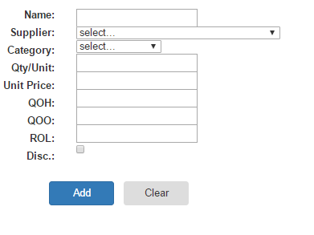

**Objectives:**

**Discuss:**

>   Managing foreign key selections?

**Code:**

>   Using \<Select\> for foreign key selections.

**Resources: Student**

Moodle site.

URL Student Notes

URL HTML5 (sitepoint)

URL HTML5 (developer.mozilla)

URL Validator controls (mikesdotnetting)

**Resources: Instructor**

Lesson 2: CRUD Insert using dropdownlist for foreign keys.

**Concepts:**

1. Why use dropdownlist to select foreign key references?

2. Dynamically creating dropdownlist (\<Select\>) from the database

3. Maintaining position in dropdownlist

**Discuss foreign key references.**

Discuss foreign keys in sql, their requirement when specified, need to exist on
the “parent” table. User should not have to guess the actual value. Using a
dropdownlist to select the reference should supply the true key value. The
\<Select\> always for 2 pieces of data: Display Text (seen by the user) and Data
Value (which can be retrieve and used by the system in CRUD).

**Coding: Add sql commands for obtaining foreign key collections**

-   Move the Database.Open line to the opening coding block after the creation
    of the local variables.

-   Add 2 query command statements

-   Add 2 .Query() statements each executing a query and obtaining a data
    collection. Each collection will be sorted and contain 2 columns.

>   Since the query commands are expect to return 0, 1 or more records, you must
>   use the .Query() database command. This is different the .QuerySingle()
>   which is expecting 0 or 1 record. .Query() can also use placeholders.
>   Testing on Query() for empty is **variablename.Count() == 0.**

var db = Database.Open("NWDB");

var supplierquery = "SELECT SupplierID, CompanyName "

\+ "FROM Suppliers "

\+ "ORDER BY 2";

var categoryquery = "SELECT CategoryID, CategoryName "

\+ "FROM Categories "

\+ "ORDER BY 2";

var suppliers = db.Query(supplierquery);

>   var categories = db.Query(categoryquery);

**Coding: Update Form**

We will be removing the textbox input controls for Supplier and Category. We
will replace these with \<Select\> controls. Filling these controls will be done
using a **foreach** loop for each respect control using their respective data
collection. Within each loop, there will be a test to determine if some entry
beside the prompt line should be shown. This positioning will be done against
the **selectedsupplier** and **selectedcategory** local variables.

Replace the two \<input\> controls for SupplierID and CategoryID with the
following. The foreach will loop through the respective collection from the 1st
record to the last record. Within the loop, the integer primary key
(SupplierID/CategoryID) on the sql record will be compared to the string value
of the control that was obtained earlier in the processing. If they are the
same, the \<option\> tag also has the **selected** attribute added to position
the dropdownlist. The [index] technique has been used to reference the column on
the sql query results. You could also have used the column title name technique.

>   \<select id="SupplierID" name="SupplierID"\>

\<option value="0"\>select...\</option\>

\@foreach (var item in suppliers)

{

if (item[0].ToString() == selectedsupplier)

{

\<option value="\@item[0]" selected\>\@item[1]\</option\>

}

else

{

\<option value="\@item[0]"\>\@item[1]\</option\>

}

}

\</select\>\ 

\<select id="CategoryID" name="CategoryID"\>

\<option value="0"\>select...\</option\>

\@foreach (var item in categories)

{

if (item[0].ToString() == selectedcategory)

{

\<option value="\@item[0]" selected\>\@item[1]\</option\>

}

else

{

\<option value="\@item[0]"\>\@item[1]\</option\>

}

}

\</select\>\ 

**Coding: Update Processing**

The handling of the local variables for the dropdownlists, need to be updated.
Since these new \<Select\> controls will always have a value (0, 1, 2, …), we
can set the default value to 0 (prompt line).

\@{

Page.Title = "Insert";

Layout = "\~/_LayoutMenu.cshtml";

var thebutton = Request.Form["formButton"];

var productname = "";

var quantityperunit = "";

var unitprice = "";

var unitsinstock = "";

var unitsonorder = "";

var reorderlevel = "";

var selectedsupplier = "0";

var selectedcategory = "0";

var discontinued = "";

}

During the IsPost processing, the .Execute() statement will change. The fields
will not be tested against .IsNullOrEmpty() but instead against zero (0).

db.Execute(insertcommand, productname,

selectedsupplier.Equals("0") ? null : selectedsupplier,

selectedcategory.Equals("0") ? null : selectedcategory,

string.IsNullOrEmpty(quantityperunit) ? null : quantityperunit,

string.IsNullOrEmpty(unitprice) ? null : unitprice,

string.IsNullOrEmpty(unitsinstock) ? null : unitsinstock,

string.IsNullOrEmpty(unitsonorder) ? null : unitsonorder,

string.IsNullOrEmpty(reorderlevel) ? null : reorderlevel,

0);
