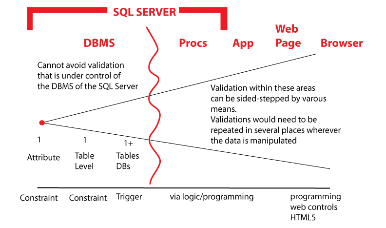

**Objectives:**

**Discuss:**

>   Validation of input data on the form.

**Code:**

>   Using Validator controls

**Resources: Student**

Moodle site.

URL Student Notes

URL HTML5 (sitepoint)

URL HTML5 (developer.mozilla)

URL Validator controls (mikesdotnetting)

**Resources: Instructor**

Lesson 3: CRUD Insert using validation.

**Concepts:**

1. HTML5 features (type=, step/min/max, required)

2. Using various techniques for Validator Controls and IsValid in processing

**Discuss need to validate incoming data**.

It is assumed that any data on a database “should” be valid. However, this is
not always the case. If you have run into an example in your career, talk about
it.

Here is one of mine. Alberta Health Care, 1982. I (Don Welch) received a
sequential copy of the database for a project/system. The data was suppose to be
valid. There were problems using the data with the supplied data field
descriptions. One field (Sex) was to have 4 codes M (male), F (female), B (male
16 and under) and G (female 16 and under). This field had ?, !, empty, all kinds
of errors. An edit of the data was performed and a print out of width 3 inches
was created. Obviously, there was problems with the validity of the data. There
were over 2.3 million records in this file.

**Coding: Validator Controls**

-   Validation.Add(controlname,Validator.xxxx(attributes)[,
    Validator.xxxx(attributes),…]).

-   Can have multiple Validators per control.

-   .xxxx is validator type and (attributes) vary depending on validator type
    but will always allow for an error message as one of the attributes.

    -   DateTime(“error msg”)

    -   Decimal(“error msg”)

    -   EqualsTo(“another controlname”, “error msg”)

    -   Float(“error msg”)

    -   Integer(“error msg”)

    -   Range(double min, double max, ”error mgs”)

    -   Regex(expression,”error msg”)

    -   Required(“error msg”)

    -   StringLength(max,min,”error mgs”)

    -   Url(“error msg”)

-   I normally place the Validation code in the opening coding block.

-   Validator controls do not “fire” unless there is data within the control,
    exception .Required()

-   Validator controls “fire” when the Validation.IsValid() method is executed
    during your processing logic on the server side. HTML5 validation occurs on
    the client side.

-   Order of validator definition does not matter

-   Range validator min and max values must be doubles but the data itself can
    be integer or decimal or double. You can also use double.MinValue or
    double.MaxValue.

//these validator controls execute on the server side

Validation.Add("ProductName",

Validator.Required("Product Name is a required field"),

Validator.StringLength(40, 1, "Product Name is limited to 40 characters"));

//minimum length of QuantityPerUnit is zero (0) since it is not a required field

Validation.Add("QuantityPerUnit",

Validator.StringLength(20, 0, "Qty/Uniy is limited to 20 characters"));

Validation.Add("UnitPrice",

Validator.Range(0.0, double.MaxValue, "Unit Price must be greater than 0.00"));

Validation.Add("UnitsInStock",

Validator.Range(0.0, 32767.0, "QOH must be between 0 and 32,767"));

Validation.Add("UnitsOnOrder",

Validator.Range(0.0, 32767.0, "QOO must be between 0 and 32,767"));

Validation.Add("ReorderLevel",

Validator.Range(0.0, 32767.0, "ROL must be between 0 and 32,767"));

//sample of using .EqualsTo() which compares two fields.

//Validation.Add("PassWord",

// Validator.EqualsTo("ConfirmPassWord", "Password invalid confirmation"));

//this is just an example of using .Regex() validator

//Validation.Add("PostalCode",

// Validator.Regex(\@"\^[A-Za-z][0-9][A-Za-z][0-9][A-Za-z][0-9]\$","Postal Code
has invalid format (T6Y7U8)"));

**Coding: Update Form**

-   Display of errors can be done in a summary; \@Html.ValidationSummary()

-   or with the input control \@Html.ValidationMessage("controlname")

>   \@\* you can display your error message in a summary group

>   the default display is a bulleted list

>   all associated messages for validations are displayed \*\@

>   \@Html.ValidationSummary()

>   \<form id="theform" action="" method="post"\>.

>   Or

\@\* error message can be display any where such as

beside the field that is in error \*\@

\<input type="text" name="ProductName" id="ProductName"

value="\@productname" /\>

\@Html.ValidationMessage("ProductName")

>   \<br/\>

**Coding: Update Processing**

To have the Validation controls fire, on the client side you need to execute the
method Validation.IsValid(). This method returns a true or false. If there are
errors with the data, the error messages associated with the validation will
automatically be generated and display for you. There is no need for an “else”
on this test. We will still want to retain data that has already been entered on
the form, thus the validation test is after the retrieval of the raw data from
the input controls. The test is done before any attempt at conversion from the
default string input to any other datatype.

reorderlevel = Request.Form["ReorderLevel"];

discontinued = Request.Form["Discontinued"];

if (Validation.IsValid())

{

Do the rest of your processing

}

**Coding: Logic processing validation**

There are times when using validation controls or HTML5 validation just does not
measure up to the task. An example is ensuring a selection has been made from a
dropdownlist that contains a prompt line. This situation can be handled with
logic.

The supplier and category are nullable fields on the sql table. We can handle
this by testing for the prompt line and submitting a null value in its place (as
we have done Lesson 2). However, if we *assume* that these fields *were
required*, then we could test the list’s selected value programmability. Lets
see how the web page code would change **if** this logic testing was included.

if (Validation.IsValid())

{

if (selectedsupplier.Equals("0"))

{

\
\\<strong\>  
Please select a supplier\</strong\>\</span\>\</p\>

}

else if (selectedcategory.Equals("0"))

{

\
\\<strong\>  
Please select a category\</strong\>\</span\>\</p\>

}

else

{

try

{ …
