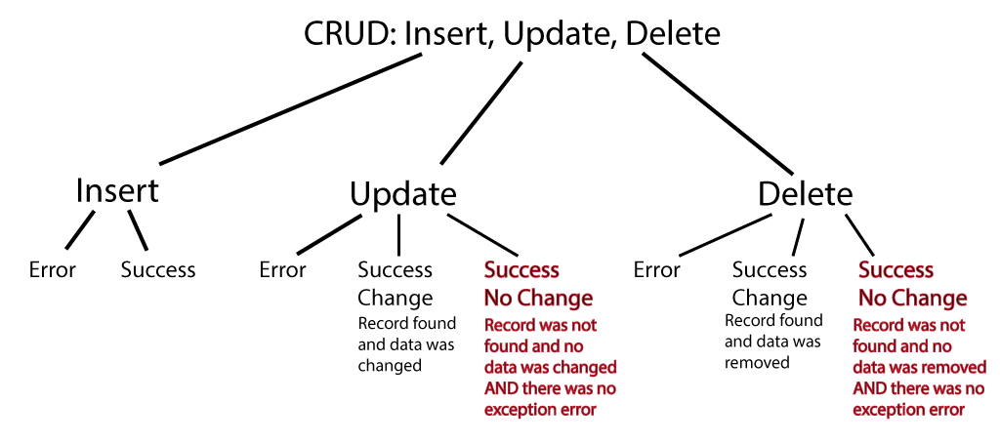
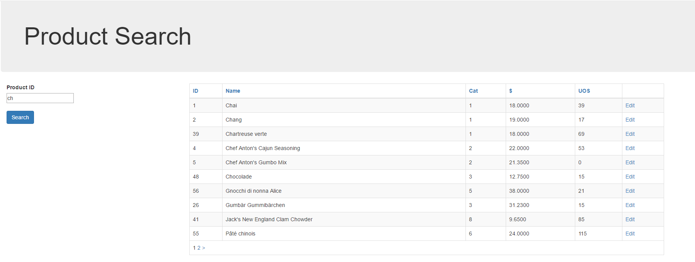
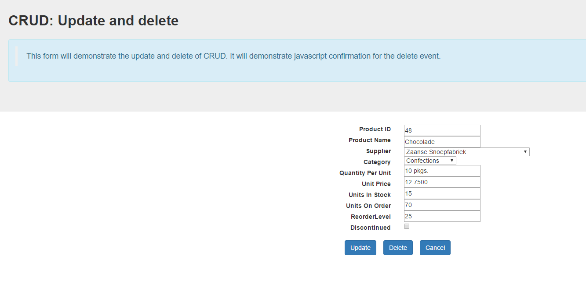

**Objectives:**

**Discuss:**

>   CRUD: Update and Delete?

>   Why lookup first?

>   Difference between Insert and Update?

>   Confirmation on Delete.

**Code:**

>   Demonstrate Product Update and Delete.

**Resources: Student**

Moodle site.

URL Student Notes

Starting Kit for Product Update and Delete

**Resources: Instructor**

Lesson 4: CRUD Update and Delete.

**Concepts:**

1. What is CRUD: Update and Delete

2. Lookup for current data before actions

3. Using various techniques for CURD: Delete

    -   Physical removal of a record

    -   Logical removal of a record

    -   Confirmation of a delete action

4. Review Lookup techniques

    -   Using a DropDownList (very small collection, pkey and description text)

    -   Using a Textbox (known pkey say of a bill number)

    -   Multiple step lookup (as a search string for a more refined list to
        chose from)

5. Processing page: basic validation for update, no validation for delete

**Discuss CRUD.**

CRUD stands for Create (insert), Read (queries), Update and Delete. Insert
places a record on the database, update alters a record on a database, and
delete physically removes a record from the database. CRUD is usually use when
discussing the maintenance of a single record. When your processing involves
altering multiple tables, it is usually referred to as an Online Transaction
Process (OLTP). OLTP will be covered in the next programming course.

Update is very similar to inserting. The difference is the update includes the
primary key processing for identity primary keys. The Primary Key should be
displayed in read-only field and was filled during a lookup.

Stress that testing needs to be done on the success of an apparent update or
delete.

Delete can be logically implemented by using a flag. You may not wish to
physically remove a record from the database because of foreign key constraints.
If you remove the record, you may need to remove other records. This may lead to
a loss of valuable historical information (such as pass sales trends, customer
purchasing trends, etc). So to indicate that a particular record is not to be
further used in processing a flag is set. Example, a product has become
discontinued. You do not wish to display it anymore to customers. You cannot
physically remove the record without removing all other data associated with it
(foreign key constraints). So, the product record has a logical flag that
indicates whether to use the record, let’s say the attribute is called
Discontinued. If the attribute is false, the product can be shown for sale; if
true, not shown. Once the attribute is true, queries do not return it for
viewing, therefore, no new sales are generated.

So, how to handle a logical delete. It becomes an update.

**Coding: Down Load ProductEdit startup kit**

-   Down load the ProductEdit starter kit zip file, unzip and move
    ProductSearch.cshtml and ProductEdit.cshtml under the DBPages folder of the
    class demonstration solution.

-   Open the file containing your website menu (_Menu.cshtml).

-   Create another a menu item to page called ProductSearch.cshtml in a folder
    called DBPages.

**Coding: ProductSearch.cshtml**

-   This page works without any changes.

-   Partial string lookup: discuss the creation of the partial string variable.
    A great way to prevent sql injection attack when using the .Query() with a
    parameter.

-   WebGrid in a form. If(IsPost) within a form.

-   Review passing data from one page to another

-   Because WebGrid is in a form, javascript is needed to do proper paging (just
    seems to be the way to go to solve paging problem). This is different then a
    WebGrid *not* in a form.

>   \@\* Since the webgrid is in the form (method:post), the webgrid's
>   method:Get used

>   for paging has a problem.

>   The following script cause a post to happen on the webgrid's paging even
>   \*\@

>   \<script type="text/javascript"\>

>   var links = \$('a[href\*=page], a[href\*=sort]'), form = \$('form');

>   links.click(function () {

>   form.attr("action", this.href);

>   \$(this).attr("href","javascript:");

>   form.submit();

>   });

>   \</script\>

**Coding: ProductEdit.cshtml**

-   Two column form labels and controls

-   Labels aligned right (text-right)

-   Controls default aligned left.

-   Put in value attribute but leave blank until processing is coded

-   Pre-coded pass data retrieval (.QueryString[“label”] (review).

-   Input control retrieval. Handling of checkbox, converting null (unchecked)
    to 0. Assign incoming ProductID value to local variable for primary lookup.

-   Lookup of data (Suppliers, Category, and Product record).

-   Validation in place.

-   An else of the if(IsPost) loads the current database values for the record
    that is to be edited or deleted.

**Coding: Additional Processing to be added**

Add a local variable to catch the value of the submit button.

The processing of this form will replace the HTML paragraph **\<p\>your coding
goes here\</p\>**.

Create a branched If/Else if to process the 3 buttons. Put simply paragraph text
as process (\<p\>your xxxx coding goes here\</p\>) where xxxx is Cancel, Update
or Delete. Run to ensure this works.

if (formbutton.Equals("cancel"))

{

\<p\>your cancel coding goes here\</p\>

}

else if (formbutton.Equals("update"))

{

\<p\>your update coding goes here\</p\>

}

else

{

\<p\>your delete coding goes here\</p\>

}

**Cancel Event**.

Replace the temporary html paragraph the following code.

//a)could redirect to search page

//b)reset data to the current record for productid

//c)empty the data fields.

//for b and c you should also supply a message to the user

productid = "";

productname = "";

supplierid = "0";

categoryid = "0";

quantityperunit = "";

unitprice = "";

unitsinstock = "";

unitsonorder ="";

reorderlevel = "";

discontinued = "0";

\<p\>\

User has cancel the action. Return to search for another product\</span\>

\<a href="\~/DBPages/ProductSearch.cshtml"\>go to search...\</a\>\</p\>

**Update Event**.

The primary key will already be loaded in a read-only input control when the
form first comes up (as will the other record data). Since the user should not
be able to change this in normal usage there should be no concern. However, it
is those individuals who attempt to disrupt your site for which you need to be
on alert. As such, it is always good practice to ensure this value still exists
before attempting any other processing. So, check to see if the primary key
exists. If not produce a message and stop the processing.

If you do have the pkey value, then execute your server side validation.

If the validation is successful, you can update your record. Create the update
sql command (very similar to the insert command). Execute the command this time
capturing the integer result of the .Execute(). This value indicates how many
records were affected. This value should be one (with an update that is not
based on the pkey, say a general 10% increase in unit price, the value could be
\>1). It however, could be zero. Why? Well, between the time the user first
looked up the record and their actual update, the record could have been removed
from the data base. Assume, the user looked up the record, was interrupted by a
phone call (30 minutes), and then did the update. What happened in that 30
minutes? Remember this is a multiple user on-line website. So, if the affected
valued is \> 0, a record was changed successfully. If the affected value is zero
(0), no record was changed but, also, no exception was encountered. Appropriate
messages should be created in both cases. Of course, the hold update is encase
in a Try/Catch.

//check is there a productid to update

//if not message to use to get new product

//if present

// cause validations

// if valid

// create update command

// execute

// message

// wrap in try/catch

if (string.IsNullOrEmpty(productid))

{

\<p\>\

No product selected. Return to search for another product

\</span\>

\<a href="\~/DBPages/ProductSearch.cshtml"\>go to search...\</a\>

\</p\>

}

else

{

if (Validation.IsValid())

{

try

{

var updatecommmand = "UPDATE Products SET "

\+ "ProductName = \@0, "

\+ "SupplierID = \@1, "

\+ "CategoryID = \@2, "

\+ "QuantityPerUnit = \@3, "

\+ "UnitPrice = \@4, "

\+ "UnitsInStock = \@5, "

\+ "UnitsOnOrder = \@6, "

\+ "ReorderLevel = \@7, "

\+ "Discontinued = \@8 "

\+ "WHERE ProductID = \@9";

//the placeholders expect a value not to be confused

// with a character string

//the null (as a value) is NOT equal to "null" which is a string

int results = db.Execute(updatecommmand, productname,

supplierid == "0" ? null : supplierid,

categoryid == "0" ? null : categoryid,

string.IsNullOrEmpty(quantityperunit) ? null : quantityperunit,

string.IsNullOrEmpty(unitprice) ? null : unitprice,

string.IsNullOrEmpty(unitsinstock) ? null : unitsinstock,

string.IsNullOrEmpty(unitsonorder) ? null : unitsonorder,

string.IsNullOrEmpty(reorderlevel) ? null : reorderlevel,

discontinued, productid);

if (results \> 0)

{

\<p\>\Product updated. \</span\>\</p\>

}

else

{

\<p\>\

Update failed. No product called \@productname with an id of \@productid  
on file. \</span\>

\</p\>

}

}

catch (Exception ex)

{

\<p\>\Deleted failed. Error
\@ex.Message\</span\>\</p\>

}

}

}

**Delete Event**.

The primary key will already be loaded in a read-only input control when the
form first comes up (as will the other record data). Since the user should not
be able to change this in normal usage there should be no concern. However, it
is those individuals who attempt to disrupt your site for which you need to be
on alert. As such, it is always good practice to ensure this value still exists
before attempting any other processing. So, check to see if the primary key
exists. If not produce a message and stop the processing.

Unlike, the update, no Validation is necessary.

In a Try/Catch, create you sql Delete command, execute (.Execute()), capture the
rows affected. Now, for the same reasons as in update, check the rows affected
and produce the appropriate message. To ensure the user does not attempt to
delete the same record twice, it is best to empty the pkey input control. This
will cause the user to do another lookup and the removed record will not be
available. Optionally you could clear out all the input controls.

//check is there a productid to delete

//if not message to use to get new product

//if present

// create delete command

// execute

// message

// wrap in try/catch

if (string.IsNullOrEmpty(productid))

{

\<p\>

\

No product selected. Return to search for another product

\</span\>

\<a href="\~/DBPages/ProductSearch.cshtml"\>go to search...\</a\>

\</p\>

}

else

{

try

{

var deletecommmand = "DELETE Products WHERE ProductID = \@0";

int results = db.Execute(deletecommmand, productid);

if (results \> 0)

{

\<p\>

\

Product deleted.

\</span\>

\</p\>

productid = "";

//optionally clear the fields.

//productname = "";

//supplierid = "0";

//categoryid = "0";

//quantityperunit = "";

//unitprice = "";

//unitsinstock = "";

//unitsonorder = "";

//reorderlevel = "";

//discontinued = "0";

}

else

{

\<p\>

\

Delete failed. No product called \@productname with an id of  
\@productid on file.

\</span\>

\</p\>

}

}

catch (Exception ex)

{

\<p\>

\

Deleted failed. Error \@ex.Message

\</span\>

\</p\>

}

}

Now you may have noticed that you did not have a chance to confirm to cancel
your delete. Ouch!!

A little javascript can help here. NOTE: the id attribute on the submit button
must be **unique.** It will be used by the javascript .getElementById(…).

\

\<button type="submit" name="theButton" id="theUpdate" class="btn btn-primary"  
value="update"\>Update\</button\>\&nbsp;&nbsp;&nbsp;

\<button type="submit" name="theButton" id="theDelete" class="btn"
value="delete"\>  
Delete\</button\>\&nbsp;&nbsp;&nbsp;

\<button type="submit" name="theButton" id="theCancel" class="btn"
value="cancel"\>  
Cancel\</button\>

\</div\>

\@\* this javascript will allow for a confirmation dialog to appear

when a particular button is pressed (theDelete) \*\@

\<script type="text/javascript"\>

document.getElementById("theDelete").onclick = ConfirmDelete;

function ConfirmDelete() {

return confirm("Are you sure you want to remove \@productname");

}

\</script\>

\</form\>

Another problem that could appear, depending on your coding, is that the client
side validation happens for the Cancel and Delete. To override this problem add
another attribute to the submit buttons: formnovalidate.

\<button type="submit" name="theButton" id="theDelete" class="btn"
value="delete"  
formnovalidate\>Delete\</button\>\&nbsp;&nbsp;&nbsp;

The last concern is whether to actually physically remove the record or do a
logical remove. A logical removal is done by setting a record attribute which
acts a flag to its appropriate value. In the case of the Product record, a
physical removal may not be the best choice. Instead, in the delete code, do an
update that alters the Discontinued attribute.

if (string.IsNullOrEmpty(productid))

{

\<p\>

\

No product selected. Return to search for another product

\</span\>

\<a href="\~/DBPages/ProductSearch.cshtml"\>go to search...\</a\>

\</p\>

}

else

{

try

{

var deletecommmand = "Update Products "  
+ "SET Discontinued = 1 "  
+ "WHERE ProductID = \@0";

int results = db.Execute(deletecommmand, productid);

if (results \> 0)

{

\<p\>

\

Product discontinued.

\</span\>

\</p\>

productid = "";

}

else

{

\<p\>

\

Discontinued failed. No product called \@productname with an  
id of \@productid on file.

\</span\>

\</p\>

}

}

catch (Exception ex)

{

\<p\>

\

Discontinued failed. Error \@ex.Message

\</span\>

\</p\>

}

}
