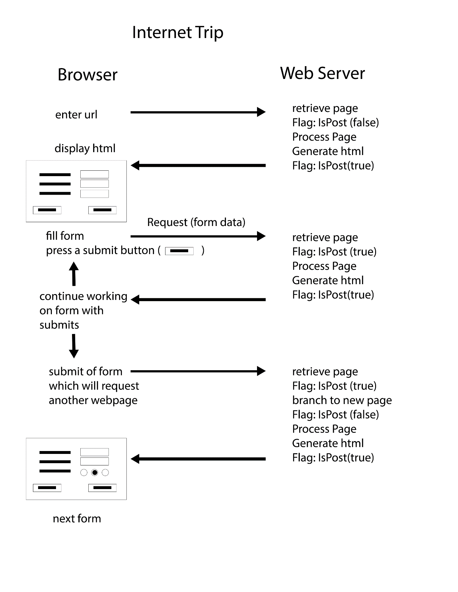
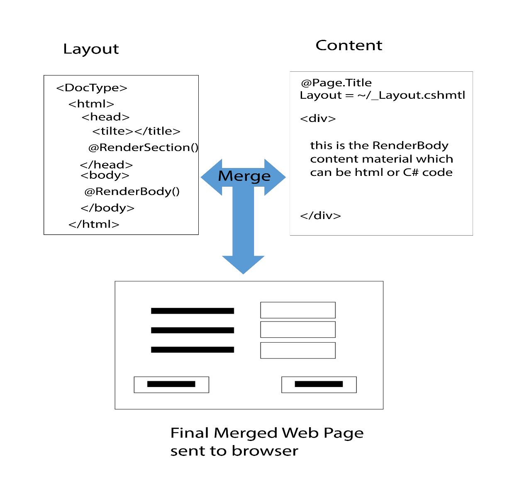
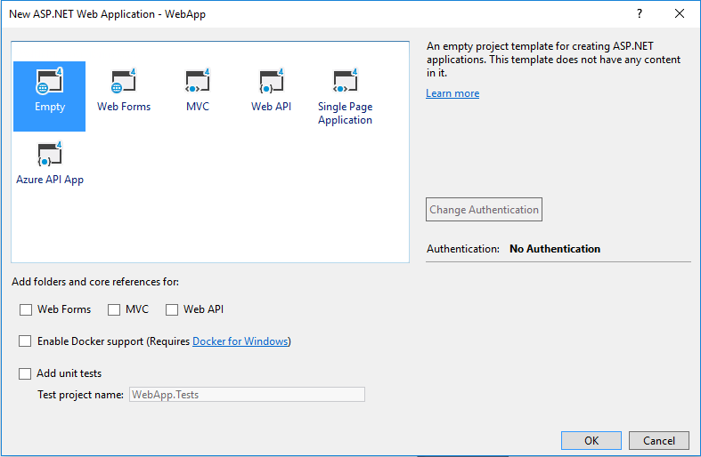

**Objectives:**

**Discuss:**

>   What is the internet trip?

>   How does the web server determine PostBack.

>   Difference between a stand-alone html page and Layout/ViewPage page setup

>   Discuss components of a .Net web application project (web.config, files
>   starting with an underscore (_), …)

>   Discuss structure of Layout/ViewPage pages

**Code:**

>   Create a Visual Studio solution using an empty web site.

>   Create a Hello Layout/ ViewPage page

**Resources: Student**

Moodle site.

URL Student Notes

Url Introduction to ASP.Net Web Programming Using the Razor Syntax (C\#)

Url A Beginner’s Guide to HTML & CSS

Url HTML Form Fields

**Resources: Instructor**

Lesson 1: Website basics using Razor and Forms

**Concepts:**

1. Internet Trip (Request and Response objects)

2. WebServer use of PostBack

3. General actions on web server for page processing

4. Web Forms Stand-alone vs Layout/ ViewPage

5. \_Layout cshtml file (\@Page, \@RenderBody, \@RenderSection(sectionname,
    required: true/false)

6. ViewPage cshtml file (\@{ Razor coding block }, Page.Ttile, Layout page
    setting, default area is the RenderBody content material, \@section)

Highlights:

-   Web server does not “remember” web pages, (retrieve, process, forget)

-   IsPost Flag is false for first access, true of repeat postings (submissions)
    as long as you remain on that page.

-   If you return to a page during a session after viewing a different page, the
    page is treated as a first access again.

-   Request Object part of internet structure and carries data to web server.

Discussion of Layout/ ViewPage pages. Layout is the site pattern. ViewPage is
the page material. HTML main tags and blocking should be done on Layout page.
ViewPage replaces any \@RenderBody or \@RenderSection. Underscore on file name
(_Layout) means the page is not directly accessible to the browser.

Benefits on Layout/ ViewPage: consistent site layout, could have several site
layout styles dependent on user (guest vs member), lower maintenance, content
centric web pages

Coding:

Create a new visual studio solution: **FormsAndRazor (this can also be done when
selecting the project)**

Create an ASP.Net Web Applicatin: **WebApp**  
(remember to navigate to the solution folder, stress to students LOCATION)

Create a Web Page (MVC 5 View Page (Razor): **StandAlone**  
(StandAlone discuss html tags, delete)

Create a Layout Page: **\_Layout.cshtml** (note file extension, basic web page
html tags)

Create a ViewPage Page with Layout (Razor): **Default.cshtml**  
(note file extension, link to layout page)

Modify Layout Page:

-   Add a \@RenderSection(“banner”, required: true) above \@RenderBody

-   Add \  before and after \@RenderBody

-   Add \
 followed by a \@RenderSection(“footer”,
    required: false) below \@RenderBody

Modify Default Page:

-   Add Page.Title = "Hello"; in front of Layout

-   Run: note error missing section

-   Add \@section banner after opening code block and add an \<h1\> Hello World
    \</h1\>

>   \@section banner{

>   \<h1\>Hello World\</h1\>}

-   Run: discuss meaning of required true vs false

-   Add \@section footer with \<p\>&copy CPSC1517, Nait Today's date is
    \@DateTime.Today.ToLongDateString().\</p\>

-   Run

-   Move \@section banner code to after \@section footer code

-   Run: note physical position of \@section on Content page does NOT need to be
    matching the physical order of Renders on the \_Layout page. However, for
    maintenance purposes, it might be better to keep the logical order the same.

-   Place a \<div\> between the banner and footer. This will represent the body
    of the form. The tags are not really necessary. Enter some text within the
    \<div\>. This text will go inside the \@RenderBody of the layout page. It
    could actually go after the footer if you desire. Anything not in a
    specified RenderSection or the opening coding block is part of the
    RenderBody.

-   Run
