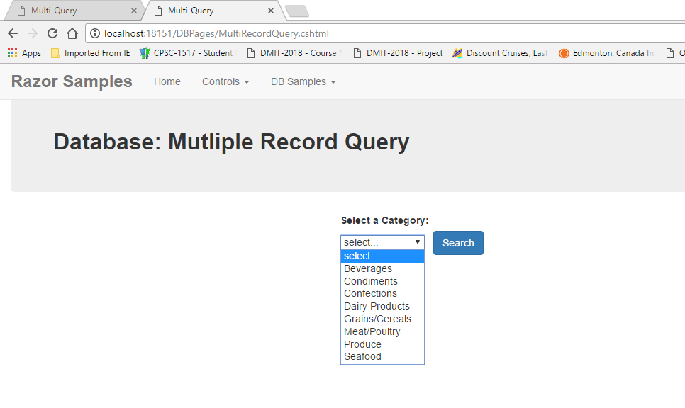

**Objectives:**

**Discuss:**

>   Displaying multiple records (WebGrid vs Table).

>   Using multiple pages for processing.

**Code:**

>   Create a multiple record query.

>   Create dynamic drop down list.

>   Passing data between pages using Get

-   Response.Redirect with arguments,

-   Request.QueryString[]

>   Load a webgrid (default)

**Resources: Student**

Moodle site.

URL Student Notes

doc Basic Search Techniques

**Resources: Instructor**

Lesson 2: Search and Display of multi-record database query.

**Concepts:**

1. Creating a dropdownlist dynamically from database data

2. QuerySingle vs Query vs QueryValue execution

3. Passing data between webpages

4. Difference between requirements for displaying multiple records from a
    query:Table vs WebGrid

**Coding:Query Page**

-   Open the file containing your website menu (_Menu.cshtml).

-   Create a new menu item in the DropDownMenu area DB Samples for a multiple
    record query which uses a context page called
    /DBPages/MultiRecordQuery.cshtml.

-   Create two content pages called MultiRecordQuery.cshtml and
    MultiRecordWebGrid.cshtml within the DBPages folder.

-   Set your Title, Layout and banner section on your new pages.

This page will load a dropdown list \<Select\> with data from the Categories
table. The ddl will have a prompt line. The process will test for a selection.
If no selection made: appropriate error message. If a slection was made then the
results will be tested. An empty collection (.Count() == 0) will cause an
appropriate message. A collection with contents will cause a transfer to page
two of the query which contains the webgrid. The webgrid could be displayed on
this first page but the design of the lesson is to include page to page transfer
of data.

The second page, webgrid, will use Request.QueryString[] to access the passed
data. A test will be done for null on the receiving value. If the content page
was called without data being passed, maybe it was by a hacker. If the value is
null then the first is recalled. If a value was passed, then the query is
re-executed on this page and the result dumped into a webgrid. Customizing the
webgrid will be done in the next lesson.

Start the page by retrieving all of the Categories records for the dropdownlist.
The Query( ) method has been used because many records are expected to be
returned. It is nice to have this collection sorted. The collection needs two
values: a text display value (CategoryName) and an associate data value
(CategoryID). This collection will be used to load the dropdownlist.

The dropdownlist has a prompt line added as the first entry. The foreach loop is
executed for each category record in the collection. For each category record,
an \<option\> tag is created using the record’s text display field and data
value field. Remember, you can reference these fields using the [index] or
property technique. Yes you can mix the two.

The post processing ensures that a category was selected. A query using the
selected category list value has been postponed just to demonstrate the queries
do NOT always have to be done in the first coding block. Testing of a Query( )
collection is done using .Count() == 0 (different then QuerySingle which is
results == null).

Page redirection is done using the Response.Redirect(“pagename”) command. In
this demonstration we wish to also pass an argument value to the next page. To
indicate that arguments are attached to the url address (page), following the
pagename with a question (?) mark. Next the argument is created. This consists
of two parts: argument label and argument value (label=value). In older browser
the total length of the url was 256 characters; now it is 3000 characters. If
you have multiple arguments to pass, separate each argument group with an
ampersand (& such as arg1=value&arg2=value …). It is important to note that the
label and value will be in **plain text** when it is seen in the url of the next
page. Therefore, **due consideration** needs to be used with what is passed
using this technique.

\@{

Page.Title = "Multi-Query";

Layout = "\~/_LayoutMenu.cshtml";

var categorylist = Request.Form["CategoryList"];

if (categorylist == null)

{//the first time the content page is activated

// the categorylist will be null because there was

// no CategoryList in existence yet

//it the value to a unknown value of the appropriate

// datatype

//Zero was chosen because primary keys are never zero.

categorylist = "0";

}

var db = Database.Open("NWDB");

//get the data for the dropdownlist

//this needs to be done prior using the collection

// in the loop under the \<Select\> tag

var ddlcommand = "SELECT CategoryID, CategoryName "

\+ "FROM Categories "

\+ "ORDER BY CategoryName";

var ddlResults = db.Query(ddlcommand);

}

\@section banner{

\\<strong\>Database: Mutliple Record
Query\</strong\>\</span\>}

\<div\>

\@if (IsPost)

{

//user did not select a region, ddl still sitting on the prompt line

if (categorylist.Equals("0"))

{

\<p\>\Make a select of a category.\</span\>\</p\>

}

else

{

//demonstration

//accessing the database for the product list can be delayed until

// the user has pressed the submit button

var querycommand = "SELECT ProductName "

\+ "FROM Products "

\+ "WHERE CategoryID = \@0";

var results = db.Query(querycommand, categorylist);

if (results.Count() == 0)

{

\<p\>\No products for this  
category.\</span\>\</p\>

}

else

{

//pass a value from this content pass to the indicated page

//? indicates argument(s) are to follow

//an argument is made up of a label=value

//multiple arguments are separated by a &

//this uses the Get posting so the value will appear

// on the url

Response.Redirect("MultiRecordWebGrid.cshtml?cid=" + categorylist);

}

}

}

\<form id="theForm" action="" method="post"\>

\

\

\<label id="forCategoryList"\>Select a Category:\</label\>\ 

\<select id="CategoryListID" name="CategoryList"\>

\<option value="0"\>select...\</option\>

\@foreach (var item in ddlResults)

{

//loop through the collection of records

// in ddlResults

//create a line in the ddl for each item

// in ddlResults

//referencing of the data items on each row

// is done using the [index] technique

// one could have used properties .CategoryID and

// .CategoryName

\<option value="\@item[0]"\>\@item[1]\</option\>

}

\</select\>\&nbsp;&nbsp;

\<button type="submit" name="formButton" value="submit"

class="btn btn-primary"\>

Search

\</button\>

\</div\>

\</div\>

\</form\>

\</div\>  

**Coding:WebGrid Page**

This content page will not appear on the menu. It is to be called only by the
Query page. This page will be expecting a value to be passed to it. This value
will be retrieved using Request.QueryString[“arglabel”]. The value supplied will
be captured as a string. If the arglabel was not passed to the page, its value
will be null. You can test this value against null. If the value is null, then
you can redirect yourself back to the query page for a proper value.

The page uses the passed value to obtain the necessary data from the database.

The passed value is used to obtain the category name from the Categories table.
The query used here is QueryValue() which expects to return a single value (not
record) from the sql query.

Next, the passed value is used to obtain the Product records for the category.
This collection is then placed in a display. The display of multiple records can
be done using two basic techniques: dynamically create a \<table\> or use a
control called a WebGrid (which creates the table for you). Unless you wish
something other than a standard grid table, WebGrid is very convenient. Create
an instance of WebGrid assigning the collection to it then display the instance.

It should be noted that this display does not use a form. Paging is an integral
part of the WebGrid.

\@{

Page.Title = "WebGrid";

Layout = "\~/_LayoutMenu.cshtml";

//rid is the argument label from the sending page

//QueryString returns either null (if argument did not exists) or

// a string value

var categoryid = Request.QueryString["cid"];

if (string.IsNullOrEmpty(categoryid))

{

Response.Redirect("MultiRecordQuery.cshtml");

}

var db = Database.Open("NWDB");

var scalarcommand = "SELECT CategoryName "

\+ "FROM Categories "

\+ "WHERE CategoryID = \@0";

//QueryValue returns a single value (not a record) from the query

//this value will be used in titling the WebGrid display

var categoryname = db.QueryValue(scalarcommand, categoryid);

var querycommand = "SELECT ProductID, ProductName, UnitPrice, UnitsInStock,  
Discontinued "

\+ "FROM Products "

\+ "WHERE CategoryID = \@0 "

\+ "ORDER BY 2";

var results = db.Query(querycommand, categoryid);

//create an instance of WebGrid

//notice the collection is passed at the time of instantiation

var gridinstance = new WebGrid(results);

}

\@section banner{

\\<strong\>Database:
WebGrid\</strong\>\</span\>}

\<div\>

\

\\<strong\>Products for
\@categoryname\</strong\>\</span\>

\<!--Display the WebGrid instance in its default display--\>

\@gridinstance.GetHtml();

\</div\>

\</div\>
