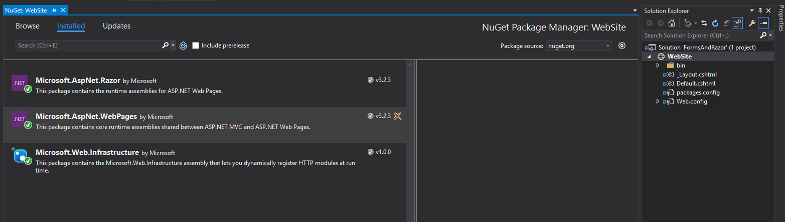
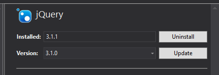
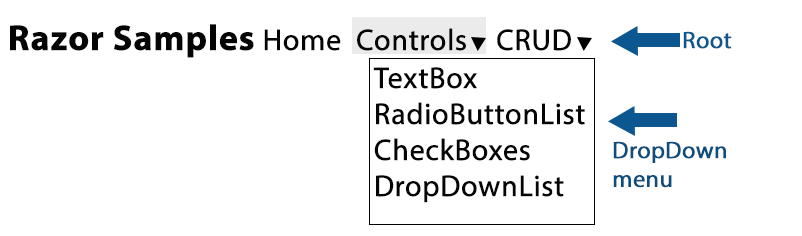

**Objectives:**

**Discuss:**

>   Managing NuGet Packages.

>   Menus and navigation.

**Code:**

>   Creating a menu within Layout page.

Creating menu as a separate file and using \@RenderPage

**Resources: Student**

Moodle site.

URL Student Notes

Url Introduction to ASP.Net Web Programming Using the Razor Syntax (C\#)

Url Bootstrap

Url A Beginner’s Guide to HTML & CSS

Url HTML Form Fields

**Resources: Instructor**

Lesson 1: Menus and Navigation

**Concepts:**

1. Menus Simple at root

2. Drop Down Menus

3. Bootstrap and menus

4. Relative address of web pages starting at web site root (\~/)

5. \@RenderPage and menu in own file

**NuGet packages**

-   Right click on project select Manage NuGet Packages….

-   Check out Installed packages

    -   Microsoft.AspNet.Razor

    -   Microsoft.AspNet.WebPages

    -   Microsoft.Web.Infrastructure

-   Select Browse

Add the following packages by entering name in Search and install

-   Mircosoft.AspNet.WebPages.Data (search web pages data)

-   Mircosoft.AspNet.WebPages.WebData (search web pages web data)

-   BootStrap (search bootstrap **install 3.3.7**)

-   JQuery.js (currently 3.3.1)

-   popper.js (come in with bootstrap 4.0.0 +)

Data packages will not actually be needed until we start using a database.
Bootstrap is used for formatting the web pages.

Updating Packages.

**NuGet indicates when updates are available for your installed packages. Be
careful what you update. Some update packages will cause problems with the code
in these lessons.**

**Coding: Bootstrap**

Add lang=”en” to the \<html\> tag in the \_Layout file.

From Scripts/Content folders, drag the following files to the page after the
\<title\> tag. Order seems to be important on future pages with the script
files.

-   Jquery-3.3.1.js (script)

-   Bootstrap.css (content)

-   Bootstrap.js (script)

Sample use of bootstrap classes: jumbotron,container. Remember css can be
overridden by creating your .css file. You could then use the \@RenderSection
head on your content pages to add the customized css to the merged pages. If you
have a customized global css file to use, place it after the three entries above
and before the \@RenderSection head

-   Place a \
 around the banner placeholder on the
    layout page. Then run.

-   Place a \
 around the jumbotron div on the layout
    page. Then run

-   Place a \
 around the jumbotron div on the
    layout page. Then run

-   Move body and footer into container \<div\>. Then run

-   Create a css stylesheet called myStyleSheet.css then drag to layout page
    after other links. Run  
    .jumbotron {

padding-top: 10px;

padding-bottom: 10px;

margin-bottom: 10px;

}

-   Go to Default.cshtml (our home page), enter \@section head in front of
    banner section, move the link statement from the layout page to this
    section. Run

**Coding: Menus**

Menus should be located in a single place for ease of maintenance, consistency,
and available to all site pages. Therefore, menus can be created into the layout
file or a separate file and referenced by the layout file. The image shows a
menu created using bootstrap formatting. Razor Sample is using the navbar-band
class with enhanced font-size and strong tags. The Home Controls CRUD is known
as menu root layer. TextBox, RadioButtonList, CheckBoxes, DropDownList is a
first level dropdown menu.

\<!--this will be the menu area--\>

\

\<!--this will be the title on the menu--\>

\

\<a class="navbar-brand" style="font-size:x-large"\>\<strong\>Razor  
Samples\</strong\>\</a\>

\</div\>

\<!--this will be the menu root items--\>

\<ul class="nav navbar-nav"\>

\<!--this will be a menu item--\>

\<li\>\<a href="\@Href("\~/default.cshtml")"\>Home\</a\>\</li\>

\<!--this will be the drop down menu--\>

\<li class="dropdown"\>

\<!--this will be the dropdown menu root item--\>

\<a href="\#" class="dropdown-toggle" data-toggle="dropdown"\>Controls  
\<b class="caret"\>\</b\>\</a\>

\<!--this will be the dropdown menu items--\>

\<ul class="dropdown-menu"\>

\<li\>\<a href="\@Href("\~/Controls/TextBoxes.cshtml")"\>TextBoxes\</a\>\</li\>

\<li\>\<a href="\@Href("\~/Controls/RadioButtonList.cshtml")"\>  
RadioButtonList\</a\>\</li\>

\<li\>\<a
href="\@Href("\~/Controls/CheckBoxes.cshtml")"\>CheckBoxes\</a\>\</li\>

\<li\>\<a href="\@Href("\~/Controls/DropDownList.cshtml")"\>  
DropDownList\</a\>\</li\>

\</ul\>

\</li\>

\</ul\>

\</div\>  
\<br/\>\ 

Place this menu after the \
 and before \

**Coding: Menu File and \@RenderPage**

Menus can be place in a separate physical file. The file can then be referenced
in the layout file using \@RenderPage. This allows maintenance of the menu (and
any accidental errors) would not touching the site structure. It is a safer way
of menu implementation.

-   Create a new Content page called \_Menu.cshtml. Delete the existing code.

-   Copy your menu code from the \_Layout page into the \_Menu page.

-   Make a copy of your current \_Layout.cshtml page. Right click on page,
    select copy. Right click on project name, select paste. Select the new file
    name and rename to \_LayoutMenu.

-   In the \_LayoutMenu page remove the menu code. Replace with
    \@RenderPage(“\~/_Menu.cshtml”).

-   Go to the default page and copy the current Layout line. Change the file to
    \_LayoutMenu. Comment out the original Layout line.

-   Test, notice no difference to the user.

-   To fully test create a new folder in the project called Controls. Add 4
    ViewPages with Layout called TextBoxes, RadioButtonList, CheckBoxes,
    DropDownList within this new folder. Within each page, add the page title
    line. Add a banner line with the control type as the text. Have your
    students create these pages as an exercise. **NOTE: I have not suggested
    adding the \@section head to these files. See if your students notice the
    difference in the page banner from the home page.**
