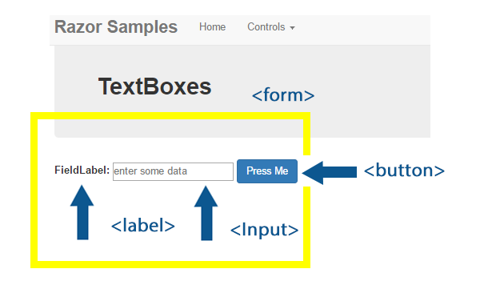
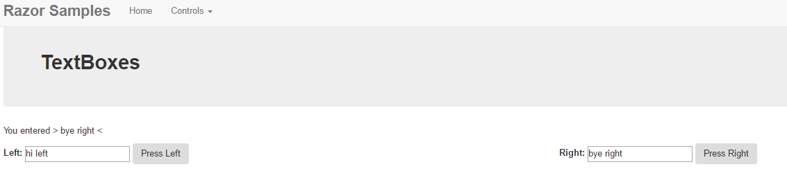

**Objectives:**

**Discuss:**

>   Forms and method of post.

>   Input controls. Label, TextBoxes, submit buttons.

>   Bootstrap column formatting.

>   IsPost (review Internet Trip)

>   \@ symbol (escape from html to C\#)

>   Request object.

**Code:**

>   Creating a content page with a form using label, textboxes and submit
>   buttons.

Demonstrate form processing using C\#.

**Resources: Student**

Moodle site.

URL Student Notes

Url Introduction to ASP.Net Web Programming Using the Razor Syntax (C\#)

Url Bootstrap

Url A Beginner’s Guide to HTML & CSS

Url HTML Form Fields

**Resources: Instructor**

Lesson 3: Forms, Input Controls, Form Processing

**Concepts:**

1. Forms and Data collection

2. Types of input controls

3. Request objects, form input controls/submit buttons

4. Processing on a Razor web page

5. Retaining data within an input control

6. Formatting using bootstrap for column layouts

**Bootstrap: Columns**

-   class=”row” The **bootstrap** grid is composed of 12 columns that can be
    adjusted in any combination within a **row** as long as they add up to 12.
    You can think of them as containment **rows** such as the likes of
    table **rows**, which are meant to separate different **rows** of content

-   class=”col-xx-nn” columns allocation can be by size (expected device) and
    number (1-12 in a row)

    -   xx

        -   lg (large) monitors

        -   md (medium) laptops/small monitors

        -   sm (small) tablets/laptops

        -   xs (extra small) mobile devices

    -   nn number of required columns 1-12

-   Class=” offset-xx-nn” will move columns nn to the right.

**Bootstrap: form-group**

The .form-group class is the easiest way to add some structure to forms. Its
only purpose is to provide margin-bottom around a label and control pairing. As
a bonus, since it’s a class you can use it with \<fieldset\>s, \<div\>s, or
nearly any other element. Aids in software that can associate a label and
control for disabled users (sight impaired).

\<form\>

\

\<label for="formGroupExampleInput"\>Example label\</label\>

\<input type="text" class="form-control" id="formGroupExampleInput"  
placeholder="Example input"\>

\</div\>

\

\<label for="formGroupExampleInput2"\>Another label\</label\>

\<input type="text" class="form-control" id="formGroupExampleInput2"  
placeholder="Another input"\>

\</div\>

\</form\>

**Form**

**The content page is processed from the start of the physical file to the end
of the file.**

\@{

Page.Title = "TextBoxes";

Layout = "\~/_LayoutMenu.cshtml";

var controlnamevariable = Request.Form["controlname"];

}

\@section banner{

\\<strong\>TextBoxes\</strong\>\</span\>}

\<div\>

\@if (IsPost)

{

\<p\>You entered \&gt; \@controlnamevariable \&lt;\</p\>

}

\<form id="theform" action="" method="post"\>

\<label for="forcontrolname"\>FieldLabel:\</label\>

\<input type="text" name="controlname" id="controlnameid"  
value="\@controlnamevariable" placeholder="enter some data" /\>

\<button type="submit" name="formbutton" id="formbuttonid" class="btn
btn-primary"

value="submit"\>Press Me\</button\>

\</form\>

\</div\>

**Request.Form[“controlname”]**

To obtain input data from form controls use Request.Form[“controlname”] where
the controlname is the name= parameter on an input control. Data will be
supplied as a string.

On the first access of the context page, you need to remember that this form has
yet to be sent to the user (internet trip). That means the form does NOT exists
yet. Therefore “controlname” does NOT exist yet, however, the command will NOT
abort. Instead, if a control does not exist, the value from Request.Form[] is
null. Once the form is sent to the user and submitted back (postback), then the
control will exist. Remember, this is C\# so these string (“controlname”) are
case-sensitive and spelling is important.

**\<form id=”formname” action=”” method=”post”\>**

-   Indicates the form. You can have multiple forms on a page but we will limit
    it to one.

-   The action attribute specifies where to send the form-data when a form is
    submitted. Action can be blank (stay on this window)

-   The method attribute specifies how to send form-data (the form-data is sent
    to the page specified in the action attribute). The form-data can be sent as
    URL variables (with method="get") or as HTTP post transaction (with
    method="post").

    -   Notes on GET

        -   Appends form-data into the URL in name/value pairs

        -   The length of a URL is limited (about 3000 characters)

        -   Never use GET to send sensitive data! (will be visible in the URL)

        -   Useful for form submissions where a user want to bookmark the result

        -   GET is better for non-secure data, like query strings in Google

    -   Notes on POST

        -   Appends form-data inside the body of the HTTP request (data is not
            shown is in URL)

        -   Has no size limitations

        -   Form submissions with POST cannot be bookmarked

Controls

-   \<Label\> used to place text next to an input control to act as a prompt for
    the user

-   \<input\> used to obtain data from the user

    -   Type= type of input expected, can many formats, Text is most general,
        TextBox

    -   Name= value used to identify control for Request.Form[]

    -   Id value used by javascript to identify an element

    -   Value= used to supply text to be displayed in control

    -   Placeholder= text that acts as a prompt for the control. Is NOT data.

-   \<button\> used to cause a post back to web server of the web page
    type=”submit”

    -   Name= value used to identify control for Request.Form[]

    -   Id value used by javascript to identify an element

    -   Value= used to supply a value for Request.Form[]

**Processing:**

-   \@if(IsPost)

    -   the \@ escapes to C\#

    -   IsPost flag is false on first page access, true on posting access

    -   \<p\> paragraph to be added to web page only if page is a post back

    -   \@controlnamevariable excapes paragraph to C\# and access C\# variable

Demo Exercise:

Create a 2 column form; which with a label, textbox, submit button. Processing,
determine under IsPost, which button was press and display the data of the
appropriate column.

-   Copy and paste label,input and button lines

-   Rename all controls indicating column,

-   \*\*\*\*\<button\> name= attributes use the **same** name but a
    **different** value\*\*\*\*\*

-   Add \
 to each set of controls

-   Alter present Request.Form to reference left column input control

-   Add Request.Form to reference right column input control

-   Add Request.Form to reference the submit button name.

Code:

\@{

Page.Title = "TextBoxes";

Layout = "\~/_LayoutMenu.cshtml";

var controlnamevariableleft = Request.Form["controlnameleft"];

var controlnamevariableright = Request.Form["controlnameright"];

var buttonpressed = Request.Form["formbutton"];

}

\@section banner{

\\<strong\>TextBoxes\</strong\>\</span\>}

\<div\>

\@if (IsPost)

{

if (buttonpressed.Equals("left"))

{

\<p\>You entered \&gt; \@controlnamevariableleft \&lt;\</p\>

}

else

{

\<p\>You entered \&gt; \@controlnamevariableright \&lt;\</p\>

}

}

\<form id="theform" action="" method="post"\>

\

\

\<label for="forcontrolnameleft"\>Left:\</label\>

\<input type="text" name="controlnameleft" id="controlnameleftid"  
value="\@controlnamevariableleft" placeholder="enter some data" /\>

\<button type="submit" name="formbutton" id="formbuttonid" class="btn"

value="left"\>

Press Left

\</button\>

\</div\>

\

\<label for="forcontrolnameright"\>Right:\</label\>

\<input type="text" name="controlnameright" id="controlnamerightid"  
value="\@controlnamevariableright" placeholder="enter some data" /\>

\<button type="submit" name="formbutton" id="formbuttonid" class="btn"

value="right"\>

Press Right

\</button\>

\</div\>

\</div\>

\</form\>

\</div\>

Testing can be done with either ctrl + F5 (no debug) or F5 (debug). If you are
doing F5, you can put in breakpoints, watch values, hold your cursor on
variables to see value, step through code. If you do use F5, then close the
browser tab, the program is still running. You will need to stop the program
(use red square on icon menu bar).
