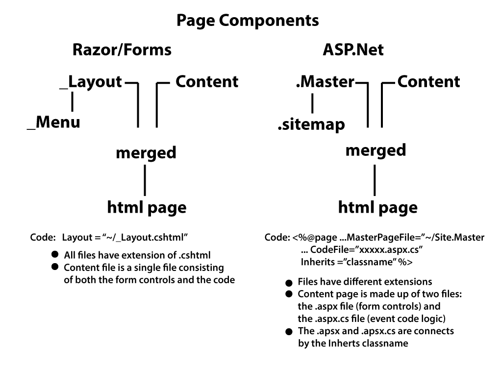

**Objectives:**

**Discuss:**

>   What is ASP.Net?

>   The Internet Trip with ASP.Net

>   Differences between Razor Forms and ASP.Net.

>   Similarities between Razor Forms (Layout/ViewPage) and ASP.Net
>   (Master/Content).

**Code:**

>   Create initial ASP.Net solution and Web Application project.

>   Explore Web Application folders and files.

>   Explore IDE and navigation between files.

**Resources: Student**

Moodle site.

URL Student Notes

**Resources: Instructor**

Lesson 1: Introduction to ASP.Net Web pages.

**Concepts:**

1. What is ASP. Net.

2. Basic internet trip is unchanged.

3. Razor and Forms vs ASP.Net

    -   Structure Layout/ViewPage similar to Master/Content

    -   Controls act in an expect fashion but ASP.Net have many more

    -   Logic processing Razor/Forms top to bottom vs Master/Content event
        driven (overview).

    -   Razor/Forms (small to medium size organizations) vs ASP.Net large to
        enterprise size organizations)

**Discuss ASP.Net.**

Readings: <https://en.wikipedia.org/wiki/ASP.NET>

<https://msdn.microsoft.com/en-us/library/4w3ex9c2.aspx>

ASP.NET is a unified Web development model that includes the services necessary
for you to build enterprise-class Web applications with a minimum of coding.
ASP.NET is part of the .NET Framework, and when coding ASP.NET applications you
have access to classes in the .NET Framework. You can code your applications in
any language compatible with the common language runtime (CLR), including
Microsoft Visual Basic and C\#. These languages enable you to develop ASP.NET
applications that benefit from the common language runtime, type safety,
inheritance, and so on.

The Three Flavors of ASP.NET: Web Forms, MVC, and Web Pages
-----------------------------------------------------------

ASP.NET offers three frameworks for creating web applications: ASP.NET Web
Forms, ASP.NET MVC, and ASP.NET Web Pages. All three frameworks are stable and
mature, and you can create great web applications with any of them.

Each framework targets a different audience or type of application. Which one
you choose depends on a combination of your web development experience, what
framework you’re most comfortable with, and which is the best fit for the type
of application you’re creating. All three frameworks will be supported, updated,
and improved in future releases of ASP.NET.

Here's an overview of each of the frameworks and some ideas for how to choose
between them.

### ASP.NET Web Forms (.aspx pages)

The Web Forms framework targets developers who prefer declarative and
control-based programming, such as Microsoft Windows Forms (WinForms) and
WPF/XAML/Silverlight. It offers a WYSIWYG designer-driven (drag-and-drop)
development model, so it's popular with developers looking for a rapid
application development (RAD) environment for web development. If you’re new to
web programming and are familiar with the traditional Microsoft RAD client
development tools (for example, for Visual Basic and Visual C\#), you can
quickly build a web application without having expertise in HTML and JavaScript.

In particular, the Web Forms model provides the following features:

-   An event model that exposes events which you can program like you would
    program a client application like WinForms or WPF.

-   Server controls that render HTML for you and that you can customize by
    setting properties and styles.

-   A rich assortment of controls for data access and data display.

-   Automatic preservation of state (data) between HTTP requests, which makes it
    easy for a programmer who is accustomed to client applications to learn how
    to create applications for the stateless web.

Web Forms works well for small teams of Web developers and designers who want to
take advantage of the large number of components available for rapid application
development. In general, creating a Web Forms application requires less
programming effort than creating the same application by using the ASP.NET MVC
framework. The components
(the [Page](https://msdn.microsoft.com/en-us/library/system.web.ui.page.aspx) class,
controls, and so on) are tightly integrated and usually require less code than
ASP.NET MVC applications. However, Web Forms is not just for rapid application
development. There are many complex commercial apps and app frameworks built on
top of Web Forms.

Because a Web Forms page and the controls on the page automatically generate
much of the markup that's sent to the browser, you don't have the kind of
fine-grained control over the HTML that the other ASP.NET models offer. An
event-driven, control-focused model hides some of the behavior of HTML and HTTP.
For example, it's not always possible to specify exactly what markup might be
generated by a control.

The Web Forms model doesn't lend itself as readily as ASP.NET MVC to
patterns-based development, [separation of
concerns](http://en.wikipedia.org/wiki/Separation_of_concerns), and [automated
unit testing](http://en.wikipedia.org/wiki/Unit_testing). If you want to write
code factored that way, you can; it’s just not as automatic as it is in the
ASP.NET MVC framework. The [ASP.NET Web Forms
MVP](http://webformsmvp.com/) project shows an approach that facilitates
separation of concerns and testability while maintaining the rapid development
that Web Forms was built to deliver. As an example of this in action, Microsoft
SharePoint is built using Web Forms MVP.

### ASP.NET MVC

ASP.NET MVC targets developers who are interested in patterns and principles
like [test-driven
development](http://en.wikipedia.org/wiki/Test-driven_development), [separation
of concerns](http://en.wikipedia.org/wiki/Separation_of_concerns), [inversion of
control](http://en.wikipedia.org/wiki/Inversion_of_control) (IoC),
and [dependency
injection](http://en.wikipedia.org/wiki/Dependency_injection) (DI). This
framework encourages separating the business logic layer of a web application
from its presentation layer.

By dividing the application into the [model (M), views (V), and controllers
(C)](http://en.wikipedia.org/wiki/Model-view-controller), ASP.NET MVC can make
it easier to manage complexity in larger applications. With ASP.NET MVC, you can
have multiple teams working on a web site because the code for the business
logic is separate from the code and markup for the presentation layer —
developers can work on the business logic while designers work on the markup and
JavaScript that is sent to the browser.

With ASP.NET MVC, you work more directly with HTML and HTTP than in Web Forms.
Web Forms tends to hide some of that by mimicking the way you would program a
WinForms or WPF application. For example, Web Forms can automatically preserve
state between HTTP requests, but you have to code that explicitly in MVC. The
MVC model enables you to take complete control over exactly what your
application is doing and how it behaves in the web environment.

MVC was designed to be extensible, providing power developers the ability to
customize the framework for their application needs. In addition, the ASP.NET
MVC source code is available under an [OSI
license](http://www.opensource.org/licenses).

MVC 4 includes a feature that helps you develop HTTP services that reach a broad
range of clients, including browsers and mobile devices. For more information,
see [Getting Started with ASP.NET Web
API](http://go.microsoft.com/?linkid=9804906). MVC 4 also helps you develop
single-page applications (SPAs) that use client-side JavaScript for responsive
client interaction. For more information, see [Single Page Application
Overview](http://go.microsoft.com/?linkid=9804907).

For more information about ASP.NET MVC, see [ASP.NET
MVC](http://go.microsoft.com/fwlink/?LinkId=216782).

### ASP.NET Web Pages (.cshtml and .vbhtml files)

ASP.NET Web Pages targets developers who want a simple web development story,
along the lines of PHP. In the Web Pages model, you create HTML pages and then
add server-based code to the page in order to dynamically control how that
markup is rendered. Web Pages is specifically designed to be a lightweight
framework, and it's the easiest entry point into ASP.NET for people who know
HTML but might not have broad programming experience — for example, students or
hobbyists. It's also a good way for web developers who know PHP or similar
frameworks to start using ASP.NET.

Like Web Forms, Web Pages is oriented toward rapid development. Web Pages
provides components called *helpers* that you can add to pages and that let you
use just a few lines of code to perform tasks that would either be tedious or
complex. For example, there are helpers to display database data, add a Twitter
feed, log in using Facebook, add maps to a page, and so on.

Web Pages provides a simpler approach than Web Forms. If you look at a .cshtml
or .vbhtml file, you can generally think of the logic as executing top-to-bottom
in the file, as you would with PHP, SHTML, etc. And because .cshtml and .vbhtml
files are essentially HTML files that have additional ASP.NET code in them, they
lend themselves easily to adding client-side functionality via JavaScript and
jQuery.

For more information about ASP.NET Web Pages, see [ASP.NET Web
Pages](http://www.asp.net/web-pages) on the ASP.NET web site.

### General Notes

All three ASP.NET frameworks are based on the .NET Framework and share core
functionality of .NET and of ASP.NET. For example, all three frameworks offer a
login security model based around a membership API, and all three share the same
facilities for managing requests, handling sessions, and so on that are part of
the core ASP.NET functionality.

In addition, the three frameworks are not entirely independent, and choosing one
does not preclude also using another. For example, MVC views are often written
as .cshtml or .vbhtml files (using "Razor" syntax), which means they can take
advantage of some of the Web Pages features like helpers. Since the frameworks
can also coexist in the same web application, it's not uncommon to see
individual components of an application written using different frameworks. For
example, the bulk of a site might be written in MVC, but the data access portion
of the site might be written using Web Forms because it’s such an easy framework
in which to perform data access. In these cases, the developers choose the
hybrid solution that plays to their strengths and makes their lives the easiest
for their particular scenarios.

As of March 28, 2012, Microsoft has placed ASP.NET MVC 4, ASP.NET Web API, and
ASP.NET Web Pages v2 (Razor syntax) under the open source [Apache 2.0
license](http://www.apache.org/licenses/LICENSE-2.0.html).  ASP.NET Web Forms is
not included. For more information, see [ASP.NET MVC, Web API, Razor and Open
Source](http://weblogs.asp.net/scottgu/archive/2012/03/27/asp-net-mvc-web-api-razor-and-open-source.aspx) (ScottGu’s
blog) and [ASP.NET MVC 4, ASP.NET Web API and ASP.NET Web Pages v2 (Razor) now
all open source with
contributions](http://www.hanselman.com/blog/ASPNETMVC4ASPNETWebAPIAndASPNETWebPagesV2RazorNowAllOpenSourceWithContributions.aspx) (Scott
Hanselman’s blog).

The remaining sections of this topic provide an overview of ASP.NET features
that are common to all three ASP.NET frameworks or unique to Web Forms.

**Internet trip**

Basically unchanged, accept instead of testing for if (IsPost), it will be if
(Page.IsPostBack). The actual life cycle and event handling can be reviewed in
the file Postbacks, Event Handling and Page Lifecycle.ppt (moodle: ASP.Net Web
Forms: PostBack PowerPoint).

**Discuss Razor/Forms vs ASP.Net webpages**

**Coding: Create new ASP.Net Website**

-   Create a new blank VS solution called BasicAPSX.

-   Right click solution name (BasicAPSX)/ Add/ New Project / ASP.NET Web
    Application (.NET Framework). Name the project WebApp

    -   Select Web Forms

    -   Check Change Authentication:

        -   No authentication (web application is not concerned about security

        -   Individual User Accounts (preferred) allow users to use security
            (DMIT2018)

            

-   Overview components of website:

    -   Account: pages for user registration to web site application (more of
        this in DMIT2018)

    -   App_Data: include a database within the website, database would be an
        .sdf file; we will not be using this as we have an external sql server
        available.

    -   App_Start: includes configuration files and start up authentication
        default files

    -   Bin: not seen in Solution Explorer but is seen via Windows Explorer in
        the project folder; compiled libraries (dynamic link libraries).

    -   Content: css files

    -   Fonts: fonts

    -   Model: IdentityModels containing security classes (more of this in
        DMIT2018)

    -   Scripts: javascript files

    -   Other files: webpages, support/startup (Global.asax) files, master
        files, configuration files

**Coding: Practice Navigating IDE**

>   When you created your website, the Default.aspx file should be displayed.

-   Menu and edit icons. If you are missing your quick icons for the Text
    Editor, right click beside the existing icons to obtain the drop down menu
    choices: select Text Editor.

-   On the left side (by default) is the Toolbox which contains the controls for
    ASP.Net. There are several categories and each have several controls. Each
    control is an object (which mean they have properties and behaviours).

-   On the right side (by default) is the Solution Explorer (similar to
    Razor/Forms) and a Properties window. In the Solution Explorer window the
    About page has been expanded to show the .aspx.aspx.cs and aspx.designer.cs
    files.

-   At the top of the ide window is the document file tabs. You can have many
    files open at one time and move between them using the tabs.

-   At the bottom of the ide window is a set of Form View Tabs. These are only
    seen when an .aspx file is open.

    -   Design:

        -   GUI view of the form

        -   Drag and drop controls (will generate the necessary html)

        -   Use Properties to assign property values

    -   Source

        -   Code view of the form (html, etc)

        -   Drag and drop controls

        -   Can use Properties to assign property values OR code the parameters
            yourself

        -   Can change the generated code yourself

    -   Split

        -   See both Design and Source at the same time

        -   Can work on either view

        -   If the views get out of sync, a yellow message line will appear
            between the two views suggesting that you click on it to re-sync the
            view.

-   Movement between the .aspx file and .aspx.cs file can be done using the
    Solution explorer OR by right clicking on the document and select a) View
    Code to go to the .aspx.cs file of the .aspx file: b)View Design to go to
    the .aspx file of the .aspx.cs file.

**Coding: Open About.aspx web page**

-   Double click on the About.aspx file in the Solution Explorer

-   Switch between views ending on the Split view.

-   On the bottom Design view, highlight the text “Your application description
    page”, change it to include your name: Sample workings of an ASP.Net web
    application. Notice the Source view is changing as you type

-   Hightlight the \<p\> text in the Source view. Alter this text with a
    statement that this solution will be demonstrating the basic usage of the
    ASP.Net form controls and event driven logic. The wording is yours.

-   Notice the yellow line and follow its instructions. The Design view will now
    sync with the Source View.

-   Student can work in either view (however they wish).

-   Run the application (Ctrl + F5).
