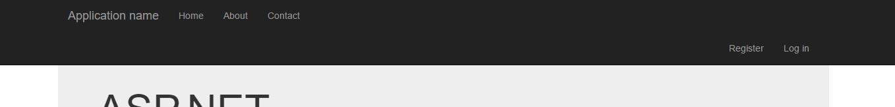
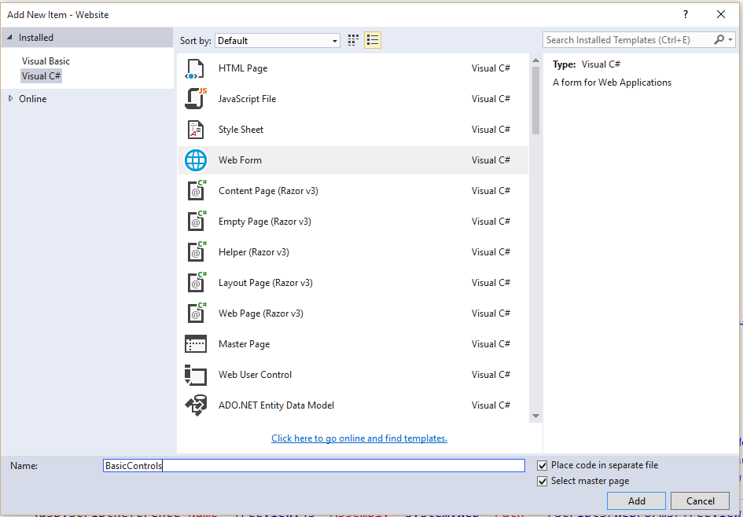

**Objectives:**

**Discuss:**

>   Similarities of RenderSection and ContentPlaceHolders

>   Menu location, .sitemap.

>   ContentPlaceholder function on .Master and Content page (.aspx)

**Code:**

>   Examine ContentPlaceholder.

>   .sitemap menu implementation.

**Resources: Student**

Moodle site.

URL Student Notes

PowerPoint – Programming ASP.NET Controls

Assigned reading for Students: Standard Screen Patterns

**Resources: Instructor**

Lesson 2: ASP.Net Web pages and menus.

**Concepts:**

1. What is the similarities between RenderSection in the Razor/Form webpage and
    an .aspx webpage ContentPlaceholder (asp:Content).

2. Setting up a menu file

    -   .sitemap

    -   .master

**Discuss Razor/Forms: RenderBody, RenderSection and RenderPage.**

<https://www.codeproject.com/Articles/383145/RenderBody-RenderPage-and-RenderSection-methods-in>

Razor/form uses have multiple, non-contiguous, replaceable “sections” within a
layout file – and enable views based on layouts to optionally “fill in” these
different sections at runtime.  The Razor syntax for doing this is clean and
concise.

**RenderBody**

In layout pages, renders the portion of a content page that is not within a
named section.
[[MSDN](http://msdn.microsoft.com/query/dev10.query?appId=Dev10IDEF1&l=EN-US&k=k(SYSTEM.WEB.WEBPAGES.WEBPAGEBASE.RENDERBODY);k(TargetFrameworkMoniker-%22.NETFRAMEWORK%2cVERSION%3dV4.0%22);k(DevLang-CSHARP)&rd=true)]

**RenderPage**

Renders the content of one page within another page.
[[MSDN](http://msdn.microsoft.com/en-us/library/system.web.webpages.webpagebase.renderpage(v=vs.99).aspx)]
The page where you will place the content could be layout or normal page. We
used it for the menu.

**RenderSection**

In layout pages, renders the content of a named section.
[[MSDN](http://msdn.microsoft.com/en-us/library/system.web.webpages.webpagebase.rendersection(v=vs.99))].
We used it for the page banner. We used it to add a secondary stylesheet to the
\<head\> and as a footer.

**Discuss ASP.Net: asp:Placeholder and asp:ContentPlaceholder controls**

<https://forums.asp.net/t/1177009.aspx?PlaceHolder+vs+ContentPlaceHolder>

<http://www.dotnetspider.com/forum/301605-Difference-between-PlaceHolders.aspx>

**asp:Placeholder**

A Placeholder control is used as a container for any controls you wish to ad and
can be used on **any** page. The control does not have any visible output itself
but can be used to group items (much like a asp:Panel). In the Master file, see
it being used in the \<head\> section.

**asp:ContentPlaceholder**

A ContentPlaceHolder is used to hold content from Content Pages and can **only**
be used on a Master Page. Master Page will contain ContentPlaceHolder control
that is used to define a region of the Master Page rendering that can be
substituted with content from a page associated to the Master Page. The
ContentPlaceHolders are where you will put specific page controls.

In summary, the ContentPlaceHolder acts very similar to the RenderSection as
there is no default RenderBody. Just like a RenderSection which has a name,
ContentPlaceHolder has an ID= parameter that one uses on the Content Page to
associate the asp:Content control with a particular Master
asp:ContentPlaceHolder. **Yes**, you can have several ContentPlaceHolder
controls on your site.master. Just ensure they each have a unique name. Alter
the \<footer\> tag and add a ContentPlacerHolder called **FootContent.** Each
new content page will have corresponding Content control for each of the
ContentPlaceHolder controls on the master. Watch for it later in this lesson.

Site.Master

\

\<asp:ContentPlaceHolder ID="MainContent" runat="server"\>

(the corresponding content in the .aspx asp:Content control

will be inserted here when the files are merged)

\</asp:ContentPlaceHolder\>

\

\<footer\>

\<p\>\&copy; \<%: DateTime.Now.Year %\> - My ASP.NET Application\</p\>

\</footer\>

\</div\>

About.aspx

\<asp:Content ID="BodyContent" ContentPlaceHolderID="MainContent"
runat="server"\>

\<h2\>\<%: Title %\>.\</h2\>

\<h3\>Don Welch: Sample workings of an ASP.Net website.\</h3\>

\<p\>This solution will be demonstrating the basic usage of the ASP.Net form
controls and event driven logic.\</p\>

\</asp:Content\>

Menus

The Site.Master has a default menu already in place with Home, About and Contact
entries.

\

\

\

\<button type="button" class="navbar-toggle" data-toggle="collapse"  
data-target=".navbar-collapse"\>

\\</span\>

\\</span\>

\\</span\>

\</button\>

\<a class="navbar-brand" runat="server" href="\~/"\>BasicASPX\</a\>

\</div\>

\

\<ul class="nav navbar-nav"\>

\<li\>\<a runat="server" href="\~/"\>Home\</a\>\</li\>

\<li\>\<a runat="server" href="\~/About"\>About\</a\>\</li\>

\<li\>\<a runat="server" href="\~/Contact"\>Contact\</a\>\</li\>

\</ul\>

\<asp:LoginView runat="server" ViewStateMode="Disabled"\>

\<AnonymousTemplate\>

\<ul class="nav navbar-nav navbar-right"\>

\<li\>\<a runat="server" href="\~/Account/Register"\>Register\</a\>\</li\>

\<li\>\<a runat="server" href="\~/Account/Login"\>Log in\</a\>\</li\>

\</ul\>

\</AnonymousTemplate\>

\<LoggedInTemplate\>

\<ul class="nav navbar-nav navbar-right"\>

\<li\>\<a runat="server" href="\~/Account/Manage"  
title="Manage your account"\>Hello,  
\<%: Context.User.Identity.GetUserName() %\>!\</a\>\</li\>

\<li\>

\<asp:LoginStatus runat="server" LogoutAction="Redirect"  
LogoutText="Log off" LogoutPageUrl="\~/"  
OnLoggingOut="Unnamed_LoggingOut" /\>\</li\>

\</ul\>

\</LoggedInTemplate\>

\</asp:LoginView\>

\</div\>

\</div\>

\</div\>

To add a new menu item: copy a \<li\>, alter the relative file path in the \<a\>
and the change the anchor text.

**Creating a separate web.sitemap menu**

You can create a separate physical menu file in ASP.Net similar to Razor/Forms
(for the same reasons).

-   Right click you website, Add/ Add New Item select sitemap.

-   Use the default name. This name will be used by the website configuration
    when used with the SiteMapDataSource control. If you do not use this name
    then you will have to alter the configuration file.

The web.sitemap is an XML file. The \<siteMapNode\> tag is used to create an
entry in the menu. Alter the code to create the following:

\<?xml version="1.0" encoding="utf-8" ?\>

\<siteMap xmlns="http://schemas.microsoft.com/AspNet/SiteMap-File-1.0" \>

\<siteMapNode url="" title="" description="root node will be ignored"\>

\<siteMapNode url="\~/Default.aspx" title="Home" description="" /\>

\<siteMapNode url="\~/About.aspx" title="About" description="" /\>

\<siteMapNode url="\~/Contact.aspx" title="Contact" description="" /\>

\</siteMapNode\>

\</siteMap\>

**Changes to site.master file**

Remove the \<ul\> default menu that came with the site.master (you can comment
it out if you wish)

>   \<ul class="nav navbar-nav"\>

\<li\>\<a runat="server" href="\~/"\>Home\</a\>\</li\>

\<li\>\<a runat="server" href="\~/About"\>About\</a\>\</li\>

\<li\>\<a runat="server" href="\~/Contact"\>Contact\</a\>\</li\>

\</ul\>

You will need to add new code to the site.master file to replace the default
menu. Open the Toolbox. Expand the Navigation group. Drag and drop a Menu
control (where the old code was). Expand the Data group. Drag and drop a
SiteMapDataSource control.

\<asp:Menu ID="Menu1" runat="server"\>\</asp:Menu\>

\<asp:SiteMapDataSource ID="SiteMapDataSource1" runat="server" /\>

Alter the SiteMapDataSource control. The ID= value can be anything you wish as
long as it is unique on this page. Add the ShowStartingNode=false. The control
will use **web.sitemap** as its default data source.

\<asp:SiteMapDataSource ID="SiteNav" runat="server" ShowStartingNode="false" /\>

Alter the Menu control to include the following attributes. NOTE: the
DataSourceID value is the value of the ID= on the SiteMapDataSource. This is how
the two control are associated. **Be extremely careful with the attributes.
Using intelli-sence without watching what you are selecting will give you
attributes that are very very similar in name but will not make the menu appear
correctly!**

\<asp:Menu ID="BasicASPXMenu" runat="server"

DataSourceID="SiteNav" Orientation="Horizontal"

StaticDisplayLevels="1"

StaticMenuStyle-CssClass="nav navbar-nav"

StaticSelectedStyle-CssClass="active"

DynamicMenuStyle-CssClass="dropdown-menu"

IncludeStyleBlock="false" EnableTheming="false" EnableViewState="false"\>

\</asp:Menu\>

Save and run your website. Notice the menu. The Register and Login entries to
the right do not appear to be correctly formatted to the menu.

This can be corrected in two ways: javascript or moving you two menu controls.
Select your two menu controls \<asp:Menu\> and \<asp:SiteMapDataSource\>. Move
the code *under* the \</asp:LoginView\> tag (which is just about 10 lines
further on in the site.master code, scroll down). After pasting the menu and
datasource, refresh your web page.

**Creating a Drop Down Menu in web.sitemap**

To create a drop down menu in a web.sitemap, you will nest your \<sitemapNode\>
tags. It should be noted that the root node on a web site **can point** to a web
page. This is not the same as a root menu item on a windows application.
Clicking on the root menu item of your VS IDE does nothing but drop the submenu.

Create a new folder under your Website calling it SamplePages. Add a content
page to this folder called BasicControls.aspx. *When* you are creating this page
select Web Form, change the name and **ensure that the Select master page
checkbox is on.** Select Site.master from the next dialog. We will use this
webpage in the next lesson. For now, put a \<h1\>Hello World\</h1\> in the
content area. **Note** the extra \<Content\> tag on this web page called
FootContent which we created earlier in this lesson.

Open the web.sitemap. Add a new \<siteMapNode\> tag under the Home node. Put in
a **separate** closing tag \</siteMapNode\> and remove the self closing /\> from
the opening tag and replace with the standard closing \>.

\<siteMapNode url="\~/Default.aspx" title="Home" description="" /\>

\<!--this is the start of a drop down submenu--\>

\<siteMapNode url="" title="Samples" description="" \>

\</siteMapNode\>

\<siteMapNode url="\~/About.aspx" title="About" description="" /\>

Insert a new node inside your drop down menu node that points to your Hello
World.

\<!--this is the start of a drop down submenu--\>

\<siteMapNode url="" title="Samples" description="" \>

\<siteMapNode url="\~/SamplePages/BasicControls.aspx" title="Basic Controls"  
description="" /\>

\</siteMapNode\>

Test your new menu by refreshing your page.

Exercise:

Drag the Hello World page into the SamplePages folder. Add a siteMapNode to the
Web.sitemap. Test.
