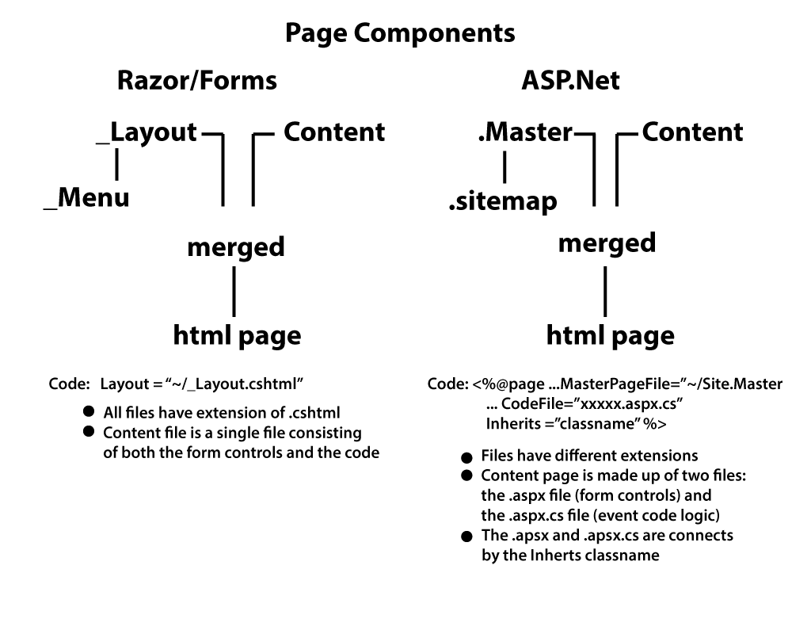
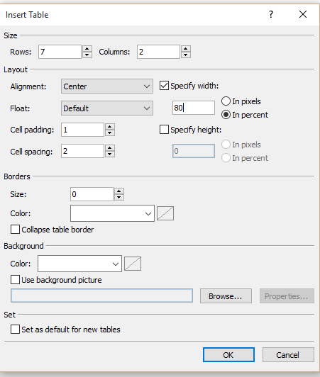
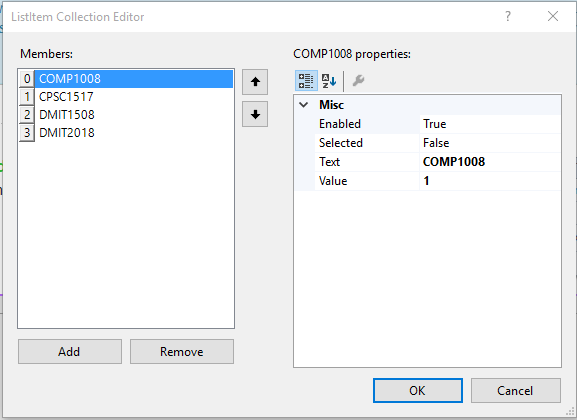

**Objectives:**

**Discuss:**

>   Review the .master, .aspx web page, and .aspx.cs code-behind file
>   relationship.

>   Controls on ASP.Net web pages (TextBox, DropDownList, RadioButtonList,
>   CheckBox, Label, Literal). The .aspx file.

>   The Page_Load event. The .aspx.cs file.

**Code:**

>   Create an .aspx web page with basic controls. Using a \<Table\> instead of
>   Bootstrap just to demonstrate it can be done.

>   Event processing in the corresponding .aspx.cs code-behind file.

**Resources: Student**

Moodle site.

URL Student Notes

Postsback PowerPoint

PowerPoint – Programming ASP.NET Controls

Assigned reading for Students: Standard Screen Patterns

**Resources: Instructor**

Lesson 3: ASP.Net Web basic controls.

**Concepts:**

1. Review the .master, .aspx web page, and .aspx.cs code-behind file
    relationship.

2. ASP.Net controls

    -   RadioButtonList instead of radio button group

    -   Using properties for setting up controls

3. What is the difference between processing in of the Razor/Form webpage and
    an .aspx webpage. Draw attention to the fact the \<form\> tag is on the
    .master file. The whole page is a form.

4. Page_Load event is always executed before the onclick event which caused the
    postback.

**Discuss ASP.Net vs Razor/Form processing.**

Razor/form processing was top down in the physical file. Your logic had to be
correct in guiding the process and producing the correct results. ASP.Net
processing is event-driven. Most controls can have an action (postback) attached
to it. This action is tied to a particular piece of code in the “code-behind”
file. The particular action does not have to be concerned with the logic of
another action. This action is called an event and responding to the event is
event handling. The usual events that will be handled are an onclick event and
is associated with a button. Review file: Postbacks, Event Handling and Page
Lifecycle.ppt

**Internet trip**

Basically unchanged, accept instead of testing for if(IsPost), it will be
if(Page.IsPostBack). The actual life cycle and event handling can be reviewed in
the file Postbacks, Event Handling and Page Lifecycle.ppt (moodle: ASP.Net Web
Forms: Postsback PowerPoint).

**Discuss Razor/Forms vs ASP.Net webpages**

**Event driven logic**

In computer programming, event-driven programming is a programming paradigm in
which the flow of the program is determined by events such as user actions
(mouse clicks, key presses), sensor outputs, or messages from other
programs/threads.

>   The two models of program execution (which are not necessarily mutually
>   exclusive) are linear and event-driven.

>   Linear programs move in a linear fashion, from step 1 to step 2 and so on,
>   to the end of all the steps. Flow control structures within the code (such
>   as loops, if statements, or function or subroutine calls) may redirect the
>   flow of the program, but essentially, once program execution begins, it runs
>   its course unaffected by anything the user or system may do. Prior to the
>   advent of GUI environments, most computer programs were linear.

>   In contrast, event-driven programming responds to events. An event is
>   generated (or raised) when "something happens," such as the user pressing a
>   button. Often, events are generated by user action, but events can also be
>   generated by the system starting or finishing work. For example, the system
>   might raise an event when a file that you open for reading has been read
>   into memory or when your battery's power is running low.

>   Windows is an event-driven program. The operating system is relatively
>   quiescent until it detects an event such as the user clicking the mouse on a
>   button. The click raises an event, which must be handled. The method that
>   responds to the event is called the event handler. When the event is raised,
>   the event handler, if one exists, is automatically executed by Windows.

>   In ASP.NET, objects may raise events and may have assigned event handlers.
>   For example, a button may raise the Click event and may have an OnClick
>   method that handles the event.

>   The event handler name is formed by prepending the word "On" to the event
>   name, so in the case of a Click event, the event handler is called OnClick.
>   Table below lists some of the more commonly used events and the names of
>   their event handlers.

From: <http://www.java-samples.com/showtutorial.php?tutorialid=977>

**Coding: Alter the /Samples/BasicControls ASP.Net Webpage**

-   Open the web page and change the \<h1\> tag to Basic Controls.

-   Create a \<Table\>:

    -   Put a least one \  after the \</h1\>.

    -   Switch to design view of your page and position your cursor on the break
        after the blockquote.

    -   From the menu chose Table/Insert Table. Fill out as seen in the dialog
        below then click OK.

-   Overview basic controls of website:

    -   TextBox. General user text entry. Properties (ID, TextMode, ToolTip,
        ReadOnly, Appearance attributes, AutoPostBack default false, Enabled vs
        Visible)

    -   RadioButtonList. One control vs many. Smart tag to get to Edit Items…
        Adding LIstItems to create the list (similar to \<option\>)

    -   Label tag vs Literal tag. Label has many for properties where as Literal
        is very limited in programmability. Both can be used for read-only type
        text display

    -   ChecKBox: Text property for creating associated text.

    -   DropDownList: Smart tag to show hard capability using Edit Items.
        However, we will look this control using code in the Page_Load event.

    -   Submit buttons: Button vs LinkButton, basically appearance.

    -   First \<tr\> row

        -   Use plain text for TextBox:. Note the left column cell will expand
            right. Do not worry. Drag and drop a TextBox in the right column
            cell. Columns will realign. Add a space then a Button control. Add a
            space and the 1 to 4 prompt. Use the properties panel to fill the
            IDs and Text on the Button.

    -   Second \<tr\> row

        -   Drag a label control to the left column and a RadioButtonList to the
            right column. Use the properties panel to fill the IDs and Text on
            the Label. Under the properties of the Radiobuttonlist, alter
            RepeatDirection and RepeatLayout (switch between table and flow and
            watch). Select the RadioButtonList and click on the smart tag that
            appears at the end of the control (little square with a \> symbol).
            Select Edit Items… In Edit Items press Add. Place your visible text
            in Text and the associated value in Value. Repeat adds for the 4
            items. Press OK.

            

    -   Third \<tr\> row.

        -   Switch to Source View. Drag and Drop a Literal in the first \<td\>
            of the row. Drag and Drop a CheckBox in the second \<td\> of the
            row. Demonstrates Drag and Drop can be done in either view. With the
            Properties panel open, click on the Literal control. Fill in the ID
            and Text. Click on the Checkbox and fill in the ID and Text. Find
            the Font Bold under Font under Appearance and set to True.

    -   Fourth \<tr\> row.

        -   Drag a Label control into both right and left columns. Instead of
            using the properties, place your cursor after “sever” on the left
            Label control, press space bar, start typing Text, select of
            intel-sense, enter your text inside the “”. Change the Label3 name
            in the ID to DisplayDataReadOnly.

    -   Fifth \<tr\> row.

        -   Have the students create this row with a Label, DropDownList, and a
            LinkButton. Follow up after a couple of minutes.

    -   Sixth \<tf\> row.

        -   Switch to Design View. Move your cursor to the left side of the
            table, just off the 6th row until it turns to a right pointing black
            arrow. Click on row to select both cells. Right click on selected
            row, Modify/Merge Cells.

    -   Seventh \<tr\> row.

        -   Merge cells. Place a Label in the merged cells. Id = MessageLabel

    -   Alignment

        -   Switch to Source View. Use align=”right” and align=”center”
            appropriately on the first \<td\> of each row.

    -   Test run with Ctrl + F5. Make adjustments where necessary. The dropdown
        list have nothing in it at this time.

>   \<table align="center" style="width: 80%"\>

>   \<tr\>

>   \<td align="right"\>TextBox:\</td\>

>   \<td\>

>   \<asp:TextBox ID="TextBoxNumberChoice" runat="server"

>   \>\</asp:TextBox\>

>   \&nbsp;\<asp:Button ID="SubmitButtonChoice" runat="server"

>   Text="Submit Choice" /\>

>   \&nbsp;Enter a number from 1 to 4\</td\>

>   \</tr\>

>   \<tr\>

>   \<td align="right"\>

>   \<asp:Label ID="Label1" runat="server" Font-Bold="True"  
>   Font-Size="Medium"

>   ForeColor="\#33CC33" Text="Choice: RadioButtonList"\>\</asp:Label\>

>   \</td\>

>   \<td\>

>   \<asp:RadioButtonList ID="RadioButtonListChoice" runat="server"  
>   RepeatDirection="Horizontal" RepeatLayout="Flow"\>

\<asp:ListItem Value="1"\>\&nbsp;COMP1008&nbsp;\</asp:ListItem\>

\<asp:ListItem Value="2"\>\&nbsp;DMIT1508&nbsp;\</asp:ListItem\>

\<asp:ListItem Value="3"\>\&nbsp;CPSC1517&nbsp;\</asp:ListItem\>

>   \<asp:ListItem Value="4"\>\&nbsp;DMIT2018&nbsp;\</asp:ListItem\>  
>   \</asp:RadioButtonList\>

>   \</td\>

>   \</tr\>

>   \<tr\>

>   \<td align="right"\>

>   \<asp:Literal ID="Literal1" runat="server"  
>   Text="Choice: CheckBox"\>\</asp:Literal\>

>   \</td\>

>   \<td\>

>   \<asp:CheckBox ID="CheckBoxChoice" runat="server"  
>   Font-Bold="True" Text="Programming Course" /\>

>   \</td\>

>   \</tr\>

>   \<tr\>

>   \<td align="right"\>

>   \<asp:Label ID="Label2" runat="server"  
>   Text="Display Label"\>\</asp:Label\>\</td\>

>   \<td\>

>   \<asp:Label ID="DisplayDataReadOnly" runat="server" \>\</asp:Label\>\</td\>

>   \</tr\>

>   \<tr\>

>   \<td align="right"\>

>   \<asp:Label ID="Label4" runat="server"  
>   Text="View Collection"\>\</asp:Label\>\</td\>

>   \<td\>

>   \<asp:DropDownList ID="CollectionList" runat="server"\>  
>   \</asp:DropDownList\>\&nbsp;

>   \<asp:LinkButton ID="LinkButtonSubmitChoice" runat="server" \>  
>   Submit Collection Choice\</asp:LinkButton\>

>   \</td\>

>   \</tr\>

>   \<tr\>

>   \<td colspan="2"\>\&nbsp;\</td\>

>   \</tr\>

>   \<tr\>

>   \<td colspan="2" align="center"\>

>   \<asp:Label ID="MessageLabel" runat="server"\>\</asp:Label\>

>   \</td\>

>   \</tr\>

>   \</table\>

-   Events: onclick for a control

    -   The onclick event for buttons. Switch to Design view. Double click the
        Buttton control to auto generate an event stub. You will be thrown to
        the code behind. Right click on code behind and select View Design.
        Repeat for LinkButton.

    -   To view code behind when in Design or Source view: right click on design
        view, select View Code.

    -   What is object sender? (The first parameter of your event handler
        (object source or sometimes object sender) is a reference to the button
        that was clicked.)

    -   What is EventArgs? (Which event has a specific set of values (arguments)
        sent about the event. Theses will change depending on the event.)

    -   Enter the following code in the each event where xxxx represents the
        specific button.

        MessageLabel.Text = "you press the xxxxx button";

    -   Test run Ctrl + F5. Press the buttons. Watch the messages.

-   Page_Load

    -   Executes on each pass of the page **before** the onclick event.

    -   IsPostBack

    -   Good place to clear old messages: MessageLabel.Text = “”;

    -   Create a data class for use by DropDownList.

        -   Right click on WebApp, Add/Add New Item/Class, call it DDLClass,
            click Ok.

>   public int ValueField { get; set; }

>   public string DisplayField { get; set; }

>   public DDLClass()

>   {

>   //

>   // TODO: Add constructor logic here

>   //

>   }

>   public DDLClass(int valuefield, string displayfield)

>   {

>   //greedy constructor

>   ValueField = valuefield;

>   DisplayField = displayfield;

>   }

-   Create a global static List\<T\> before the Page_Load.

    public static List\<DDLClass\> DataCollection;

-   Demonstrate load of a list using a data Class. Show .Sort method of
    List\<T\>. Programmability load the drop down list. Then test run. Note
    dropdown list will have values now.

>   //if you need to reset fields on each pass (process) of the page

>   // you can do it here

>   //page initialization can be done here under the IsPostBack flag

>   //the ID= attribute on your control is the name that is use in

>   // your code to reference the control

>   //the ID= name is unique to the form

>   //each control is an object and behaves as an object

>   MessageLabel.Text = "";

>   //the test for posting a form back to the web server is IsPostBack

>   if (!Page.IsPostBack)

>   {

>   //load the DropDownList (DDL) only on the first pass of the page

>   //In this example a locally create List\<T\> will act

>   // as the data source for the DDL

>   DataCollection = new List\<DDLClass\>();

>   //add instances to the list

>   DataCollection.Add(new DDLClass(1, "COMP1008"));

>   DataCollection.Add(new DDLClass(2, "DMIT1508"));

>   DataCollection.Add(new DDLClass(3, "CPSC1517"));

>   DataCollection.Add(new DDLClass(4, "DMIT2018"));

>   //place the data in the DDL in alphabetic order (ascending)

>   //(x,y) represent any two rows in the collection DataCollection

>   //Compare x.DisplayField to y.DisplayField, ascending

>   //Compare y.DisplayField to x.DisplayField, descending

>   DataCollection.Sort((x, y) =\> x.DisplayField.CompareTo(y.DisplayField));

>   //to place a collection into the DDL control we need to do 4 steps

>   //a) assign the collection to the control's DataSource property

>   CollectionList.DataSource = DataCollection;

>   //b) assign field names to the properties DataTextField and DataValueField

>   //the DataTextField contents the data seen by the user

>   //the DataValueField is the data returned by the control on access\*

>   CollectionList.DataTextField = "DisplayField";

>   CollectionList.DataValueField = "ValueField";

>   //c) Bind the information and data to your control

>   CollectionList.DataBind();

>   //d) optional, assign a prompt to your control

>   //such that it appears before the data

>   CollectionList.Items.Insert(0, "select....");

>   }

**Coding: SubmitButtonChoice_Click**

>   When you double click the submit button on the web page (under Design view)
>   a method stub is generated. Double click both submit buttons on the web page
>   to generate the method studs. Place a temporary MessageLabel string in each
>   submit method. These methods will be completed in the next lesson. Test run
>   code using CTRL + F5.

>   protected void SubmitButtonChoice_Click(object sender, EventArgs e)

>   {

>   MessageLabel.Text = "Inside SubmitButtonChoice.";

>   }

>   protected void LinkButtonSubmitChoice_Click(object sender, EventArgs e)

>   {

>   MessageLabel.Text = "Inside LinkButtonSubmitChoice.";

>   }
