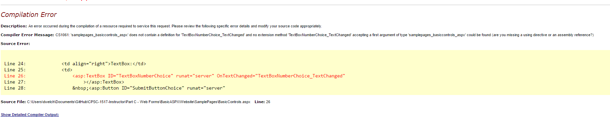
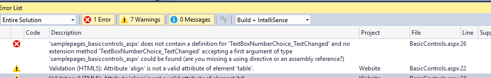
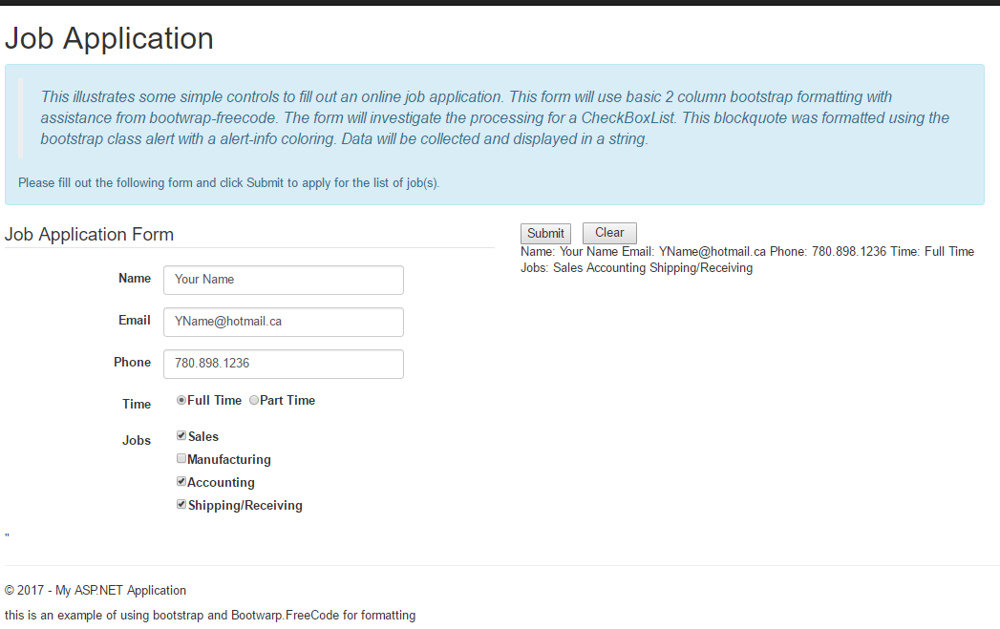

**Objectives:**

**Discuss:**

>   Basic control access within submit buttons

>   Formatting with bootstrap and bootwrap.

>   Handling CheckBoxList.

**Code:**

>   Create an .aspx web page to using a Bootstrap and Bootwrap formatting as
>   demonstration.

>   Event processing in the corresponding .aspx.cs code-behind file:
>   CheckBoxList.

**Resources: Student**

Moodle site.

URL Student Notes

URL <https://v4-alpha.getbootstrap.com/components/alerts>

PowerPoint – Programming ASP.NET Controls

Assigned reading for Students: Standard Screen Patterns

**Resources: Instructor**

Lesson 4: ASP.Net Web pages formatting and CheckBoxList.

**Concepts:**

1.  Accessing basic controls (complete events for Basic Control page)

2.  Review the use of Bootstrap formatting.

3.  Bootwarp NuGet package

    -   Created by Dan Gilleland

    -   Assist in basic formatting of a web page

    -   Limited to basic controls and format

    -   Is a NuGet package

4.  CheckBoxList and its processing.

**Coding: SubmitButtonChoice_Click**

>   When you test this code, use good data for the time being.

-   RadioButtonList:

    -   SelectedValue returns the value= argument value

    -   SelectedIndex returns the physical index value of the selected button in
        the list.

    -   SelectedItem returns the visible text of the selected button in the
        list.

    -   To set a radiobutton on use SelectedValue or SelectIndex.

-   CheckBox, to turn off or on use False or True and set the Checked
    properties. To retrieve the value, create a bool variable and set it to the
    controlname.Checked property.

-   DropDownList acts in the same fashion as a RadioButtonList: SelectedValue,
    SelectedIndex and SelectedItem.

-   Test run code using CTRL +F5.

>   protected void SubmitButtonChoice_Click(object sender, EventArgs e)

>   {

>   //to grab the contents of a control will depend on the access

>   // technique of that control

>   //for TextBox, Label, Literal use .Text

>   //for Lists (RadioButtonList, DropDownList) you may use

>   // .SelectedValue, .SelectedIndex, .SelectItem

>   //for CheckBox use .Checked

>   //for the most part, all data from a control returns as a string

>   //except for boolean type controls

>   string submitchoice = TextBoxNumberChoice.Text;

>   if (string.IsNullOrEmpty(submitchoice))

>   {

>   MessageLabel.Text = "You did not enter a value in the textbox.";

>   }

>   else

>   {

>   //you can set the radiobuttonlist choice by either using

>   // .SelectedValue or .SelectedIndex or SelectedItem

>   //it is best to use .SelectValue

>   RadioButtonListChoice.SelectedValue = submitchoice;

>   //place a check mark in the checkbox if the choosen

>   //course is a programming course

>   if (submitchoice.Equals("2") \|\| submitchoice.Equals("4"))

>   {

>   CheckBoxChoice.Checked = true;

>   }

>   else

>   {

>   CheckBoxChoice.Checked = false;

>   }

>   //set the position in the DDL using .SelectedValue

>   CollectionList.SelectedValue = submitchoice;

>   //to set the contents of a label use .Text

>   //demonstrate the difference between SelectedValue, SelectedIndex

>   // and SelectedItem

>   DisplayDataReadOnly.Text = CollectionList.SelectedItem.Text

>   \+ " at index " + CollectionList.SelectedIndex

>   \+ " having a value of " + CollectionList.SelectedValue;

>   }

>   }

>   **Coding: Student Exercise.**

-   Student exercise, no marks, complete the LInkButtonSubmitChoice_Click.

    -   Make sure a selection was made by testing the index of the DDL, should
        not be zero (0) which is the prompt line.

    -   Set the other controls according to the value from the DDL.

>   if (CollectionList.SelectedIndex == 0)

>   {

>   MessageLabel.Text = "Please select from the list before pressing the  
>   button.";

>   }

>   else

>   {

>   string submitchoice = CollectionList.SelectedValue;

>   TextBoxNumberChoice.Text = submitchoice;

>   RadioButtonListChoice.SelectedValue = submitchoice;

>   if (submitchoice.Equals("2") \|\| submitchoice.Equals("4"))

>   {

>   CheckBoxChoice.Checked = true;

>   }

>   else

>   {

>   CheckBoxChoice.Checked = false;

>   }

>   DisplayDataReadOnly.Text = CollectionList.SelectedItem.Text

>   \+ " at index " + CollectionList.SelectedIndex

>   \+ " having a value of " + CollectionList.SelectedValue;

>   }

**Coding: Unwanted events.**

>   There may be times when you accidently create an unwanted event. This is
>   usually done by double clicking a control. Double click the TextBox.

protected void TextBoxNumberChoice_TextChanged(object sender, EventArgs e)

{

>   }

>   And

\<asp:TextBox ID="TextBoxNumberChoice" runat="server"  
OnTextChanged="TextBoxNumberChoice_TextChanged"\>\</asp:TextBox\>

>   To remove the unwanted event you **must** physically remove **both** the
>   event stub **and** the OnTextChanged attribute. Try just removing the event
>   stud. Run. You will get a compile error. You could solve this error just be
>   removing the event attribute but then you are left with an empty event stub
>   in the code behind. It will run but this is not very good for maintenance.

**Job Application Form**

**Setup**

Create a new content page called JobApplication under SamplePages. Set up and
review the menu item for a page. Place a \<h3\>Job Application\</h3\> tag at the
top. This would be a good time to review the need to ensure a Site.master file
is used when creating the web page. If you demonstrated multiple
ContentPlaceHolders on the master, add the additional footer string about
formatting. Test Run.

**Using Bootstrap class alert.**

Add the founding blockquote to the top of the page under the h3 tag. This will
demonstrate bootstrap offset and blocking. It will also introduce the alert
class and its coloring (success, info, warning, and danger).

>   \<h3\>Job Application\</h3\>

>   \

>   \

>   \

>   \<blockquote style="font-style:italic"\>

This illustrates some simple controls to fill out an online

job application. This form will use basic 2 column bootstrap

formatting with assistance from bootwrap-freecode. The form

will investigate the processing for a CheckBoxList. This

blockquote was formatted using the bootstrap class alert with

a alert-info coloring. Data will be collected and displayed

in a string.

>   \</blockquote\>

>   \</div\>

>   \</div\>

\</div\>

**Install Bootwrap FreeCode**

Dan Gilleland has created a NuGet package to aid the user in simply two control
formatting of the basic controls on a web page. This package is called
Bootwrap.FreeCode. It is very limited in its coverage of controls. It requires a
set of controls: Label and web control. Using the script in your Bootstrap
application allows for cleaner Html forms. Simply write up your forma as a
series of Label/Input pairs in a fieldset, and the script will reorganize the
tags and apply div wrappings and classes in common Bootstrap formatting.

-   Right click on your website, select Manage NUGet packages.

-   Browse for bootwrap.freecode

-   Install

-   OK

**Create 2 column Bootstrap form**

-   I use the Source View to create this form.

-   Create 2 column boostrap form using col-sm-6

-   Add \<fieldset class=”form-horizontal”\>\</fieldset\> to first col-sm-6
    column

-   Add \<legend\>your form title\</legend\> inside \<fieldset\>

-   **Create (drag and drop) asp:Label ID, runat, Text, AssociatedControlID. The
    AssociatedControlID attribute value is the ID value of the associated input
    control. This attribute is needed for Bootwrap to work.**

-   **Add the associated input control. Ensure the ID value is the same as the
    AssociatedControlID value.**

-   Creating the CheckBoxList entries is the same as the RadioButtonList. When
    in the Source View, you can click on the asp: part of the control and a
    small rectangle should appear below the asp:. This is the smart tag. Click
    on the rectangle and open the smart tag. This demonstrates that one does not
    need to be in the Design View to use smart tags.

-   Create 2 buttons in the second col-sm-6 column and a Label to display
    messages.

-   Test run. Your output will look crappie.

\<%--create a 2 column form--%\>

\

\<fieldset class="form-horizontal"\>

\<legend\>Job Application Form\</legend\>

\<asp:Label ID="Label1" runat="server" Text="Name"

AssociatedControlID="FullName"\>\</asp:Label\>

\<asp:TextBox ID="FullName" runat="server"\>\</asp:TextBox\>

\<asp:Label ID="Label2" runat="server" Text="Email"

AssociatedControlID="EmailAddress"\>\</asp:Label\>

\<asp:TextBox ID="EmailAddress" runat="server"\>\</asp:TextBox\>

\<asp:Label ID="Label3" runat="server" Text="Phone"

AssociatedControlID="PhoneNumber"\>\</asp:Label\>

\<asp:TextBox ID="PhoneNumber" runat="server"\>\</asp:TextBox\>

\<asp:Label ID="Label4" runat="server" Text="Time"

AssociatedControlID="FullOrPartTime"\>\</asp:Label\>

\<asp:RadioButtonList ID="FullOrPartTime" runat="server"

RepeatDirection="Horizontal" RepeatLayout="Flow"\>

\<asp:ListItem\>Full Time\&nbsp;&nbsp;\</asp:ListItem\>

\<asp:ListItem\>Part Time\</asp:ListItem\>

\</asp:RadioButtonList\>

\<asp:Label ID="Label5" runat="server" Text="Jobs"

AssociatedControlID="Jobs"\>\</asp:Label\>

\<asp:CheckBoxList ID="Jobs" runat="server"

RepeatLayout="Flow" RepeatDirection="Vertical"\>

\<asp:ListItem\>Sales\</asp:ListItem\>

\<asp:ListItem\>Manufacturing\</asp:ListItem\>

\<asp:ListItem\>Accounting\</asp:ListItem\>

\<asp:ListItem\>Shipping/Receiving\</asp:ListItem\>

\</asp:CheckBoxList\>

\</fieldset\>

\</div\>

\

\<asp:Button ID="Submit" runat="server" Text="Submit" /\>\&nbsp;&nbsp;

\<asp:Button ID="clear" runat="server" Text="Clear" height="26px" width="63px"  
/\>\ 

\<asp:Label ID="Message" runat="server" \>\</asp:Label\>

\</div\>

**Script needed for Bootwrap.**

You will notice that the form is not yet neatly formatted. To finish the
formatting you need to add the follow script. This script expect **pairs** of
controls. You will notice that there are no \<br/\> tags in the pairs of
controls. They are not needed unless you wish to have additional spacing between
the pairs of controls. Place a \<br/\> between a pair and run to view the
results.

\</div\>

\<script src="../Scripts/bootwrap-freecode.js"\>\</script\>"

**Coding: Button Events**

-   Create the event stubs for your 2 buttons. (Design View, double click the
    button)

-   Page_Load: empty message label

-   Clear_Click: empty text boxes; set selectedindex to -1

protected void clear_Click(object sender, EventArgs e)

{

FullName.Text = "";

EmailAddress.Text = "";

PhoneNumber.Text = "";

FullOrPartTime.SelectedIndex = -1; //or

Jobs.ClearSelection();

}

-   Submit_Click

    -   Access and concatenate TextBoxes and RadioButtonList values into a
        string.

    -   Handling the checkboxlist is similar to handling the list in razor
        accept instead of a delimiter as in razor, use the foreach loop and the
        controlname.Items as the collection. Each checkbox in the list is one
        item.

    -   Use a standard search structure (bool found flag, loop, check if found)
        to complete the data display message.

protected void Submit_Click(object sender, EventArgs e)

{

string message = "";

message += "Name: " + FullName.Text;

message += " Email: " + EmailAddress.Text;

message += " Phone: " + PhoneNumber.Text;

message += " Time: " + FullOrPartTime.SelectedValue;

//traverse the checkboxlist, review one item

//at a time and add those items to the message

//IF no items were choosen then add a message stating

//that no items were choosen to the message

message += " Jobs: ";

bool found = false;

foreach (ListItem jobrow in Jobs.Items)

{

if (jobrow.Selected)

{

message += jobrow.Text + " ";

found = true;

}

}

if (!found)

{

message += " you did not select a job. Application rejected.";

}

Message.Text = message;

}

**Exercise Practice.**

Download and open the Forms Practice image file. It contains 3 images. This is
student practice, there are **no marks** for this work. They will be able to use
these forms for the next lesson also when they learn about Validation. **These
form will be a good way to practice for the module’s in class assessment.**

**User Registration**:

-   fieldset textboxes, add check box and button

-   button, check checkbox, if not on message else collect and display data

**Movie Library:**

-   fieldset Title to ISBN, new line buttons

-   Search button display Title; Add button collect and display data

**CD Library**:

-   fieldset text boxes

-   button collect and display data
