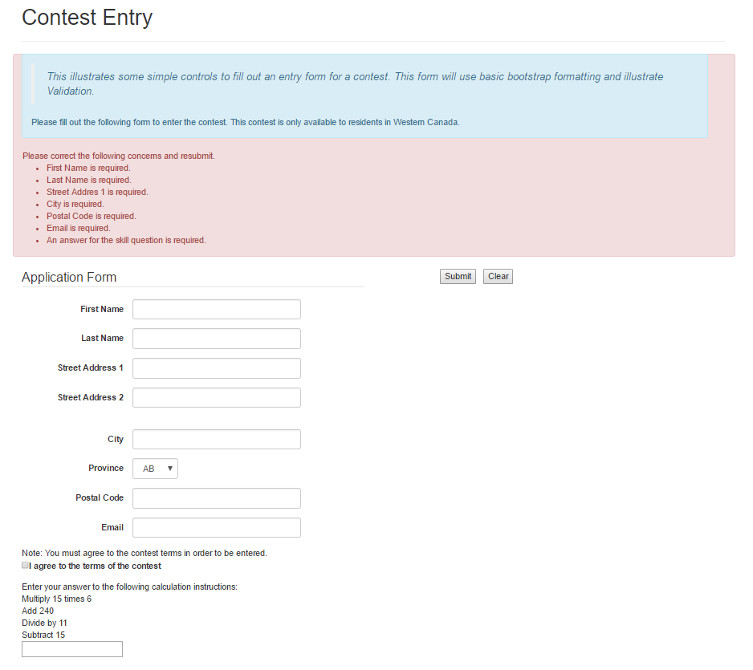
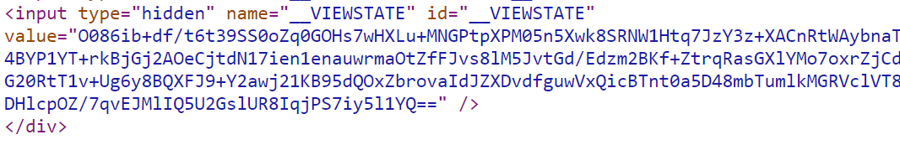
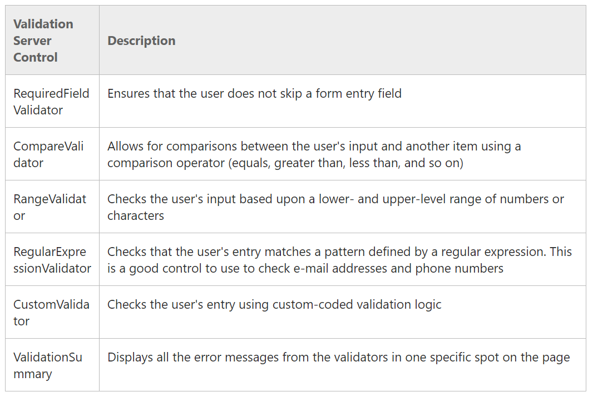
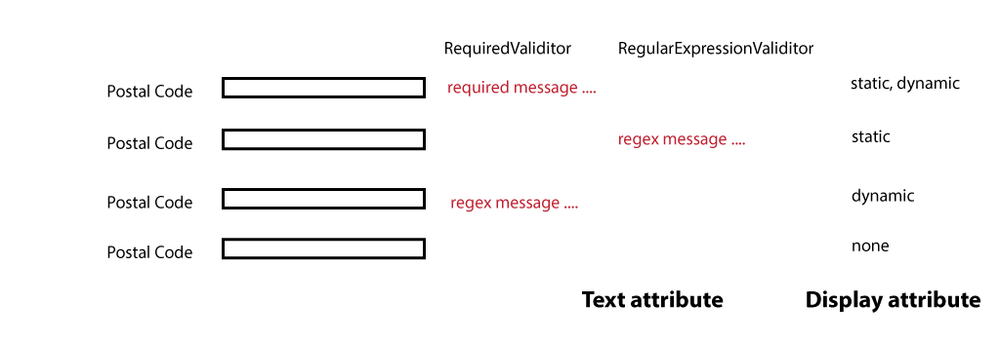

**Objectives:**

**Discuss:**

>   ASP.Net Validation controls.

>   Introduce GridView control to display multiple records.

>   Overview of data value retention on web sites

-   Browser(ViewState, cookies)

-   Web Server (static variable in program(server memory), session variables)

-   Database Server will be discussed as the permanent data storage during
    Client/Server ASP.Net module

**Code:**

>   Bring in a web page and add to your web site.

>   Add Validation controls.

>   Event processing in the corresponding .aspx.cs code-behind file:
>   CheckBoxList.

**Resources: Student**

Moodle site.

URL Student Notes

URL <https://msdn.microsoft.com/en-us/library/aa479013.aspx>

PowerPoint –ASP.NET Basic Form Validation

**Resources: Instructor**

Lesson 5: ASP.Net Web pages form validation.

**Concepts:**

1. Review basic validation.

2. Data Retention

    -   Browser (ViewState and cookies (session and permanent))

    -   Server (session variables and program static variables)

    -   Database (permanent) (this will be covered in detail in the Client
        Server modules)

3. GridView (multi-record display, defaults only). 
    

**Contest Validation Form**

**Setup**

Download the starter kit (zip file) and unpack. Move the two files into the
SamplePages folder of your solution. Refresh the SamplePages folder in the
Solution Explorer. Add a menu item referencing this new page. Test Run.

**Data Retention.**

Cookies

Two types of cookies: session and permanent. Session cookies reside in the
browser machine’s memory as long as session lasts then disappears. Permanent
cookies reside on the browser machine until they are deleted. A permanent cookie
has an expiry date set.

<https://f5.com/resources/white-papers/cookies-sessions-and-persistence>

Programming variables

One can create level static variables for the web site or web page. If the
variable is static, it is shared by everyone who uses the web site. It is
created on the first access to the web site. It lasts until the website is shut
down. (We will be using this in our example for simplicity sake).

//Since we have no database, we will use a List\<T\> to

//hold the data.

//This List\<T\> will be a static list which will be

//shared by all accessing this website

//It will be create when the website first begins,

//will remain as long as the website exists,

//will be destroyed when the website stops

private static List\<Entry\> contestentries = new List\<Entry\>();

Session Variables

These are variables that are created by the website and reside on the web
server. Session variables are special variables that exist only while the
user's sessionwith your application is active. Session variables are specific to
each visitor to your site. They are used to store user-specific information that
needs to be accessed by multiple pages in a web application.

<http://www.profoundlogic.com/rpgsp_software_doc/SessionVariables.htm>

ViewState

View state is the method that the ASP.NET page framework uses to preserve page
and control values between round trips. When the HTML markup for the page is
rendered, the current state of the page and values that must be retained during
postback are serialized into base64-encoded strings. ViewState is a storage
variable that travels with the web page, to and fro with the browser. This area
exists as long as the webpage exists. It will grow as you add more controls
and/or data to the web page. You can programmably add your own data to this
storage (ViewState.uniquevaraiblename = value;). All data associated with your
web controls are stored in this storage. You can view this encrypted variable by
running a web page, right click on your browser and view page source. The hidden
ViewState is located at the top of your page source. The following image is the
page source for the Job Application.

<https://msdn.microsoft.com/en-us/library/bb386448.aspx>

Database

Used to permanently store data independent of web server. Student are suppose to
have DMIT1508 or currently taking DMIT1508. We will be using database in the
next ASP.Net Client/Server modules.

**Validation Controls**

Validation controls operate both on the browser and in the webserver. Input
controls **may** have several validators associated with it **but** a specific
validation control may **only be used once** per input control. Review the
following link.

<https://msdn.microsoft.com/en-us/library/aa479013.aspx>

**Create Validation for ContestEntry**

| **Control**             | **Validation**                                     | **Notes**                                                                                                      |
|-------------------------|----------------------------------------------------|----------------------------------------------------------------------------------------------------------------|
| FirstName : string      | Required                                           | On the control you can use MaxLength=”25” to limit characters                                                  |
| LastName : string       | Required                                           | MaxLength=”25”                                                                                                 |
| StreetAddress1 : string | Required                                           | MaxLength=”75”                                                                                                 |
| StreetAddress2 : string |                                                    | MaxLength=”75”                                                                                                 |
| City : string           | Required                                           | MaxLength=”50”                                                                                                 |
| Province : string       | No prompt line so required value will be available |                                                                                                                |
| PostalCode : string     | Required RegularExpression                         | Expression [a-zA-Z][0-9][a-zA-Z][0-9][a-zA-Z][0-9] MaxLength=”6”                                               |
| EmailAddress : string   | Required RegularExpression                         | Expression \\w+([-+.']\\w+)\*\@\\w+([-.]\\w+)\*\\.\\w+([-.]\\w+)\* On the control you can use TextMode=”email” |
| Terms : Boolean         |                                                    | Program logic control only                                                                                     |
| CheckAnswer : numeric   | Required Compare                                   | Logic control only. If not valid then don’t proceed                                                            |
| Submit : button         |                                                    | Onclick process data                                                                                           |
| Clear : button          |                                                    | set CausesValidation=”False” onclick clear fields                                                              |

Common Validation Control Fields.

-   ID: unique identifier for the control

-   Runat=”server”

-   ErrorMessage: main message text, displayed if no value for Text, display in
    summary

-   Text: if present used where control is physically on page

-   Display:

    -   Static: Text not adjusted from position

    -   Dynamic: Text will move left if additional validation not displayed

    -   None: Do not display Text

-   ControlToValidate: asp:inputcontrol ID value to associate validation control
    with input control**.**

-   SetFocusOnError: move cursor to input control if validation error**.**

RequiredFieldValidator

Indicates the control needs some type of input.

\<asp:RequiredFieldValidator ID="RequiredFieldFirstName" runat="server"

ErrorMessage="First Name is required." Display="None"

ForeColor="\#990000" ControlToValidate="FirstName"

SetFocusOnError="True"\>\</asp:RequiredFieldValidator\>

RangeValidator

Indicates the control input value needs to be between a minimum value and
maximum value (inclusive). You may use constants like .MaxValue or .MinValue.
The control is active only if data is input. Since there is no need for this
validator on the ContestEntry page, this is for demonstration purposes only.

\<asp:RangeValidator ID="RangeProductRating" runat="server"

ErrorMessage="Rating is 1 (worse) to 5 (best)" Display="None"

ForeColor="\#990000" ControlToValidate="ProductRating"

SetFocusOnError="True" MinimumValue="1" MaximumValue="5"

Type="Integer"\>\</asp:RangeValidator\>

RegularExpressionValidator

Indicates the control input value needs to match the supplied pattern. The
control is active only if data is input.

\<asp:RegularExpressionValidator ID="RegularExpressionPostalCode" runat="server"

ErrorMessage="Invalid Postal Code format (T5Y7U0)"

Display="None" ForeColor="\#990000" SetFocusOnError="true"

ControlToValidate="PostalCode"

ValidationExpression="[a-zA-Z][0-9][a-zA-Z][0-9][a-zA-Z][0-9]"\>

\</asp:RegularExpressionValidator\>

ComparerValidator

Indicates the control input value meets the specified compare criteria. This
control can be used in three styles: datatype, against a constant, and against
another input control. The control is active only if data is input.

DataType:

\<asp:CompareValidator ID="CompareCheckAnswer" runat="server"

ErrorMessage="You answer for the skill question is incorrect."

Display="None" ForeColor="\#990000" SetFocusOnError="true"

ControlToValidate="CheckAnswer" Type="Integer" Operator="DataType"

\>\</asp:CompareValidator\>

Against a constant:

\<asp:CompareValidator ID="CompareCheckAnswer" runat="server"

ErrorMessage="You answer for the skill question is incorrect."

Display="None" ForeColor="\#990000" SetFocusOnError="true"

ControlToValidate="CheckAnswer" Type="Integer" Operator="Equal"

ValueToCompare="15"\>\</asp:CompareValidator\>

Against another input control:

\<asp:CompareValidator ID="CompareConfirmPassword" runat="server"

ErrorMessage="Pasword not confirmed."

Display="None" ForeColor="\#990000" SetFocusOnError="true"

ControlToValidate="ConfirmPassword" Type="String" Operator="Equal"

ControlToCompare="Password"\>\</asp:CompareValidator\>

**Coding: Validation Control Placement**

>   Validation controls can be placed anywhere within your form (content area).
>   However, if you have the Display attribute anything but None, the
>   ErrorMessage value or Text value will be displayed in that physical
>   location. Therefore, you should consider placing the validation controls in
>   a logical location.

>   One typical location is as a block near the top of the form with Display =
>   None and using the ValidationSummary control. This will given a bulleted
>   list of errors.

>   A second typical location is placing the validation controls beside the
>   input control. Here the Display attribute is important as to using Static or
>   Dynamic. One thing to consider when using this second technique and
>   Bootwrap.FreeCode is that Bootwrap will **not** work as expected. Bootwrap
>   requires **pairs** of controls (Label and Input Control). The presences of
>   the validator controls (which bootwrap does **not** handle) will cause an
>   unexpected form display.

\<asp:RequiredFieldValidator ID="RequiredFieldFirstName" runat="server"

ErrorMessage="First Name is required." Display="None"

ForeColor="\#990000" ControlToValidate="FirstName"

SetFocusOnError="True"\>\</asp:RequiredFieldValidator\>

\<asp:RequiredFieldValidator ID="RequiredFieldLastName" runat="server"

ErrorMessage="Last Name is required." Display="None"

ForeColor="\#990000" ControlToValidate="LastName"

SetFocusOnError="True"\>\</asp:RequiredFieldValidator\>

\<asp:RequiredFieldValidator ID="RequiredFieldStreetAddress1" runat="server"

ErrorMessage="Street Addres 1 is required." Display="None"

ForeColor="\#990000" ControlToValidate="StreetAddress1"

SetFocusOnError="True"\>\</asp:RequiredFieldValidator\>

\<asp:RequiredFieldValidator ID="RequiredFieldCity" runat="server"

ErrorMessage="City is required." Display="None"

ForeColor="\#990000" ControlToValidate="City"

SetFocusOnError="True"\>\</asp:RequiredFieldValidator\>

\<asp:RequiredFieldValidator ID="RequiredFieldPostalCode" runat="server"

ErrorMessage="Postal Code is required." Display="None"

ForeColor="\#990000" ControlToValidate="PostalCode"

SetFocusOnError="True"\>\</asp:RequiredFieldValidator\>

\<asp:RegularExpressionValidator ID="RegularExpressionPostalCode" runat="server"

ErrorMessage="Invalid Postal Code format (T5Y7U0)"

Display="None" ForeColor="\#990000" SetFocusOnError="true"

ControlToValidate="PostalCode"

ValidationExpression="[a-zA-Z][0-9][a-zA-Z][0-9][a-zA-Z][0-9]"\>

\</asp:RegularExpressionValidator\>

\<asp:RequiredFieldValidator ID="RequiredFieldEmailAddress" runat="server"

ErrorMessage="Email is required." Display="None"

ForeColor="\#990000" ControlToValidate="EmailAddress"

SetFocusOnError="True"\>\</asp:RequiredFieldValidator\>

\<asp:RegularExpressionValidator ID="RegularExpressionEmailAddress"
runat="server"

ErrorMessage="Invalid Email address format"

Display="None" ForeColor="\#990000" SetFocusOnError="true"

ControlToValidate="EmailAddress"

ValidationExpression="\^([\\w\\.\\-]+)\@([\\w\\-]+)((\\.(\\w){2,3})+)\$"\>  
\</asp:RegularExpressionValidator\>

\<asp:RequiredFieldValidator ID="RequiredFieldCheckAnswer" runat="server"

ErrorMessage="An answer for the skill question is required." Display="None"

ForeColor="\#990000" ControlToValidate="CheckAnswer"

SetFocusOnError="True"\>\</asp:RequiredFieldValidator\>

\<asp:CompareValidator ID="CompareCheckAnswer" runat="server"

ErrorMessage="You answer for the skill question is incorrect."

Display="None" ForeColor="\#990000" SetFocusOnError="true"

ControlToValidate="CheckAnswer" Type="Integer" Operator="Equal"

>   ValueToCompare="15"\>\</asp:CompareValidator\>

>   Validation Summary Control

>   This control can be placed anywhere on your form. I place it after the
>   blockquote and validation controls but before the input form controls. Each
>   of the validation controls have used Display=None so that Bootwrap can be
>   used to format the form.

\

\<asp:ValidationSummary ID="ValidationContestEntry" runat="server"

HeaderText="Please correct the following concerns and resubmit."

CssClass="alert alert-danger" /\>

>   \</div\>

**Code: Setup for event processing.**

This example will be collecting the input data into a static List\<T\> variable.
The \<T\> will be a class called **Entry.cs**. Add the class to the App_Code
folder

public class Entry

{

public string FirstName { get; set; }

public string LastName { get; set; }

public string StreetAddress1 { get; set; }

public string StreetAddress2 { get; set; }

public string City { get; set; }

public string Province { get; set; }

public string PostalCode { get; set; }

public string EmailAddress { get; set; }

public Entry()

{

//

// TODO: Add constructor logic here

//

}

}

Create a static List\<T\> variable and place it before the Page_Load event.

//since we have no database, i will use a List\<T\> to

//hold my data.

//this List\<T\> will be a static list which will be

//shared by all accessing this website

//it will be create when the website first begins,

//will remain as long as the website exists,

//will be destroyed when the website stops

private static List\<Entry\> contestentries = new List\<Entry\>();

To display the contents of the List\<T\> during processing, place a GridView
control after the label Message control. We will use the defaults of the control
at this time.

\<asp:GridView ID="GridViewContestEntries" runat="server"\>\</asp:GridView\>

**Code: Event Buttons.**

-   Clear_Click

protected void Clear_Click(object sender, EventArgs e)

{

FirstName.Text = "";

LastName.Text = "";

StreetAddress1.Text = "";

StreetAddress2.Text = "";

City.Text = "";

PostalCode.Text = "";

EmailAddress.Text = "";

CheckAnswer.Text = "";

Province.SelectedIndex = 0;

}

-   Submit_Click

    -   Retesting of validation controls on the server side is accomplished by
        using if(Page.IsValid).

    -   Logical programming check to agree to contest terms if(Terms.Checked).
        This value will not be saved.

    -   If the terms were not agreed to (unchecked) display a message.

    -   If the terms have been agreed to, create an instance of the data class,
        load the class properties and place the instance on the List\<T\> static
        variable.

    -   To display the current contents of the List\<T\> assign the collection
        to the GridView control and bind.

protected void Submit_Click(object sender, EventArgs e)

{

//the client side validation (browser) done by the Validator controls

//can be re-executed on the server (webserver) side

if(Page.IsValid)

{

//the next step is to do any non client side validation

//before other processing

//In this case the Agree to Terms needs to be checked

if (Terms.Checked)

{

//create an instance of Entry

Entry theentry = new Entry();

//load the instance

theentry.FirstName = FirstName.Text;

theentry.LastName = LastName.Text;

theentry.StreetAddress1 = StreetAddress1.Text;

theentry.StreetAddress2 =  
string.IsNullOrEmpty(StreetAddress2.Text)?null: StreetAddress2.Text;

theentry.City = City.Text;

theentry.Province = Province.Text;

theentry.PostalCode = PostalCode.Text;

theentry.EmailAddress = EmailAddress.Text;

//store the instance in the List\<T\> collection

contestentries.Add(theentry);

//display the current contents of the collection in the GridView

GridViewContestEntries.DataSource = contestentries;

GridViewContestEntries.DataBind();

}

else

{

Message.Text = "You did not agree to the Terms. Entry rejected.";

}

}

}

**Exercise Practice.**

Download and open the Forms Practice image file. It contains 3 images. This is
student practice, there are **no marks** for this work. They will be able to use
these forms for the previous lesson when they learned about formatting. **These
form will be a good way to practice for the module’s in class assessment.**

**User Registration**:

-   fieldset textboxes, add check box and button

-   button, check checkbox, if not on message else collect and display data

-   validation see yellow tag

**Movie Library:**

-   fieldset Title to ISBN, new line buttons

-   Search button display Title; Add button collect and display data

-   validation see yellow tag

**CD Library**:

-   fieldset text boxes

-   button collect and display data

-   validation see yellow tag
