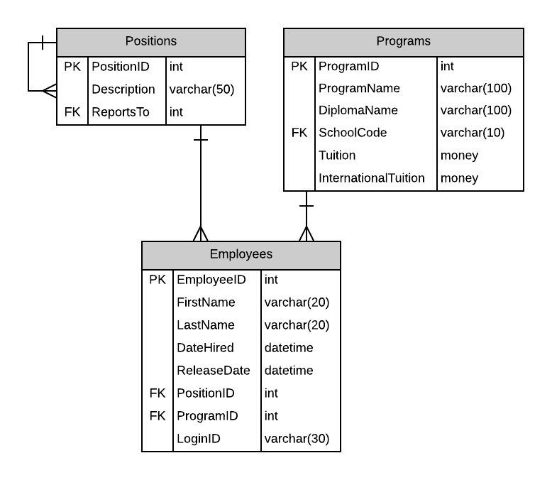

# A01: Employees

You must do three forms (A, B and C) based on the following database tables.

- **Form A** - Single Item Create/Read/Update/Delete
  - Employees
- **Form B** - Gridview Lookup with Code-Behind
  - Employees by Position
- **Form C** - Gridview Lookup with ObjectDataSource controls
  - Employees by Position 

**Recommended Stored Procedures** - The following specialty stored procedures are available:

`Employees_FindByPosition`  Returns zero or more Employees matching the supplied position id

`Employees_FindByPartialName` Returns zero or more Employees whos first or last name includes the supplied string

**Important Notes:** 

Employees cannot be deleted. Employees are terminated. Employees have a nullable ReleaseDate which is set to indicate the employee is no long with the school.

Use filter search for main lookup.

Include a not mapped property called FullName when creating the Employee entity definition. This property will return a string containing the LastName, Firstname of the employee.
