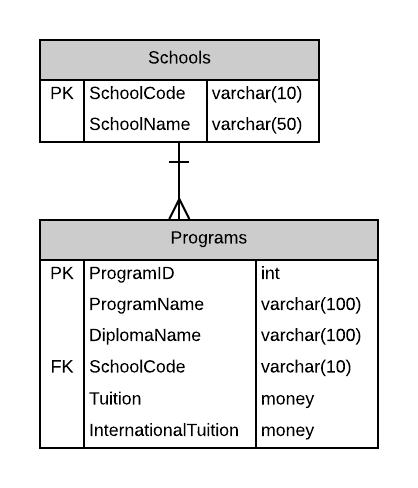

# A03: Programs

You must do three forms (A, B and C) based on the following database tables.

- **Form A** - Single Item Create/Read/Update/Delete
  - Programs
- **Form B** - Gridview Lookup with Code-Behind
  - Programs by School
- **Form C** - Gridview Lookup with ObjectDataSource controls
  - Programs by School 

**Recommended Stored Procedures** - The following specialty stored procedures are available:

`Programs_FindBySchool` Returns zero or more Programs records matching the supplied school code

**Important Notes:** 
