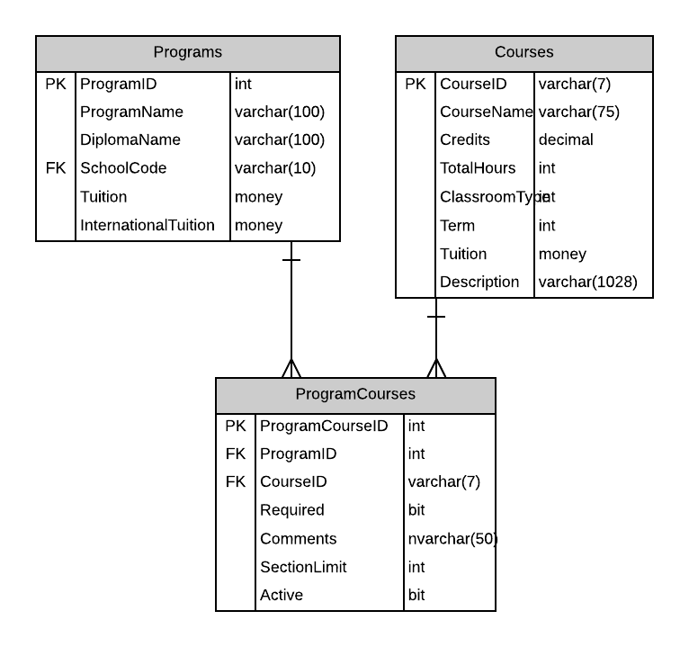
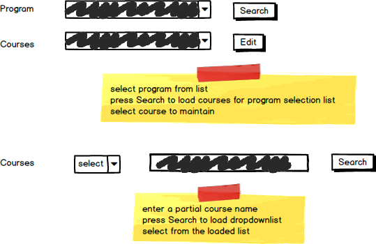

# A04: Program Courses

You must do three forms (A, B and C) based on the following database tables.

- **Form A** - Single Item Create/Read/Update/Delete
  - ProgramCourses
- **Form B** - Gridview Lookup with Code-Behind
  - ProgramCourses by Program
- **Form C** - Gridview Lookup with ObjectDataSource controls
  - ProgramCourses by Program

**Recommended Stored Procedures** - The following specialty stored procedures are available:

`ProgramCourses_FindByProgramAndCourse` Returns zero or more ProgramCourses records matching the supplied program id and course id

`ProgramCourses_FindByProgram` Returns zero or more ProgramCourses records matching the supplied program id

`Courses_FindByPartialName` Returns zero or more Courses whos course name includes the supplied string

**Important Notes:** 

Provide a prompt line to ensure the user selects a Course (no default).

ProgramCourses are not deleted. ProgramCourses are made inactive. Change the Active flag of ProgramCourses to indicate its current status.

Form B and Form C do not need to display the ProgramId as part of their multiple records display. Form C must display CourseNameID.

Include a not mapped property called CourseNameID when creating the Course entity definition. This property will return a string containing the CourseName ( CourseID ) of the course.

**Search Filter**

Use Programs and Course partial name filtering for ProgrmCourse record lookup 

Use Course partial name filtering for foreign key: CourseID

Form A filter search mockup