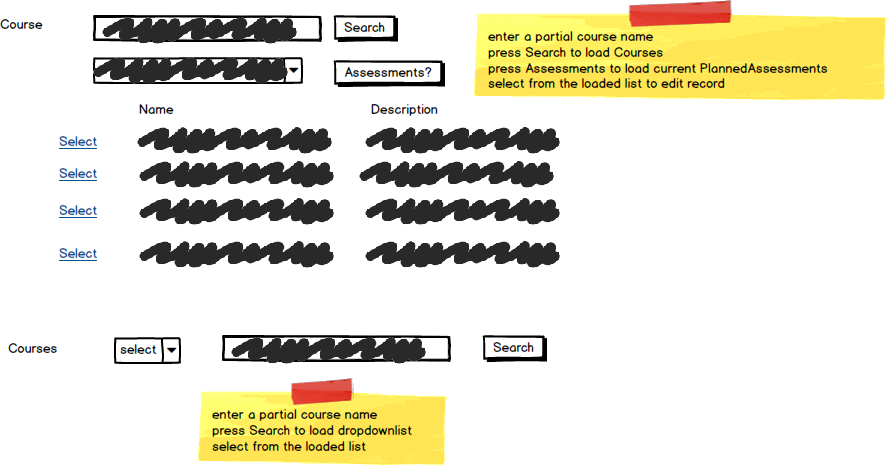

# A05: Planned Assessments

You must do three forms (A, B and C) based on the following database tables.

- **Form A** - Single Item Create/Read/Update/Delete
  - PlannedAssessments
- **Form B** - Gridview Lookup with Code-Behind
  - PlannedAssessments by Course 
- **Form C** - Gridview Lookup with ObjectDataSource controls
  - PlannedAssessments by Course 

**Recommended Stored Procedures** - The following specialty stored procedures are available:

`PlannedAssessments_FindByCourse` Returns zero or more PlannedAssessments matching the supplied course id

`Courses_FindByPartialName` Returns zero or more Courses whos course name includes the supplied string

**Important Notes:** 

Provide a prompt line to ensure the user selects a Course (no default).

You must set LastModifiedDate in your controller methods.

**Search Filter**

Use Course partial name filtering for Courses lookup then select course for a list of current PlannedAssessments

Use Course partial name filtering for foreign key: CourseID

Form A filter search mockup