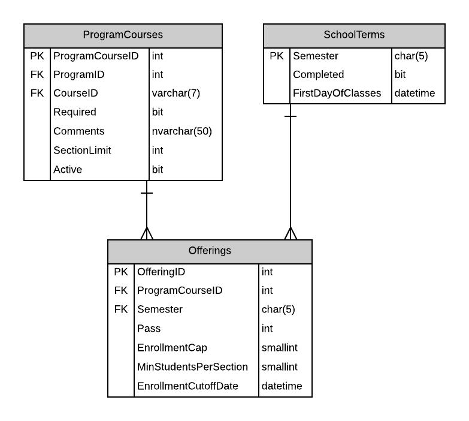

# A06: Offerings

You must do three forms (A, B and C) based on the following database tables.

- **Form A** - Single Item Create/Read/Update/Delete
  - Offerings
- **Form B** - Gridview Lookup with Code-Behind
  - Offerings by Semester
- **Form C** - Gridview Lookup with ObjectDataSource controls
  - Offerings by Semester

**Recommended Stored Procedures** - The following specialty stored procedures are available:

`Offerings_FindByProgramCourseAndSemester` Returns zero or 1 Offerings records matching the supplied program id, course id and semester

`Offerings_FindBySemester` Returns zero or more Offerings records matching the supplied semester

`ProgramCourses_FindByProgramAndCourse` Returns zero or 1 ProgramCourse records matching the supplied program id and course id

`Courses_FindByProgram` Returns zero or more Courses belonging to the supplied program id

`Semesters_FindActiveFuture` Returns zero or more SchoolTerms records currently active or are future semseters

**Important Notes:** 

Use filtering for main lookup: ProgramID, CourseID (filter by Program) and Semester

Only Offerings for current or future semesters can be updated or deleted.

This scenario lookup may be more challenging. You will need to create the Program and Course entities
