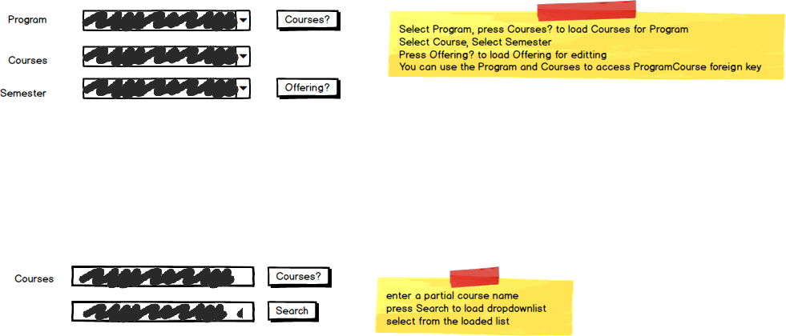

# A06: Offerings

You must do three forms (A, B and C) based on the following database tables.

- **Form A** - Single Item Create/Read/Update/Delete
  - Offerings
- **Form B** - Gridview Lookup with Code-Behind
  - Offerings by Course
- **Form C** - Gridview Lookup with ObjectDataSource controls
  - Offerings by Course

**Recommended Stored Procedures** - The following specialty stored procedures are available:

`Offerings_FindByProgramCourseAndSemester` Returns zero or 1 Offerings records matching the supplied program id, course id and semester

`Offerings_FindByCourse` Returns zero or more Offerings records matching the supplied course id

`ProgramCourses_FindByProgramAndCourse` Returns zero or 1 ProgramCourse records matching the supplied program id and course id

`Courses_FindByProgram` Returns zero or more Courses belonging to the supplied program id

`Courses_FindByPartialName` Returns zero or more Courses belonging to the supplied partial course name

`Semesters_FindActiveFuture` Returns zero or more SchoolTerms records currently active or are future semseters

**Important Notes:** 

This scenario lookup may be more challenging. 

Only Offerings for current or future semesters can be updated or deleted.

FormB and FormC will use a two step filter to find the course id. Find a list of courses to select from using the partial course name.

Create a NotMapped annotation property in the ProgramCourse entity which will return a string formatted to  courseid (programid). Example BAI3990 (2).

Use the ProgramCourse notmapped annotation in Form C as the display text for a dropdownlist used in displaying the programcourseid. Ensure you properly position in the dropdownlist.

**Search Filter**

Form A filtering for Offering lookup for update and delete: ProgramID, CourseID (Courses filter by Program) and Semester

Use Course partial name filtering for Form B and C

Form A, B and C filter search mockup
