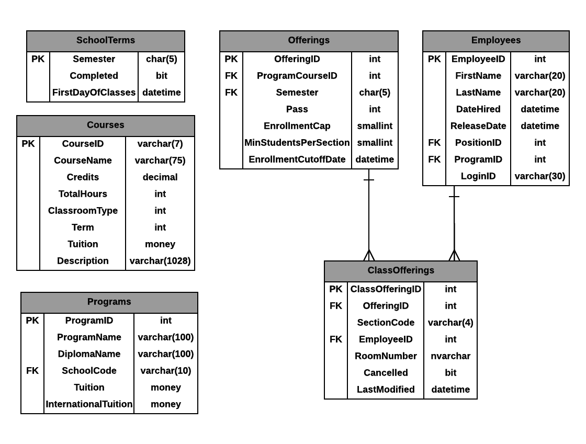

# A07: ClassOfferings

You must do three forms (A, B and C) based on the following database tables.

- **Form A** - Single Item Create/Read/Update/Delete
  - ClassOfferings
- **Form B** - Gridview Lookup with Code-Behind
  - ClassOfferings by Course/Semester
- **Form C** - Gridview Lookup with ObjectDataSource controls
  - ClassOfferings by Course/Semester

**Recommended Stored Procedures** - The following specialty stored procedures are available:

`ClassingOfferings_FindByCourseAndSemester` Returns zero or more ClassingOfferings records matching the course id and semester

`Courses_FindByPartialCourseName` Returns zero or more Courses whos course name includes the supplied string

`Semesters_FindActiveFuture` Returns zero or more SchoolTerms records currently active or are future semseters

`Employees_FindByPartialName` Returns zero or more Employees whos first or last name includes the supplied string

**Important Notes:** 

Use filtering for main lookup: CourseID(filter) and Semester

Use filtering for foreign key; EmployeeID

Only ClassOfferings for current or future semesters can be updated or deleted.

Provide an option for "no" Employee assisted to the ClassOffering.

ClassOfferings cannot be deleted. ClassOfferings are cancelled. ClassOfferings have a cancel flag which is set to indicate the classoffering is cancelled.

You must set the LastModifiedDate in your controller method.

Include a not mapped property called FullName when creating the Employee entity definition. This property will return a string containing the LastName, Firstname of the employee.
