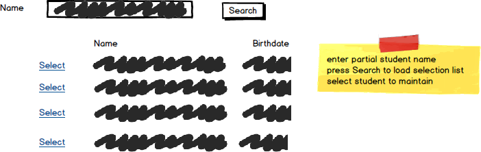

# A08: Students

You must do three forms (A, B and C) based on the following database tables.

- **Form A** - Single Item Create/Read/Update/Delete
  - Students
- **Form B** - Gridview Lookup with Code-Behind
  - Students by Gender
- **Form C** - Gridview Lookup with ObjectDataSource controls
  - Students by Gender

**Recommended Stored Procedures** - The following specialty stored procedures are available:

`Students_FindByGender` Returns zero or more Students records whos gender matches the supplied gender

`Students_FindByPartialName` Returns zero or more Students whos first or last name includes the supplied string

**Important Notes:** 

Form B and Form C will allow the user to choose the gender to be viewed. Form C is to display the CountryName.

Include a not mapped property called FullName when creating the Student entity definition. This property will return a string containing the LastName, Firstname of the student.

**Search Filter**

Use Student partial name filtering for Students lookup 

Form A filter search mockup