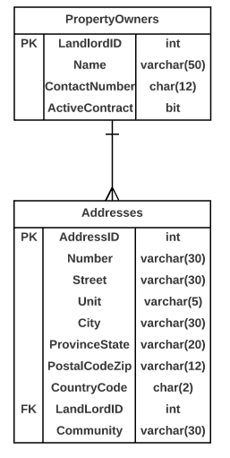

# A09: Addresses

You must do three forms (A, B and C) based on the following database tables.

- **Form A** - Single Item Create/Read/Update/Delete
  - Addresses
- **Form B** - Gridview Lookup with Code-Behind
  - Addressses by Landlord 
- **Form C** - Gridview Lookup with ObjectDataSource controls
  - Addressses by Landlord

**Recommended Stored Procedures** - The following specialty stored procedures are available:

`Addresses_FindByLandlord` Returns zero or more Addresses matching the supplied Landlord id

`Addresses_FindByPartialStreetAddress` Returns zero or more Addresses whos Number and Street contains the supplied values.

**Important Notes:** 

Use Address filter (Number and Street) search for main lookup.

There is a table trigger requiring the Country Code to match one of the existing country codes in the Countries table. You must use a Drop-Down for the Address' `CountryCode` on all forms.

Form B and Form C does not need to display the `Landlord` attribute.

Include a not mapped property called Fulladdress when creating the Address entity definition. This property will return a string containing the full address format number street (unit). Only add the (unit) if the unit is not null. Examples 1001 14 Ave or 12015 109 St (A215).

