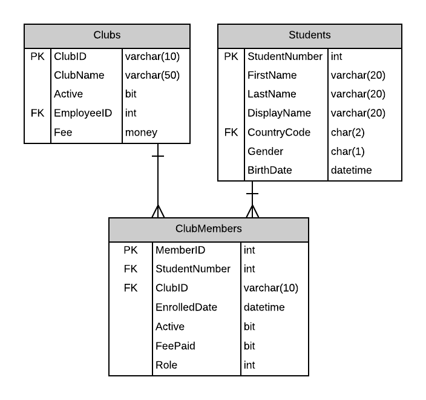
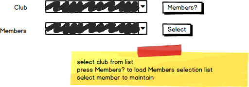
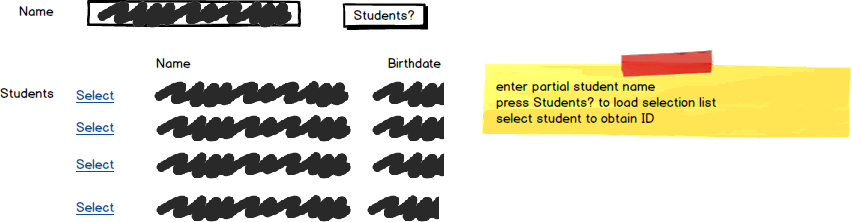

# A11: Club Members

You must do three forms (A, B and C) based on the following database tables.

- **Form A** - Single Item Create/Read/Update/Delete
  - ClubMembers
- **Form B** - Gridview Lookup with Code-Behind
  - ClubMembers by Club
- **Form C** - Gridview Lookup with ObjectDataSource controls
  - ClubMembers by Club

**Recommended Stored Procedures** - The following specialty stored procedures are available:

`ClubMembers_FindByClub` Returns zero or more ClubMembers matching the supplied club id

`Students_FindByClub` Returns zero or more Student records belonging to the supplied club id

**Important Notes:** 

ClubMembers are not deleted. ClubMembers are made inactive. There is an Active flag in ClubMembers.

Forms A and C will obtaining the role from a list of role descriptions on the database. Form B can simply display the role id.

Include a not mapped property called FullName when creating the Student entity definition. This property will return a string containing the LastName, Firstname of the student.

**Search Filter**

Use filtering on club obtaining clubmember student list. Select from the member list for the specific clubmember.

Use student firstname/lastname filtering for foreign key: StudentID

Form A filter search mockup