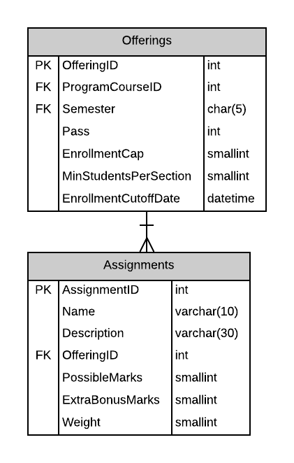
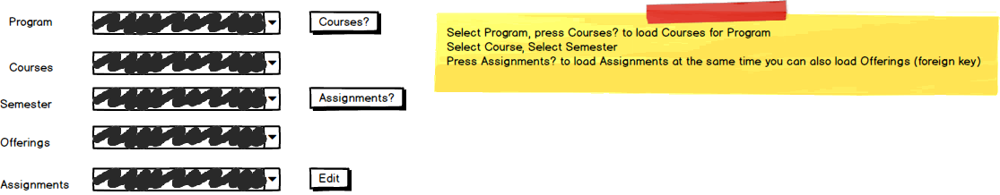

# A12: Assignments

You must do three forms (A, B and C) based on the following database tables.

- **Form A** - Single Item Create/Read/Update/Delete
  - Assignments
- **Form B** - Gridview Lookup with Code-Behind
  - Assignments by Offering
- **Form C** - Gridview Lookup with ObjectDataSource controls
  - Assignments by Offering

**Recommended Stored Procedures** - The following specialty stored procedures are available:

`Assignments_FindByProgramCourseAndSemester` Returns zero or more Assignments records matching the program id, course id and semester

`Offerings_FindByProgramCourseAndSemester` Returns zero or 1 Offerings records matching the program id, course id and semester

`Courses_FindByProgram` Returns zero or more Courses belonging to the supplied programid

`Semesters_FindActiveFuture` Returns zero or more SchoolTerms records currently active or are future semseters

**Important Notes:** 

Only Assignments for current or future semesters can be updated or deleted.

**Search Filter**

Use filtering for Assignments main lookup: ProgramID, CourseID(Courses filter on ProgramID) and Semester

Use filtering for Offerings lookup: ProgramID, CourseID(Courses filter on ProgramID) and Semester

Form A filter search mockup