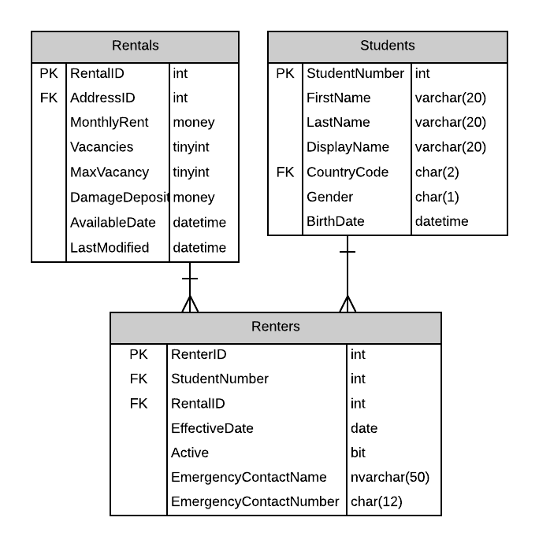

# A16: Renters (not available)

You must do three forms (A, B and C) based on the following database tables.

- **Form A** - Single Item Create/Read/Update/Delete
  - Renters
- **Form B** - Gridview Lookup with Code-Behind
  - Renters by RentalAgreement
- **Form C** - Gridview Lookup with ObjectDataSource controls
  - Renters by RentalAgreement

**Recommended Stored Procedures** - The following specialty stored procedures are available:

`Students_FindByPartialName` Returns zero or more Students whos first or last name includes the supplied string

**Important Notes:** 

You must filter the list of possible Students to select from in order to assign an Student to the Renter. Use the supplied stored procedure to create the filtered list. The supplied stored procedure will raise an error if the results are too large. Provide a prommpt line to ensure the user selects a Student (no default).
