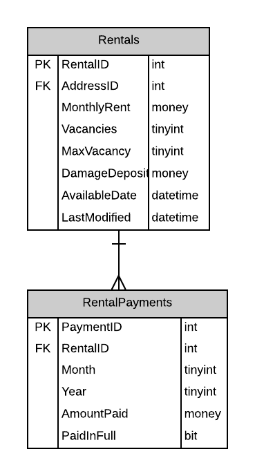

# A17: RentalPayments (not available)

You must do three forms (A, B and C) based on the following database tables.

- **Form A** - Single Item Create/Read/Update/Delete
  - RentalPayments
- **Form B** - Gridview Lookup with Code-Behind
  - RentalPayments by RentalAgreement
- **Form C** - Gridview Lookup with ObjectDataSource controls
  - RentalPayments by RentalAgreement

**Recommended Stored Procedures** - The following specialty stored procedures are available:

**Important Notes:** 
