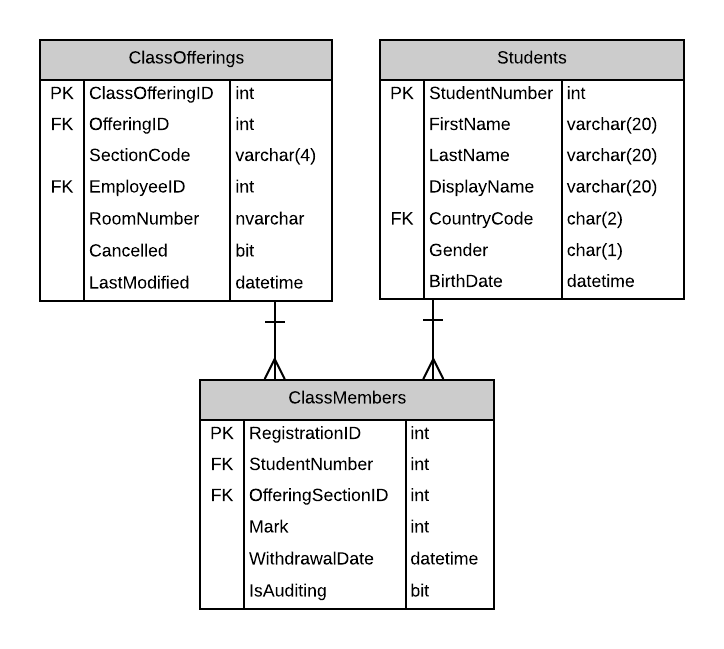

# A18: Class Members (not available)

You must do three forms (A, B and C) based on the following database tables.

- **Form A** - Single Item Create/Read/Update/Delete
  - ClassMembers
- **Form B** - Gridview Lookup with Code-Behind
  - ClassMembers by ClassOffering
- **Form C** - Gridview Lookup with ObjectDataSource controls
  - ClassMembers by ClassOffering

**Recommended Stored Procedures** - The following specialty stored procedures are available:

**Important Notes:** 

