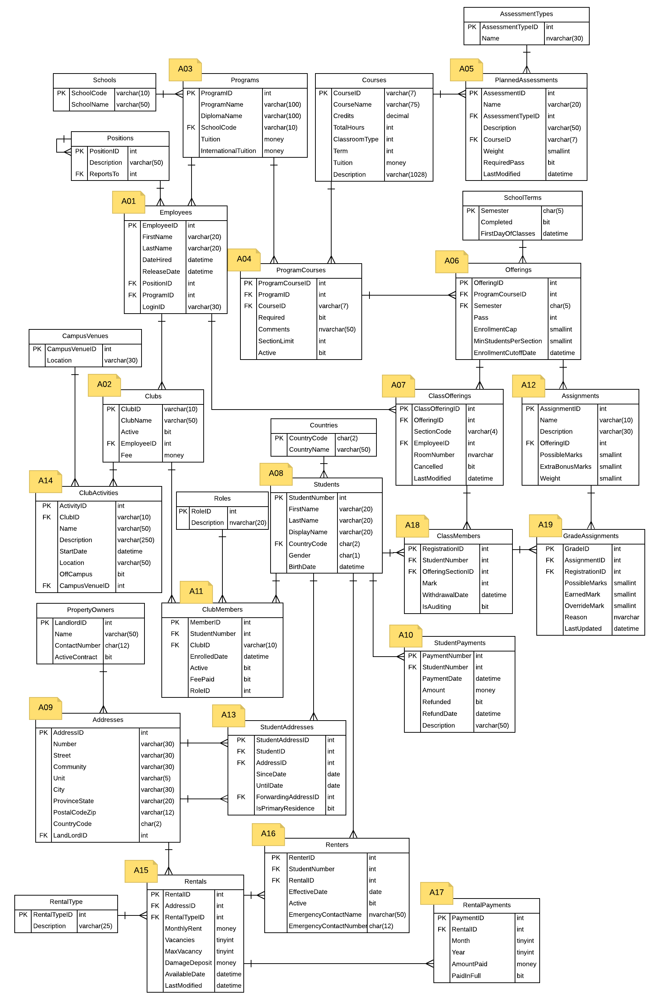

# Star-TED - Lab Selection

> Star-TED – V 2016.2.12.143

This document contains over 30 distinct scenarios for simple CRUD operations on the **Star-TED** database.

## Choose Your Lab Scenario!

You must select a single scenario for your lab project. Each student in the class must have a **separate scenario** (unless otherwise approved by the instructor). Before beginning your lab, you must sign up for your scenario and your selection must be approved by your instructor; contact your instructor for details. If you are repeating the course, you **must** select a different scenario than the one you attempted in the previous term.

For details on the lab specifications and the marking guide, please see the separate document titled "CPSC1517 Course Project".

### Database Tables and Foreign Keys

Each scenario has an ERD (Entity Relationship Diagram) that shows the database tables for that scenario. Students are responsible to create the lab code for those tables in their scenario's ERD; you only need to code for the tables that you actually use in your scenario.

## Scenarios

|                                    |                                 |                                  |                                 |
| ---------------------------------- | ------------------------------- | -------------------------------- | ------------------------------- |
| [A01: Employees](A01)           | [A02: Clubs](A02)            | [A03: Programs](A03)          | [A04: Program Courses](A04)  |
| [A05: Planned Assessments](A05) | [A06: Offerings](A06)        | [A07: Class Offerings](A07)   | [A08: Students](A08)         |
| [A09: Addresses](A09.md)           | [A10: Student Payments](A10) | [A11: Club Members](A11)      | [A12: Assignments](A12)      |
| [A13: Student Addresses](A13)   | [A14: Club Activities](A14)  | [A15: Rentals](A15)           | [A16: Renters](A16)          |
| [A17: Rental Payments](A17)     | [A18: Class Members](A18)    | [A19: Grade Assignments](A19) | [A20: *TBA*](#)                 |

## ERD

