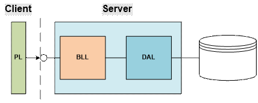
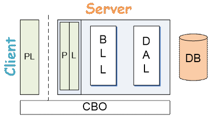
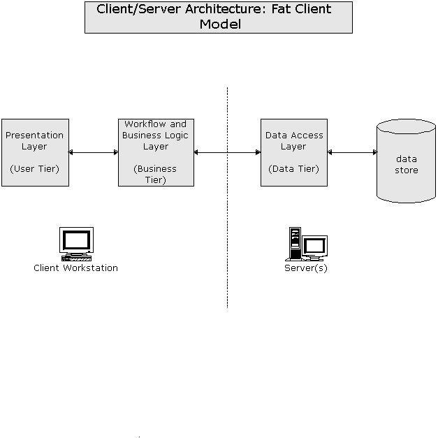
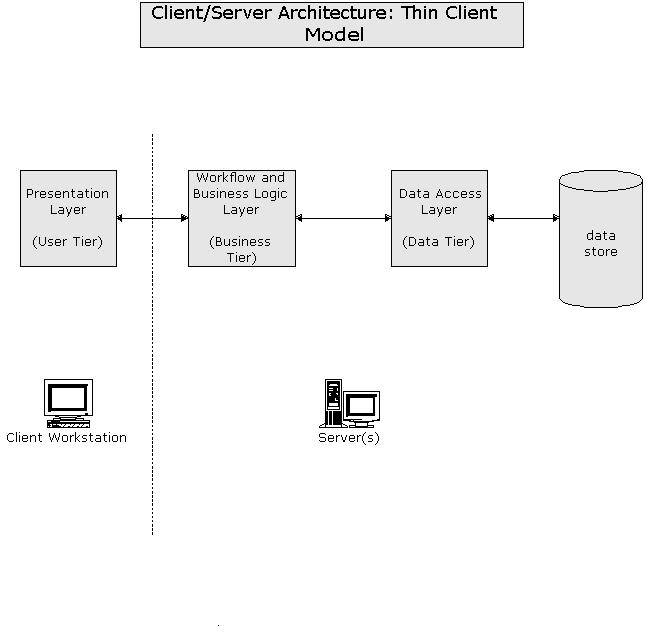

---
title: Client Server Architecture
---
# Client Server Architecture

## Overview

When talking about Client-Server Architecture, a couple of terms get bandied about: Tiers and Layers. Sometimes these terms are used interchangeably, and that's OK. Other times, they are used to specifically distinguish the *logical* parts of our software (Layers) from the *physical* deployment of the software (Tiers).

A simple diagram of the Client-Server architecture will typically show the Presentation Layer (PL), Business Logic Layer (BLL) and Data Access Layer (DAL). The following Client-Server diagram represents what is called a "thin" client, because the client side consists of only the Presentation Layer.

Simple Client-Server

The layers within a client-server architecture each provide a specific purpose. The code we write goes into a particular layer based on the purpose of the code. In the following image, the client-server architecture is drawn with a typical ASP.NET Web Forms application in mind. Keep in mind, however, that the key aspects of a *logical* arrangement into layers is meant to convey how our application is *conceptually* arranged.

Logical Layers in Client-Server

PL (Presentation Layer)
  ~ Provides the User Interface of the application.

BLL (Business Logic Layer)
  ~ Provides the services that are offered by the application or system. It is also the entry point of the system. The BLL is responsible for managing workflow and enforcing the business rules of the system.

DAL (Data Access Layer)
  ~ Provides access to the database and handles the transfer of data to and from the database. It also performs "hydration" of CBOs (Custom Business Objects).

DB (Database)
  ~ Provides storage of data. The database is responsible for ensuring the integrity of the data as a whole. It does this through table design, relations (foreign keys), constraints (such as checks on columns), stored procedures, and triggers. It also provides a final point of security for the system's data.

CBO (Custom Business Object)
  ~ CBOs provide in-memory storage of data for use and manipulation by the system.

A client-server application can be arranged in various ways as *physical tiers* (which may or may not combine various logical layers). Here are some of the more common arrangements of physical tiers that you can use.

- 1 Tier (Single Computer)
  - Monolithic Apps (e.g.: MS Word)
  - "Client-Server" architecture apps set to install/run on a single computer
- 2 Tier (Two Computers)
  - "Traditional" client-server arrangement
  - Comes in two "flavours"
    - Fat Client 
    - Thin Client     
- 3 Tier (Three Computers)
  - Standard web application arrangement 
- n-Tier
  - More than three computers
  - Multiple computers share the load of a specific layer of the client-server architecture
    - Web Farms – two or more computers acting as the "single" web server
    - "Mirrored" Databases and Database Clusters – Two or more computers acting as the database server
    - Application Server – Separate computer(s) dedicated to handle the BLL and possibly the DAL as well. With application servers that use web app front ends, the web application is completely separate from the website. Sometimes application servers make their services available as XML Web Services.

Client-server architecture provides a number of benefits to developers.

- Parallel Development – Each "team" is working on their own layer/tier of the application. All teams work at the same time (in parallel). Apps get developed faster (but usually require some RAD or Agile approach).
- Easier Maintenance – Changes can be applied to one layer without having to update other layers.
- Scalability – The app can handle more load and grow in capacity by adding hardware without needing to change the software (code).
- Improved Security – BLL provides a single point of entry into the system.

## More about the PL

The Presentation Layer (also called the "Front End") of the application is typically concerned with providing a way for a human user to interact with the application. Because of the human interaction, it's very important to give a solid and "intuitive" interface that the user can easily work with. Human interface design is a huge area of development all on its own. With the advances in multi-touch screens and other devices (besides the keyboard and mouse), you can be sure that the possibilities in presentation layer designs will continue to grow.

Not every application has to have a presentation layer, however. Many programs are designed for interacting with other computer programs, rather than with human users. A common scenario for this occurs when one business wants to share or connect its systems with those of another business. These Business-to-Business (or B2B) applications can still leverage client-server architectures; in doing so, each business simply treats the other business as the "client", even though the interaction between the two systems may be entirely automated.

## More about the BLL

The Business Logic Layer, in its simplest form, ensures that business rules and workflow are enforced in the system. In complex systems, the BLL can be expanded into distinct compartments that provide specialized functionality. For example, a Business Façade or Service Layer can be used to simplify or consolidate the general "services" that the application offers to the "clients" of the system. Internal operations of the business logic layer are thereby hidden from the clients, and can contain various levels of complexity in enforcing business rules or managing alternate or interchangeable workflows.

Typically, as the BLL grows and evolves over time, it is more and more important to integrate appropriate software design patterns to keep a system from becoming bogged down in its own complexity. An excellent resource for learning more about using design patterns for complex systems can be found in the writings of Martin Fowler ([http://martinfowler.com](http://martinfowler.com)) and in the pages of the Data & Object Factory website ([http://www.dofactory.com](http://www.dofactory.com)).

## More about CBOs

Custom Business Objects may be designed as full-featured objects (sometimes called Domain Objects), with support for data integrity (validation rules) and even concurrency management (concurrency management is concerned with dealing with conflicts around synchronizing changes to database data when it is being used or modified by many people simultaneously). CBOs are sometimes distinguished from DTOs (Data Transfer Objects) that are solely responsible for wrapping data for transport across system boundaries.

An alternative to CBOs is to use ORM (Object Relational Mapping) systems such as nHybernate or Microsoft's Entity Relational Framework. Sometimes CBOs or ORMs are generated through code-generation tools like My Generation (free) or CodeSmith (commercial).

Strictly speaking, a Client-Server application does not need to use Custom Business Objects, even if a database is being used in the application. Other "container" types of objects exist which can be used to store database information in memory for the application to use. Some examples include

- DataSets and DataTables
- Typed DataSets
- Entity Framework objects
- Dynamic LINQ query results

## More about the DB

A well-designed Client-Server application can easily survive the migration from one database vendor to another. Whether you intend to use Microsoft's SQL Server, Oracle, MySQL, XML or any other database system, the ultimate need of many applications is the same: to have a place to store and retrieve data quickly.

Databases are about more than just data storage, however. In fact, there are a number of extensions to these database systems which provide various forms of business intelligence and reporting services. As databases grow in size and capacity, the ability to coordinate databases through techniques such as mirroring becomes critical to ensure the scalability of an application. Think, for example, of the vast amount of data stored in all the databases used by Google. It's imperative to Google that their end-users are not slowed down in their attempts to access and use all of that data. Likewise, as cloud-computing gains traction among businesses and individuals, the needs of data management will continue to grow over time.
