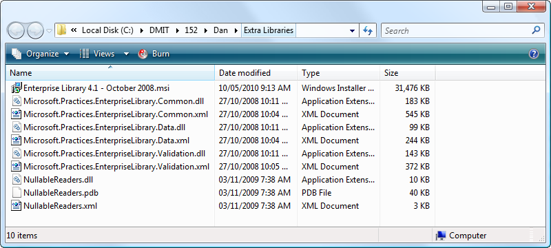
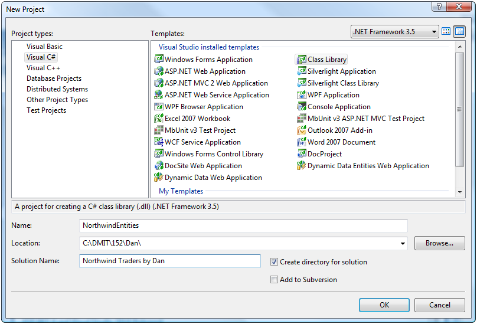
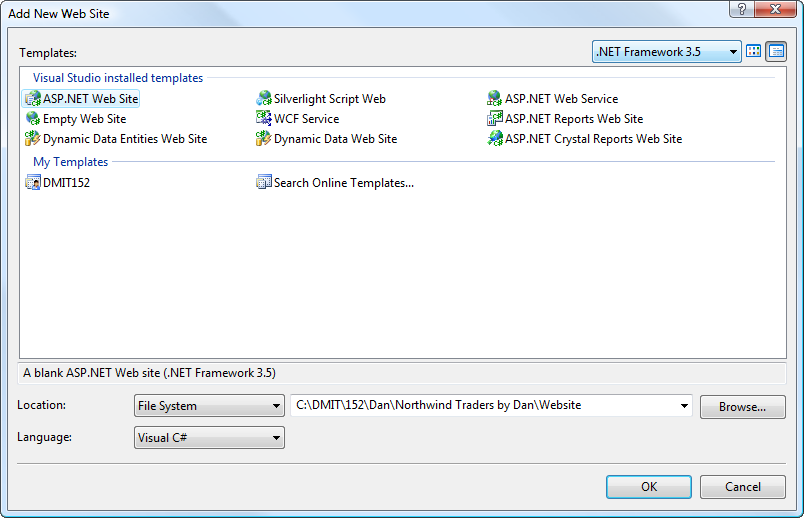
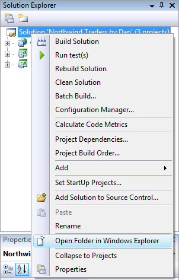
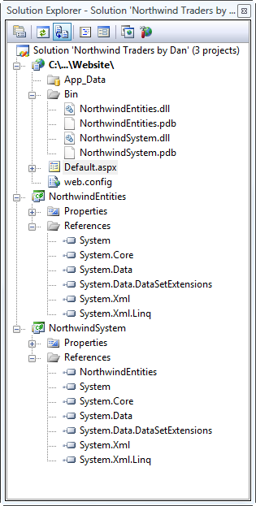
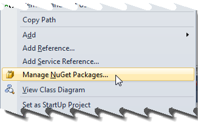
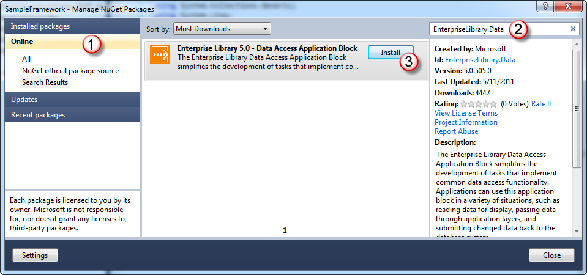
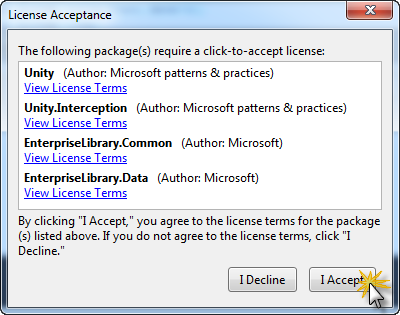
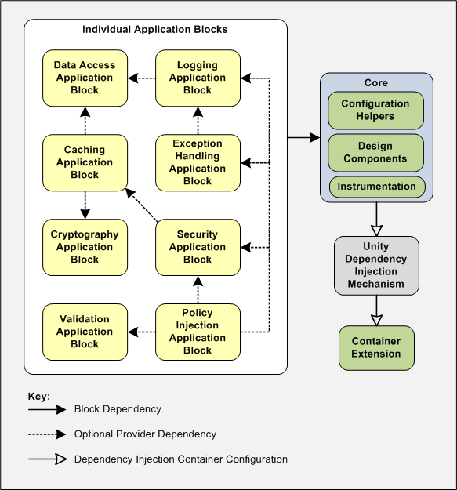

# Setting Up Client-Server in Visual Studio Part 1 of 9

:::warning OBSOLETE
The content in this demo is obsolete. Use the Entity Framework library as demonstrated in class.
:::

This is the first in a series of hands-on tutorials are designed to demonstrate how to build a web application that uses a Client-Server architecture and that persists information in a database. Each tutorial will walk the reader through steps to build upon a specific web application scenario based upon the Northwind Traders database.

There are nine tutorials in this package. Each hands-on tutorial has a Starter Kit folder with all of the required material to begin the tutorial and a Solution folder with the final product of the tutorial.

## Setup in Visual Studio

- Estimated time: 15-20 minutes.
- Parts:
  1. Part 1 – Setting up the Solution  
    This part walks through the basics of creating a Visual Studio solution with three projects.
  2. Part 2 – Adding External Resources  
    This part prepares the solution for later tutorials by adding references to additional DLLs.

### Purpose

This tutorial will lead you through the steps to set up a Web Site in Visual Studio with a Client-Server Architecture. This solution will be the foundation for a series of tutorials in creating Client-Server Web Sites. The supporting database is the modified Northwind Traders database for this course (NorthwindExtended).

The solution will contain the following projects.

- **NorthwindEntities** – This is a Class Library which will hold all the Custom Business Objects (aka: Business Entities) used by the other two projects.
- **NorthwindSystem** – This is a Class Library which will hold the BLL and DAL code for the system.
- **Website** – This is an ASP.NET Web Site which will act as the front end or client of the system.

### Setup

As part of setting up the solution, you will need third-party libraries (DLLs) to support the DAL in later tutorials. The Starter Kit folder contains a folder called "Extra Libraries" which will be used in Part 2 of this tutorial.

### Part 1 – Setting up the Solution

The goal of this part is to demonstrate how to set up a multi-project solution in Visual Studio.

1. **Create NorthwindEntities** – Start Visual Studio and create a (Visual C#) Class Library project called NorthwindEntities. Create the project using the path "C:\\DMIT\\152\\YourName" and be sure to set the name of the solution to "Northwind Traders by YourName". 
2. **Create NorthwindSystem** – Add another new Class Library project to the solution (File->Add->New Project&hellip;) and name it NorthwindSystem. 
3. **Create Website** – Add a new ASP.NET Web Site to the solution (File->Add->New Web Site&hellip;) and set the location to "C:\\DMIT\\152\\YourName\\Northwind Traders by YourName\\Website". 
4. **Check Your Solution Folder** – Check that the projects in the solution are correctly organized.
  1. In the Solution Explorer, right-click on the solution name and select "Open Folder in Windows Explorer". 
  2. You should see three folders (one for each project) inside your solution folder. 
5. **Clean Up** – Delete the Class1.cs files from the NorthwindEntities and NorthwindSystem projects. Then, right-click the Website and select "Set as Startup Project". 
6. **Wire Up** – This step is all about ensuring that the projects have the correct references to each other.
  1. Right-click the NorthwindSystem project and select "Add References&hellip;" to open the Add Reference dialog box. From the Projects tab, select the NorthwindEntities project and click OK. 
  2. Right-click the Website and select "Add Reference&hellip;" to open the Add Reference dialog box. Select the "Projects" tab and select both the NorthwindSystem project and the NorthwindEntities project; then click OK. 
7. **Build Solution** – From the Build menu, select "Build Solution" (or click \[Ctrl\] + b). This will compile all the projects and ensure that the DLLs from the class libraries are copied to the appropriate projects. When you are done, click "Save All" from the File menu. 
8. **Check Your Solution** – Check your solution by selecting each Class Library project in the Solution Explorer and clicking the "Show All" icon. Then expand each folder. Your results should look like this. 
  
### Part 2 – Adding External Resources

In order for this application to connect with the database, we will make use of a few third-party libraries and a core library from the .NET Framework. This part of the tutorial walks through setting up the references to these libraries.

1. **Getting Started** – Open the solution from the previous tutorial. Download the third-party DLLs for this tutorial.
2. **Adding Enterprise Library 5.0** – Add references to the supporting libraries by following these steps
  1. Right-click the NorthwindSystem project and selecting "Add Library Package Reference&hellip;" or "Manage NuGet Packages&hellip;".  
    
  2. Search for the EnterpriseLibrary.Data package by selecting the Online set of packages and entering the package name in the search box. Then, click the "Install" button. 
    
  3. A number of additional libraries may be required. When prompted, accept the terms for all these libraries by clicking "I Accept". 
    
  4. The package(s) should be installed; installed packages have a green checkmark beside them. You may close the Manage NuGet Packages dialog. 

### Summary

In this hands-on tutorial, you created a multi-project solution from scratch that uses a Client-Server Architecture. At this point, the Visual Studio solution is an empty shell. This solution makes use of MS Enterprise Library 5.0 DLLs for supporting the Data Access Layer. The presentation layer is an ASP.NET Website.

#### Discussion Points

The following questions are designed to help you review key aspects of this tutorial.

- What these libraries are for? (see http://msdn.microsoft.com/en-us/library/ff632023.aspx for details)
  1. **Microsoft.Practices.EnterpriseLibrary.Data.dll** – This library will provide resources for accessing the database. The easiest way to install this library is to use the NuGet Package Manager, which will help resolve any dependencies on other DLLs.

Figure 1 - See [http://msdn.microsoft.com/en-us/library/ff664422(v=pandp.50).aspx](http://msdn.microsoft.com/en-us/library/ff664422(v=pandp.50).aspx)

