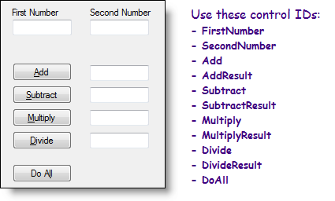

# Programming with ASP.NET Controls

<dl>
  <dt>What is Code-Behind?</dt>
  <dd>A class (regular OOP); Is inherited by the ASPX page; Programmers write code to respond to page and control events</dd>

  <dt>Event Handler</dt>
  <dd>A method on the page’s code-behind class that runs when the event occurs; Is called in response to the event; default event's handler is created by double-clicking the GUI control</dd>

  <dt>Page_Load</dt>
  <dd>Use for one-time setup of control values; Check for Page.IsPostback; Set control’s initial property values</dd>

  <dt>Button_Click</dt>
  <dd>Respond to user clicking Button/LinkButton</dd>
</dl>

* Each ASP.NET control
  * Has an (ID) - Programmatic name of the control
  * Is an object
    * Properties & Methods
    * Inherits from System.Web.UI.Control
      * “Defines the properties, methods, and events that are shared by all ASP.NET server controls”
      * Has unique Properties & Methods

| Control Type    | Property |
| --------------- | -------- |
| Label           | .Text |
| TextBox         | .Text |
| CheckBox        | .Checked |
| DropDownList    | .SelectedValue |
| RadioButtonList | .SelectedValue |
| Image           | .ImageUrl |
| Calendar        | .SelectedDate |
| Web.UI.Control  | .Enabled, .Visible, .Page, .Parent, .ViewState |

* Create Event Handler Method
  * Page_Load - Double-click blank part of GUI Page
  * Button_Click - Double-click button
* Write Code in Event Handler’s Body
  * Anything you want (within reason)
    * Get/Set Control Properties
    * Call Methods of Controls
    * Call other methods
    * Create/Use objects
    * Flow-Control Statement (If-Else, Loops, etc.)

----

{% assign placeholder1 = "

Open the demos in Visual Studio and examine the code in the code-behind files.

* What is the syntax of an If statement?
* What is the this keyword in C#?
* What is the syntax for declaring and initializing a variable in C#? What’s the syntax for comments?
* List the primitive data types used for variables in the code samples.
* The following lines of code are used to replace specific text from one string with some other text. What is used as the placeholder text in the original string?

  ```csharp
  String text = "I am in {{ placeholder1 }}.";
  this.Sentence.Text = text.Replace("{{ placeholder1 }}", this.TermDropDownList.SelectedValue);
  ```

* The Convert class is used to convert strings to numbers and numbers to strings. Look in the help files and list at least four methods of the Convert class that you think you will probably use at some point in the course.
* What is the String.Format() method and how is it used? (Research in the help files for more details)
* What is the value of the Text property of a TextBox control if the user has not entered anything into the TextBox?
* What happens if the Visible property of a control is set to false?
* What is the purpose of the Enabled property that exists for many of the ASP.Net controls?
* For a CheckBox control, which property would you examine to tell if the user has checked off the control? What is the data type of that property?
* Read more about the DropDownList control in the help files. What is the difference between the SelectedIndex property and the SelectedValue property?
* Is it possible to have no item selected in the DropDownList? Why or why not?
* What property of the Image control is used to set the path or URL for the image to be displayed?
* What are Label controls typically used for on web forms?

----

Research the controls in the following chart. Then, complete the chart by placing a checkmark for each property that exists for that control.

| Properties / Controls | Label | TextBox | Button | CheckBox | RadioButton | DropDownList |
| .Text                 |                 |        |          |             |              |


| .Text | [ ] | [ ] | [ ] | [ ] | [ ] | [ ] |
| .Font | [ ] | [ ] | [ ] | [ ] | [ ] | [ ] |
| .Checked | [ ] | [ ] | [ ] | [ ] | [ ] | [ ] |
| .Selected | [ ] | [ ] | [ ] | [ ] | [ ] | [ ] |
| .Enabled | [ ] | [ ] | [ ] | [ ] | [ ] | [ ] |
| .Visible | [ ] | [ ] | [ ] | [ ] | [ ] | [ ] |
| .ReadOnly | [ ] | [ ] | [ ] | [ ] | [ ] | [ ] |

----

Calculator Tutorial


* Write out the syntax for declaring a class.
* What is the purpose of the “partial” keyword?
* What is the difference between a subroutine and a function?
* What is the syntax for writing a method of a class?
* What is the syntax for a Subroutine?
* What is the syntax for a Function?
* What is the syntax for declaring parameters in a method?
* Explain, in general terms, the purpose and functionality of inheritance.
* What is the syntax for indicating inheritance in C#?
* List the names of methods, fields and properties that a web form inherits from System.Web.UI.Page.
* Explain why it’s a bad idea to give a control on a form an (ID) that matches a method, field or property inherited from System.Web.UI.Page.


Review the learning outcomes for this topic by answering the following questions.

* What is the relationship of the code-behind file to its web form (ASPX page)?
* What are event handlers and what is their purpose?
* What is unique and important to remember about the page load event in web forms?
* What is the IsPostback property? How and when should it be used?
* List the commonly used properties of the following controls:
  * TextBox, Label, CheckBox, DropDownList, RadioButtonList, Image, Calendar
* List important properties common to all/most ASP.NET controls.
* Which property of an ASP.Net control is used to programmatically access the control?

