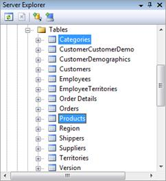
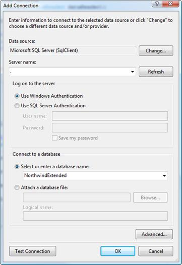
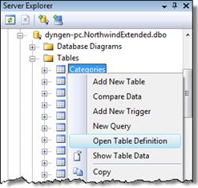
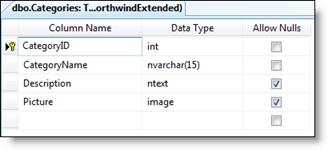
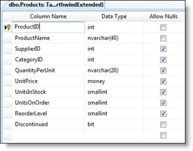

# Mapping to the Database - Part 2 of 9

This series of hands-on tutorials are designed to demonstrate how to build a web application that uses a Client-Server architecture and that persists information in a database. Each tutorial will walk the reader through steps to build upon a specific web application scenario based upon the Northwind Traders database.

There are nine tutorials in this package. Each hands-on tutorial has a Starter Kit folder with all of the required material to begin the tutorial and a Solution folder with the final product of the tutorial.




## Mapping to the Database

*   Estimated time: 30 minutes.
*   Parts:
    1.  **Creating Custom Business Objects (CBOs)**  
        This part of the tutorial focuses on creating classes for business entities that have a one-to-one mapping with the tables in the database
    2.  **The Abstract DAL Provider**  
        In this part of the tutorial, a base class is developed for the upcoming DAL classes. This base class will centralize access to the database and define common methods for mapping database data to the business entities.
    3.  **Mapping the Data**  
        The final part of this tutorial finishes off the mapping of database information to specific business entities. The classes created here will serve as the primary DAL classes for each business entity in the upcoming tutorials.

----

### Purpose

This tutorial will lead you through the steps to create the underlying code needed to map database information to Business Entities (or CBOs). This will involve designing classes to represent and hold database information and writing the DAL code that will connect to the database and handle the transfer of data.

The two tables which will be mapped to the application in Part 3 are the Categories and Products tables. Mapping the Suppliers table, which will be needed for later tutorials, is left as an exercise at the end of this tutorial.

### Setup

For this lab, you will need the NorthwindExtended database. The Starter Kit folder contains a folder with a backup of this database named “NorthwindExtended.bak”. Before starting this tutorial, restore this database to your local installation of Microsoft SQL Server.

Note: If you don’t have the full version of SQL Server installed on your computer, you can restore the database to SQL Express instead. In this case, you would need to use “./SQLEXPRESS” as the Server Name and Data Source.

### Part 1 – Creating Custom Business Objects (CBOs)

This part of the tutorial focuses on creating classes for business entities that have a one-to-one mapping with the tables in the database. Two classes will be created, one for data in the Products table and one for the Categories table.

1.  Open Server Explorer and add a connection to the NorthwindExtended database.

    

2.  Expand the database in Server Explorer until you see a list of the tables. Right-click on the Categories table and select Open Table Definition. This will allow you to see the column names and data types for Categories data.

    
    

3.  Add a class to the NorthwindEntities solution and name it Category. In this class, create a single property for each column in the Categories table. This new Category class is a custom business object (CBO) or business entity that, when instantiated, will hold the data for a single row from the Categories table.

```csharp
using System;
namespace NorthwindEntities
{
    public class Category
    {
        #region Properties
        public int CategoryID { get; set; }
        public string CategoryName { get; set; }
        public string Description { get; set; }
        public byte[] Picture { get; set; }
        #endregion
    }
}
```

4.  Add two constructors for this class. The first one will be a “greedy” constructor, and will have one parameter for each property of the class. The second will be a parameter-less constructor which will leave the properties un-initialized. The parameter-less constructor will offer flexibility when instantiating while the greedy constructor will be helpful for developers who want to set initial property values when they create their CBO.

```csharp
#region Constructors
public Category(int categoryID, string categoryName, string description, Byte[] picture)
{
    CategoryID = categoryID;
    CategoryName = categoryName;
    Description = description;
    Picture = picture;
}
public Category()
{
}
#endregion
```

5.  Repeat steps 2-4 for the Products table. Create a CBO class named Product that has a property for each table column and two constructors. Use nullable types for properties whenever a column allows null values.

    

```csharp
using System;
namespace NorthwindEntities
{
    public class Product
    {
        #region Properties
        public int ProductID { get; set; }
        public string ProductName { get; set; }
        public int? SupplierID { get; set; }
        public int? CategoryID { get; set; }
        public string QuantityPerUnit { get; set; }
        public decimal? UnitPrice { get; set; }
        public short? UnitsInStock { get; set; }
        public short? UnitsOnOrder { get; set; }
        public short? ReorderLevel { get; set; }
        public bool Discontinued { get; set; }
        #endregion
        #region Constructors
        public Product(int productID, string productName, int? supplierID, int? categoryID, string quantityPerUnit, decimal? unitPrice, short? unitsInStock, short? unitsOnOrder, short? reorderLevel, bool discontinued)
        {
            ProductID = productID;
            ProductName = productName;
            SupplierID = supplierID;
            CategoryID = categoryID;
            QuantityPerUnit = quantityPerUnit;
            UnitPrice = unitPrice;
            UnitsInStock = unitsInStock;
            UnitsOnOrder = unitsOnOrder;
            ReorderLevel = reorderLevel;
            Discontinued = discontinued;
        }
        public Product()
        {
        }
        #endregion
    }
}
```

### Part 2 – The Abstract Data Provider

The data access layer of our application will be responsible for communicating with the database and passing data to and from our application. As part of the DAL strategy for our program, we will use Microsoft’s Enterprise Library 5.0\. Details for connecting to the database will be held in the web.config’s <connectionstrings> node. In addition, we will use a base class for our DAL classes that will identify the database and perform common data mapping logic for reading data from the database.

The base class we will create in this step is named “AbstractDataProvider”. It will be both abstract and internal. It will also make use of generics to support mapping data to the CBOs. (This mapping of data to business entities is sometimes referred to as Hydration.)

1.  In the web site, open the web.config file and find the <connectionstrings> node. Edit this node to match the following code.

```xml
<connectionstrings configsource="webConnectionStrings.config" />
```

2.  Right-click on the website and select “Add New Item…”. Select “Web Configuration File” and name the file “webConnectionStrings.config”.
3.  Replace the entire contents of the “webConnectionStrings.config” file to contain the following XML code.

```xml
<connectionstrings>
  <add name="NorthwindEnhanced"
       connectionstring="Data Source=.;Initial Catalog=NorthwindExtended;Integrated Security=True"
       providername="System.Data.SqlClient" />
</connectionstrings>
```

4.  In the NorthwindSystem project, create a folder called DAL. This will hold the various DAL classes for our system.
5.  Create a new class in the DAL folder and name it AbstractDataProvider. Make sure it’s defined as both internal and abstract.

```csharp
namespace NorthwindSystem.DAL
{
    internal abstract class AbstractDataProvider
    {
    } // end of class
} // end of namespace
```

6.  Import the following namespaces and modify the class name to declare it as a generic type.

```csharp
using System;
using Microsoft.Practices.EnterpriseLibrary.Data;
using System.Data;
using System.Collections.Generic;
namespace NorthwindSystem.DAL
{
    internal abstract class AbstractDataProvider<t>
    {
    } // end of class
} // end of namespace
```

7.  In the AbstractDataProvider class, add a constant to hold the name of the connection string setting in the web.config file. Also add a property to represent the database. Create a constructor that initializes the property with the settings pulled from the configuration file.

```csharp
#region Properties, Fields and Constants
private const string CONNECTION_STRING_NAME = "NorthwindExtended";
public Database DataStore { get; private set; }
#endregion
#region Constructors
public AbstractDataProvider()
{
    DataStore = DatabaseFactory.CreateDatabase(CONNECTION_STRING_NAME);
} // end of Constructor
#endregion
```

8.  Add an abstract method for mapping the database data to the business entities. This method will be overridden in later classes to provide the specific logic for mapping data from individual tables.

```csharp
    protected abstract T Hydrate(IDataReader dataReader);
```

9.  Add a method for creating a single CBO. This method will be responsible for validating the data reader (making sure it is not null) and ensuring that it is properly closed (disposed of). The details of extracting the data and hydrating the business entity will be dealt with by the Hydrate() method.

```csharp
protected T FillObject(IDataReader reader)
{
    if (reader == null)
        throw new ArgumentNullException("reader", "reader is null.");
    T result = default(T);
    using (reader)
    {
        if (reader.Read())
        {
            result = Hydrate(reader);
        }
    }
    return result;
}
```

10.  Add a method for creating a list of CBOs. This method will validate the data reader and ensure it is properly closed. Once again, the details of hydrating the business entity will be handled by the Hydrate() method.

```csharp
protected List<t> FillList(IDataReader reader)
{
    if (reader == null)
        throw new ArgumentNullException("reader", "reader is null.");
    List<t> infoList = new List<t>();
    if (!reader.IsClosed)
    {
        using (reader)
        {
            while (reader.Read())
            {
                infoList.Add(Hydrate(reader));
            }
        }
    }
    return infoList;
}
```

### Part 3 – Extensions for IDataReader

One of the big issues surrounding Data Access Layer code is the question of how to deal with translating null values from the database into our custom business objects. A number of strategies have been proposed in the past, but with the presence of Extension Methods since C# 3.0 and Generics , there is a quick and light-weight solution: Add new methods to the IDataReader interface.

1.  Create a new folder inside of the DAL folder of the NorthwindSystem project. Give it the name “Extensions”.
2.  Right-click on the Extensions folder and select AddClass… . Name the class “DataReaderExtensions”. Then, modify the code to match the following.

```csharp
using System;
using System.Collections.Generic;
using System.Linq;
using System.Text;
namespace System.Data
{
    public static class DataReaderExtensions
    {
        public static T GetValue<T> (this IDataReader reader, string columnName)
        {
            T value = default(T);
            int index = reader.GetOrdinal(columnName);
            if (!reader.IsDBNull(columnName))
                value = (T)(reader.GetValue(index));
            return value;
        }
        public static bool IsDBNull(this IDataReader reader, string columnName)
        {
            int index = reader.GetOrdinal(columnName);
            return reader.IsDBNull(index);
        }
    }
}
```

These two methods (`GetValue<T>` and `IsDBNull`) will be used extensively in the various Data Provider classes used in this tutorial. Note that we are using the namespace of System.Data; this is to make sure that any code which uses the IDataReader (also in the System.Data namespace) will have access to these extensions.

### Part 4 – Mapping the Data

This part of the tutorial focuses on creating the initial DAL classes for each table in the database.

1.  Create new class in the DAL folder of the NorthwindSystem project. Give it the name CategoryProvider. Import the System.Collections.Generic, System.Data, and NortwindEntities namespaces, as these will be needed in our class.

```csharp
using System;
using System.Collections.Generic;
using System.Data;
using NorthwindEntities;
namespace NorthwindSystem.DAL
{
    public class CategoryProvider
    {
    }
}
```

2.  Ensure that CategoryProvider inherits from the AbstractDataProvider and that it specifies the Category class as the specific type that will be mapped. Because the AbstractDataProvider is declared as internal, the CategoryProvider class must also be declared as internal.

```csharp
using System;
using System.Collections.Generic;
using System.Data;
using NorthwindEntities;
namespace NorthwindSystem.DAL
{
    internal class CategoryProvider : AbstractDataProvider<category>
    {
    }
}
```

3.  Write a method in the CategoryProvider class to implement the abstract Hydrate() method from the base class. This method is concerned with mapping a single row of data from the Categories table to the Category CBO class.

```csharp
    protected override Category Hydrate(IDataReader reader)
    {
    }
```

4.  Create an instance of the Category class; then extract data from the data reader into each property of the new Category object. We will use our extension methods to handle both the null values (of the Description and Picture columns) and the data conversions when translating values from the database into our C#-specific data types. Also, notice that the Picture column of the table (whose data type is Image) is being represented as an array of bytes in the Category class. At the end of the method, return the hydrated Category object.

```csharp
    protected override Category Hydrate(IDataReader reader)
    {
        Category result = new Category();
        result.CategoryID = reader.GetValue<int>("CategoryID");
        result.CategoryName = reader.GetValue<string>("CategoryName");
        result.Description = reader.GetValue<string>("Description");
        result.Picture = reader.GetValue<byte[]>("Picture");
        return result;
    }
```

5.  Repeat the above steps for the Product class and Products table. Notice that for the nullable columns in the data reader, a nullable type is used in the generic extension method, GetValue(), for data types that map to C# value types.

```csharp
using System;
using System.Collections.Generic;
using System.Data;
using NorthwindEntities;
namespace NorthwindSystem.DAL
{
    internal class ProductProvider : AbstractDataProvider<product>
    {
        #region Business Entity Hydration
        protected override Product Hydrate(IDataReader dataReader)
        {
            Product info = new Product();
            info.ProductID = dataReader.GetValue<int>("ProductID");
            info.ProductName = dataReader.GetValue<string>("ProductName");
            info.SupplierID = dataReader.GetValue<int?>("SupplierID");
            info.CategoryID = dataReader.GetValue<int?>("CategoryID");
            info.QuantityPerUnit = dataReader.GetValue<string>("QuantityPerUnit");
            info.UnitPrice = dataReader.GetValue<decimal?>("UnitPrice");
            info.UnitsInStock = dataReader.GetValue<short?>("UnitsInStock");
            info.UnitsOnOrder = dataReader.GetValue<short?>("UnitsOnOrder");
            info.ReorderLevel = dataReader.GetValue<short?>("ReorderLevel");
            info.Discontinued = dataReader.GetValue<bool>("Discontinued");
            return info;
        } // end of Hydrate()
        #endregion
    }
}
```

### On Your Own

Try creating your own classes to map data from the Suppliers table into your application. Create a CBO class called “Supplier” and a DAL class called “SupplierProvider” using the patterns and techniques shown above.

Also, for the Supplier CBO, add some read-only properties to “break apart” the HomePage information. The HomePage data of the Suppliers table stores up to four pieces of information, separated by the hash or pound symbol (#), in the following format:

`displayText#address#subAddress#screentip`

Hint: Use the string’s .Split() method to break the HomePage into it’s parts.E.g.:

```csharp
    public string DisplayText
    {
        get
        {
            string temp = null;
            if (!string.IsNullOrEmpty(HomePage))
            {
                string[] Parts = HomePage.Split('#');
                if (Parts.Length >= 1)
                    temp = Parts[0];
            }
            return temp;
        }
    }
```

### Summary

In this hands-on tutorial, you created the mapping component of the application. This mapping allows the database information to be represented and used in the application. A one-to-one mapping strategy has been employed which maps a single Custom Business Object (class) for each database table. While this tutorial walked through the specifics of mapping the Categories and Products tables of Northwind, the same techniques can be applied to the remaining tables.

At the foundation of the mapping strategy is a single abstract class acting as the basis for all other classes in the DAL.

#### Discussion Points

The following questions are designed to help you review key aspects of this tutorial.

1.  What is meant by the term “hydrate”?
2.  Why are database null values somewhat problematic in computer programs?
3.  What is the role of the <connectionstrings> node in the web.config file?

#### Creating Custom Business Objects

*   POCO – Plain Old CLR Objects vs Rich Business Objects
*   Choosing a starting point
    *   Database Driven Design
    *   Behaviour Driven Design

#### Mapping CBO to Database Tables

In this tutorial, we designed our Custom Business Objects based upon the Database Tables, and coded the DAL provider classes to map to columns that have the same name as the database tables. In truth, the mapping that happens in the DAL provider classes is going to be heavily dependent on the stored procedures (SProcs) in the database. In other words, this mapping will only work if the stored procedures for reading from the database use the following pattern. Stored procedures for SELECT-ing rows must:

*   Return all (and only) the columns for a single database table
*   Use column names (headings) that are identical to the column names on the database table

Any variation from this pattern will require customizations to provider class’ the Hydrate and FillObject/FillList methods.

#### The Problem of Database Nulls

Note that many of the columns in the database table allow null values. Our business entities must also support null values for their corresponding properties. With string data, this is not an issue because a string (as a reference type) can be assigned a null value. However, primitive types such as numbers and dates are value types in C# (and VB.NET); by definition, value types on their own cannot have a null value.

In .NET 2.0, however, a class named Nullable<t> was introduced to act as a “wrapper” for value types that would allow null values. Thus, it is possible to declare a variable as a nullable integer with the following code.

```csharp
    Nullable<int> age;
```

In C#, a shorthand way of writing the same code was made available by appending a question mark (?) to the value type. The above line of code could then be written as follows.

```csharp
    int? age;
```
