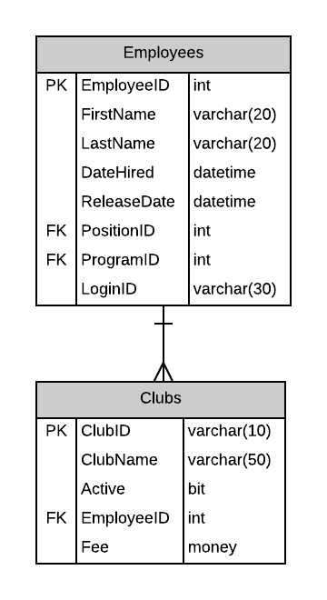

# A02: Clubs

You must do three forms (A, B and C) based on the following database tables.

- **Form A** - Single Item Create/Read/Update/Delete
  - Clubs
- **Form B** - Gridview Lookup with Code-Behind
  - Clubs by Active Status
- **Form C** - Gridview Lookup with ObjectDataSource controls
  - Clubs by Active Status

**Recommended Stored Procedures** - The following specialty stored procedures are available:

`Clubs_FindByActiveStatus` Returns zero or more Clubs matching the supplied active status

`Employees_ActiveInClubs` Returns all employees associated with clubs

`Employees_FindByPartialName` Returns zero or more employees whos first or last name contains the supplied string

**Important Notes:**

Use employee firstname/lastname filtering for Employee lookup: EmployeeID.

Allow the user to choose between veiwing active or non active clubs for Forms B and Form C.

Provide an option for "no" Employee overseeing the club. 

Include a not mapped property called FullName when creating the Employee entity definition. This property will return a string containing the LastName, Firstname of the employee.
