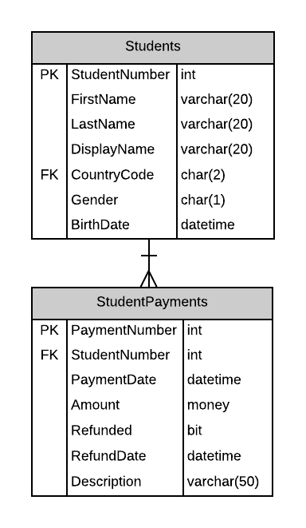

# A10: Student Payments

You must do three forms (A, B and C) based on the following database tables.

- **Form A** - Single Item Create/Read/Update/Delete
  - StudentPayments
- **Form B** - Gridview Lookup with Code-Behind
  - StudentPayments by Student
- **Form C** - Gridview Lookup with ObjectDataSource controls
  - StudentPayments by Student

**Recommended Stored Procedures** - The following specialty stored procedures are available:

`Students_FindByPartialName` Returns zero or more Students whos first or last name includes the supplied string

`StudentPayments_FindByStudent` Returns zero or more StudentPayments records matching the supplied student id

**Important Notes:** 

Use student firstname/lastname filtering for main lookup.

Provide a prompt line to ensure the user selects a Student (no default).

Payment: StudentPayments `Paymentdate` must be set when a payment is made.

Refund: Create a new record in StudentPayments. `Refunded` and `RefundDate` must be set for a refund.

StudentPayments records are never deleted.

Include a not mapped property called FullName when creating the Student entity definition. This property will return a string containing the LastName, Firstname of the student.
