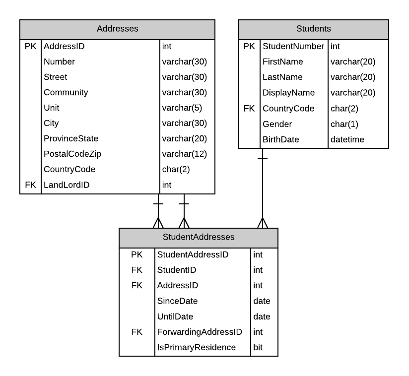

# A13: Student Addresses

You must do three forms (A, B and C) based on the following database tables.

- **Form A** - Single Item Create/Read/Update/Delete
  - StudentAddresses
- **Form B** - Gridview Lookup with Code-Behind
  - StudentAddresses by Student
- **Form C** - Gridview Lookup with ObjectDataSource controls
  - StudentAddresses by Student

**Recommended Stored Procedures** - The following specialty stored procedures are available:

`Students_FindByPartialName` Returns zero or more Students whos first or last name includes the supplied string

`StudentAddressess_FindByStudent` Returns zero or more StudentAddresses matching the supplied student id

`Addresses_FindByPartialStreetAddress` Returns zero or more Addresses whos Number and Street contains the supplied values.

**Important Notes:** 

Use Student firstname/lastname filter for main StudentAddress lookup (find all address for a specific student): 

StudentAddresses are not delete. StudentAddresses are in effect until the UntilDate has been set.

Use Address filter (Number and Street) search for Address and ForwardingAddress.

Form B and Form C will display the FullAddress for Address and FowardingAddress.

Include a not mapped property called FullAddress when creating the Address entity definition. This property will return a string containing the full address format number street (unit). Only add the (unit) if the unit is not null. Examples 1001 14 Ave or 12015 109 St (A215).
