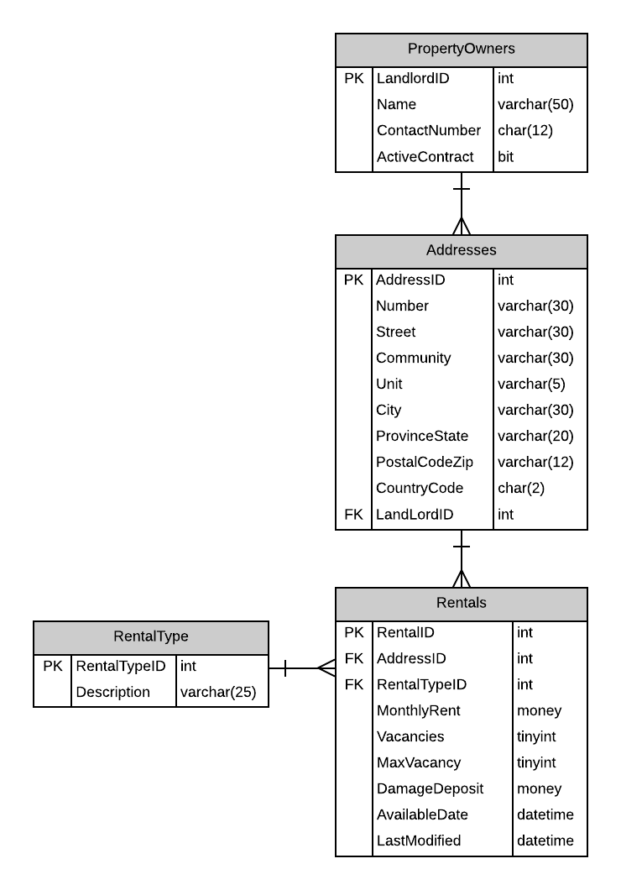

# A15: Rentals

You must do three forms (A, B and C) based on the following database tables.

- **Form A** - Single Item Create/Read/Update/Delete
  - Rentals
- **Form B** - Gridview Lookup with Code-Behind
  - Rentals by MonthlyRate Range
- **Form C** - Gridview Lookup with ObjectDataSource controls
  - Rentals by MonthlyRate Range

**Recommended Stored Procedures** - The following specialty stored procedures are available:

`Rentals_FindByLandlord Returns` zero or more Rentals records for the supplied landlord id

`Addresses_FindByPartialStreetAddress` Returns zero or more Addresses whos Number and Street contains the supplied values.

`Rentals_FindByMontlyRateRange` Returns zero or more Rentals whos MonthlyRent is within a specified range.

**Important Notes:** 

Use filtering for main lookup: Landlord ID

Use Address (Number and Street) filtering for Address lookup: 

MaxVacancy is the legal number of individual allowed in the unit. Example, a 4 bedroom unit would allow up to 4 individuals in the unit. The monthly rent is for the unit regardless of the number of individuals renting the unit.

You must set the LastModifiedDate in your controller method.

LandLord name and Rental type descriptions lists can be obtained from the database for used on the respective forms. 
