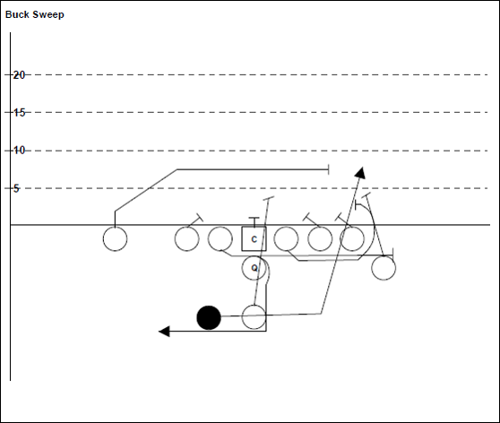

# Learning Outcomes

*At the end of this topic, you should be able to*

## (Understanding/Knowledge)

- Describe the role of debugging tools in software development
  - [Debugging tools help the developer in finding and fixing run-time logical errors in an application]
- Explain how to use breakpoints to pause program execution at a specific location of code
- Explain what is meant by the phrase "yellow screen of death"
- List common types of run-time errors
- Identify how to edit the configuration file (web.config) to enable or disable debugging
- Describe the difference between "Step Into", "Step Over" and "Step Out" in the debugger

## (Ability)

- Identify and fix run-time errors in an application using the debugging tools
- Use the debugging tools to step through code
- Use the locals and watch windows to examine the current state of variables and objects at run-time
- Use the immediate window to make changes to or examine objects at run-time

---

# Rules of Thumb

- If "it doesn't work", then it's *your* fault
  - It might just be a typo
  - If it's not a typo, then it might be something you don't fully understand…

This isn't a "put-down" – it's just a statement.
Expect to learn about stuff you think you already know.

---

# Sample Coding Errors

- Cut & Paste Paper-Cuts
  - Property Get/Set not using correct field
  - ***Demo*-Lition** – Copying code samples when it would have been better (& faster!) to type it from scratch
- Mistaking Intelli-*sense* for Intelli*gence*
  - Intelli-sense does ***not*** tell you what to type
  - Intelli-sense does tell you what exists in the code-base
- Type Conversions
  - String Concatenation – forgetting .ToString() when using the plus (+) operator to do concatenation
  - Integer/Double/Date values – forgetting to check the data type of TextBox values before using them
- Argument/Parameter Mismatch
  - Not sending the arguments in the order required by the parameter list
- Constructor Routing Errors
  - Constructor not routing values through the Set properties, when present
  - Spelling error on parameter variable causes "do-nothing" value assignment in constructor's body
- Null Object Reference
  - An attempt to use a property or method on an object that doesn't exist
- Looping Logic Errors
  - Looping too many times
  - Looping too few times
  - Infinite loop

---

# Follow the Flow of Execution

Slow Motion Replays
Football players will watch videos of how they executed certain plays in order to compare that to how the expected the play to work.

We can do the same using debugging tools

---

# Demo

